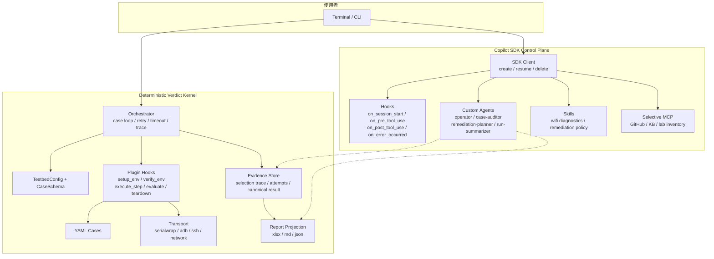
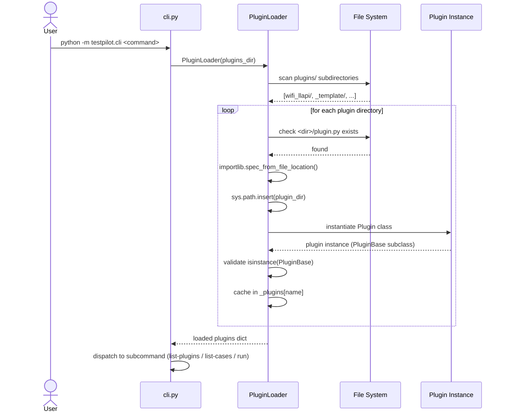
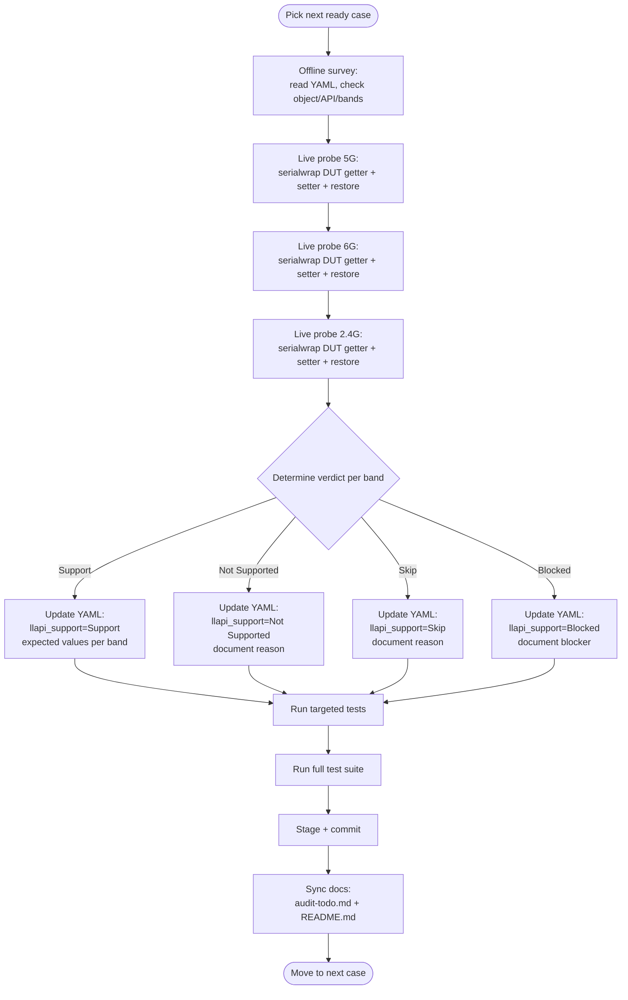
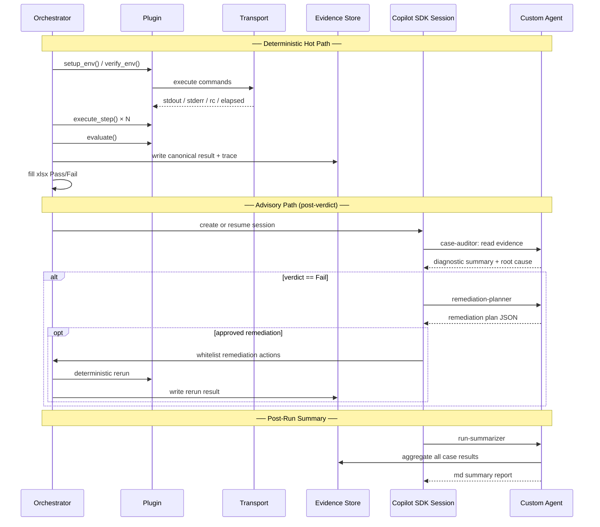

# TestPilot

Plugin-based test automation framework for embedded device verification.

## 概述

TestPilot 是一套 plugin-based 嵌入式裝置測試自動化框架，面向 prplOS / OpenWrt 裝置。系統架構分為兩個平面：

- **Deterministic verdict kernel**：負責測試執行、證據蒐集、pass/fail 判定與報表投影
- **Copilot SDK control plane**：負責 session 管理、custom agents、advisory audit、remediation planning

核心原則：**Copilot SDK 負責 control plane，不負責最終 verdict**。

---

## 系統架構

### System Block Diagram



### 啟動與 Plugin 載入時序圖



### 測試流程圖


### 校正行為流程（Calibration Flow）



### Multi-Agent 介入時機圖



---

## 目前能力

1. Plugin 架構完整：discover / setup / verify / execute / evaluate / teardown / report
2. Transport 支援 `serialwrap / adb / ssh / network`，serialwrap 支援 auto-detect template
3. `wifi_llapi` 420 筆 official cases 全部校正完畢（343 Support + 54 Not Supported + 20 Skip + 3 Blocked）
4. 報告雙軌輸出：`xlsx`（對外 Pass/Fail）+ `md/json`（內部診斷，已落地但尚未接入 orchestrator output path）
5. 3x full run determinism 驗證通過：Run 2/3 verdict 100% 一致
6. Per-case retry-aware timeout、fail-and-continue、per-case trace 輸出
7. 第三次重構 scaffolding 完成（21/21 items, v0.1.4）

## 第三次重構已落地模組

| 模組 | 檔案 | 說明 |
|------|------|------|
| Orchestrator 拆分 | `case_utils.py` / `runner_selector.py` / `execution_engine.py` | 原 1009L facade 拆為 4 模組 |
| Hook policy | `hook_policy.py` | 6 lifecycle hooks, fail_open/closed policy |
| Agent roles | `agent_roles.py` | 4 builtin roles + config merge |
| SDK session | `copilot_session.py` | create/cleanup lifecycle per case |
| Skill registry | `skill_registry.py` | SKILL.md discovery + role-based resolution |
| Advisory | `advisory.py` | AdvisoryCollector + IHook handler factory |
| Remediation | `remediation.py` | RemediationPlanner + severity-prioritized actions |
| MCP config | `mcp_config.py` | Role-selective MCP server management |
| Reporter | `reporter.py` | IReporter + MarkdownReporter + JsonReporter |
| Plugin template | `plugins/_template/` | Loadable skeleton for new plugins |
| CommandResolver | `plugins/wifi_llapi/command_resolver.py` | Strategy pattern refactor |

---

## 建立新 Plugin（Step by Step）

### Step 1: 複製 template

```bash
cp -r plugins/_template plugins/my_plugin
cd plugins/my_plugin
```

產出的目錄結構：

```text
plugins/my_plugin/
├── plugin.py          # Plugin 主程式
├── cases/             # 測試案例 YAML
│   └── example.yaml   # 範例案例
└── README.md          # Plugin 文件
```

### Step 2: 修改 plugin.py

編輯 `plugins/my_plugin/plugin.py`，修改 `Plugin` class：

```python
"""My custom plugin for testing XYZ feature."""

from __future__ import annotations
from pathlib import Path
from typing import Any

from testpilot.core.plugin_base import PluginBase


class Plugin(PluginBase):
    """XYZ feature test plugin."""

    @property
    def name(self) -> str:
        return "my_plugin"              # ← 改為你的 plugin 名稱

    @property
    def version(self) -> str:
        return "0.1.0"                  # ← 設定版本

    @property
    def cases_dir(self) -> Path:
        return Path(__file__).parent / "cases"

    def discover_cases(self) -> list[dict[str, Any]]:
        """掃描 cases/ 載入所有 YAML（跳過 _ 開頭的檔案）。"""
        cases: list[dict[str, Any]] = []
        if not self.cases_dir.is_dir():
            return cases
        import yaml
        for yaml_file in sorted(self.cases_dir.glob("*.yaml")):
            if yaml_file.stem.startswith("_"):
                continue
            data = yaml.safe_load(yaml_file.read_text(encoding="utf-8"))
            if isinstance(data, dict):
                data.setdefault("id", yaml_file.stem)
                cases.append(data)
        return cases

    def setup_env(self, case: dict[str, Any], topology: Any) -> bool:
        """佈建測試環境。回傳 True 表示成功。"""
        # TODO: 實作 DUT/STA 環境準備
        return True

    def verify_env(self, case: dict[str, Any], topology: Any) -> bool:
        """驗證環境就緒。回傳 True 表示可開始測試。"""
        # TODO: 實作環境自檢
        return True

    def execute_step(self, case: dict[str, Any], step: dict[str, Any], topology: Any) -> dict[str, Any]:
        """執行單一測試步驟。"""
        cmd = step.get("command", "")
        # TODO: 透過 transport 執行 cmd，取得 output
        output = ""
        return {
            "success": True,
            "output": output,
            "captured": {},
            "timing": 0.0,
        }

    def evaluate(self, case: dict[str, Any], results: dict[str, Any]) -> bool:
        """依 pass_criteria 評估測試結果。"""
        # TODO: 實作 pass/fail 判定邏輯
        return True

    def teardown(self, case: dict[str, Any], topology: Any) -> None:
        """清理測試環境。"""
        pass
```

#### PluginBase 必須實作的方法

| 方法 | 回傳 | 說明 |
|------|------|------|
| `name` (property) | `str` | Plugin 識別名稱 |
| `discover_cases()` | `list[dict]` | 掃描 cases/ 載入 YAML |
| `execute_step(case, step, topology)` | `dict` | 執行單步，回傳 `{success, output, captured, timing}` |
| `evaluate(case, results)` | `bool` | 判定 pass/fail |

#### 可選覆寫的方法

| 方法 | 預設行為 | 說明 |
|------|----------|------|
| `version` | `"0.0.0"` | Plugin 版本 |
| `cases_dir` | `Path(__file__).parent / "cases"` | Cases 目錄路徑 |
| `setup_env()` | `return True` | 環境佈建 |
| `verify_env()` | `return True` | 環境驗證 |
| `teardown()` | no-op | 環境清理 |
| `create_reporter()` | `return None` | 自訂 reporter |
| `report_formats()` | `["xlsx"]` | 支援的報告格式 |
| `run_pipeline()` | setup→verify→steps→evaluate→teardown | 完整 pipeline |

### Step 3: 撰寫測試案例 YAML

在 `plugins/my_plugin/cases/` 建立 YAML 檔案：

```yaml
# cases/test_001_basic_check.yaml
id: my-plugin-001-basic-check
name: "Basic connectivity check"
description: Verify DUT responds to basic query.

bands:
  - 5G
  - 2.4G

steps:
  - id: step_01
    action: execute
    target: dut
    command: "echo hello"
    capture: step_01

pass_criteria:
  - field: step_01.output
    operator: contains
    value: "hello"
```

> 檔名以 `_` 開頭的 YAML 不會被 `discover_cases()` 自動掃入。

### Step 4: （可選）新增 agent-config.yaml

若需要 agent/model 策略配置：

```yaml
# plugins/my_plugin/agent-config.yaml
version: 1
execution:
  scope: per_case
  mode: sequential
  max_concurrency: 1
  failure_policy: retry_then_fail_and_continue
  timeout:
    base_seconds: 120
    per_step_seconds: 45
runners:
  - priority: 1
    cli_agent: copilot
    model: gpt-5.4
    effort: high
```

### Step 5: 驗證 plugin 載入

```bash
# 確認 plugin 被發現
python -m testpilot.cli list-plugins
# 預期看到: my_plugin v0.1.0

# 列出 cases
python -m testpilot.cli list-cases my_plugin
# 預期看到: my-plugin-001-basic-check

# 執行單一 case
python -m testpilot.cli run my_plugin \
  --case my-plugin-001-basic-check
```

### Step 6: （可選）新增 plugin 專屬測試

```bash
mkdir -p plugins/my_plugin/tests
```

在 `pyproject.toml` 的 `testpaths` 加入路徑後即可用 `pytest` 執行。

---

## Usage

### 1) 環境準備

```bash
cd testpilot
uv venv && source .venv/bin/activate
uv pip install -e ".[dev]"
python -m testpilot.cli --version
```

### 2) 設定 testbed（首次）

```bash
cp configs/testbed.yaml.example configs/testbed.yaml
# 依實際環境修改 configs/testbed.yaml（DUT / STA / Endpoint）
```

`wifi_llapi` 常見使用 `DUT: transport: serial`，可用 `serial_port` / `selector` / `alias` / `session_id` 對應 serialwrap session。

### 3) 驗證環境與案例列表

```bash
# 建議先確認 serialwrap session 狀態
serialwrap session list | jq '.sessions[] | {session_id, com, alias, state, device_by_id, real_path}'

# 探索 plugin / cases
python -m testpilot.cli list-plugins
python -m testpilot.cli list-cases wifi_llapi
```

### 4) 建立 Wifi_LLAPI 報告模板（可選）

```bash
python -m testpilot.cli wifi-llapi build-template-report \
  --source-xlsx "0302-AT&T_LLAPI_Test_Report_20260107.xlsx"
```

### 5) 執行 wifi_llapi 測試

先跑單一 case（smoke）：

```bash
python -m testpilot.cli run wifi_llapi \
  --case wifi-llapi-D004-kickstation \
  --dut-fw-ver BGW720-B0-403
```

全量執行（420 discoverable cases）：

```bash
python -m testpilot.cli run wifi_llapi \
  --dut-fw-ver BGW720-B0-403
```

### 6) 產出檔案

1. Excel 報告：`plugins/wifi_llapi/reports/YYYYMMDD_<FW>_wifi_LLAPI_<run_id>.xlsx`
2. Markdown 報告：`plugins/wifi_llapi/reports/<FW>_wifi_llapi_<run_id>.md`
3. JSON 報告：`plugins/wifi_llapi/reports/<FW>_wifi_llapi_<run_id>.json`
4. 每 case trace：`plugins/wifi_llapi/reports/agent_trace/<run_id>/`
5. 對齊失敗報告：`plugins/wifi_llapi/reports/alignment/*_alignment_issues.json`

### 7) YAML 指令稽核（dry-run）

```bash
python -m testpilot.cli wifi-llapi audit-yaml-commands \
  --out /tmp/wifi_llapi_command_audit.json
```

### 8) 常見錯誤

若出現 `ModuleNotFoundError: testpilot`，先確認已執行 `uv pip install -e ".[dev]"`。
臨時排查可改用：`PYTHONPATH=src python -m testpilot.cli ...`

---

## 報告策略（雙軌）

| 軌道 | 格式 | 狀態 | 用途 |
|------|------|------|------|
| 對外交付 | `xlsx` | ✅ 已整合 | Pass / Fail only，寫入 Excel 報告 |
| 內部診斷 | `md` | ✅ 已整合 | 人可讀摘要，含 per-case 指令與輸出 |
| 結構化資料 | `json` | ✅ 已整合 | 機器可讀，含 summary 統計 |

## Agent / Model Policy

1. 第一優先：`copilot + gpt-5.4 + high`
2. 第二優先：`copilot + sonnet-4.6 + high`
3. 第三優先：`copilot + gpt-5-mini + high`
4. 執行模式：`per_case + sequential(max_concurrency=1)`
5. 失敗策略：`retry_then_fail_and_continue`，timeout 隨 retry attempt 調整
6. 第一優先不可用時可自動降級，保留 `selection trace`

## 專案結構

```text
testpilot/
├── README.md
├── AGENTS.md
├── docs/
│   ├── plan.md               # 主計畫
│   ├── spec.md               # 系統規格 + 架構圖
│   ├── todos.md              # 唯一待辦看板
│   ├── test-plan.md          # 測試計畫
│   ├── plugin-dev-guide.md   # Plugin 開發指南
│   ├── audit-guide.md        # 校正指南
│   └── audit-todo.md         # 校正追蹤
├── src/testpilot/
│   ├── cli.py
│   ├── core/
│   │   ├── orchestrator.py          # thin facade
│   │   ├── case_utils.py            # pure utility functions
│   │   ├── runner_selector.py       # RunnerSelector + execution policy
│   │   ├── execution_engine.py      # ExecutionEngine + RetryResult
│   │   ├── hook_policy.py           # HookDispatcher + 6 lifecycle hooks
│   │   ├── agent_roles.py           # 4 builtin roles + config merge
│   │   ├── advisory.py              # AdvisoryCollector + IHook handler
│   │   ├── remediation.py           # RemediationPlanner
│   │   ├── skill_registry.py        # SKILL.md discovery
│   │   ├── mcp_config.py            # role-selective MCP config
│   │   ├── copilot_session.py       # SDK session manager
│   │   ├── plugin_base.py           # PluginBase (4 abstract methods)
│   │   └── plugin_loader.py         # sys.path-safe loader
│   ├── reporting/
│   │   ├── wifi_llapi_excel.py      # xlsx report generation
│   │   ├── excel_adapter.py         # openpyxl isolation layer
│   │   └── reporter.py              # IReporter + md/json reporters
│   ├── schema/
│   ├── transport/
│   └── env/
├── plugins/
│   ├── _template/                   # Plugin skeleton (copy to create new)
│   └── wifi_llapi/
│       ├── plugin.py
│       ├── command_resolver.py
│       ├── agent-config.yaml
│       ├── cases/                   # 420 official YAML cases
│       ├── reports/
│       │   └── templates/           # xlsx template (versioned)
│       └── tests/                   # plugin 專屬測試
├── configs/
│   └── testbed.yaml.example
├── scripts/
└── tests/                           # engine 核心測試
```

## 開發與測試

```bash
# 安裝開發環境
uv pip install -e ".[dev]"

# 執行全部測試
uv run pytest -q

# 執行特定 plugin 測試
uv run pytest plugins/wifi_llapi/tests/ -q
```

## 開發文件

| 文件 | 說明 |
|------|------|
| `docs/spec.md` | 系統規格（含 mermaid 架構圖） |
| `docs/plan.md` | 主計畫 |
| `docs/todos.md` | 唯一待辦看板 |
| `docs/test-plan.md` | 測試計畫 |
| `docs/plugin-dev-guide.md` | Plugin 開發指南 |
| `docs/audit-guide.md` | 校正指南 |
| `docs/audit-todo.md` | 校正交接 / 恢復入口 |

## License

MIT
