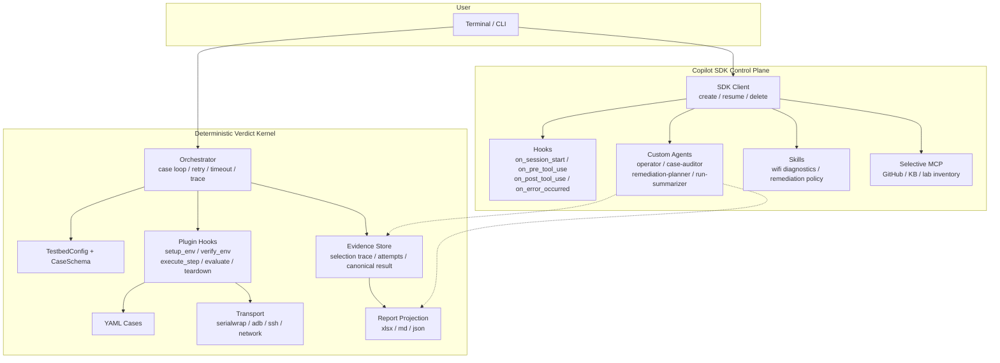
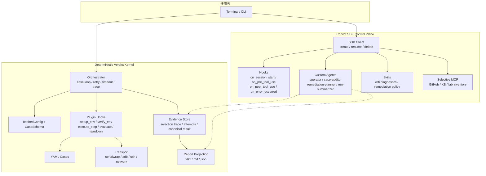
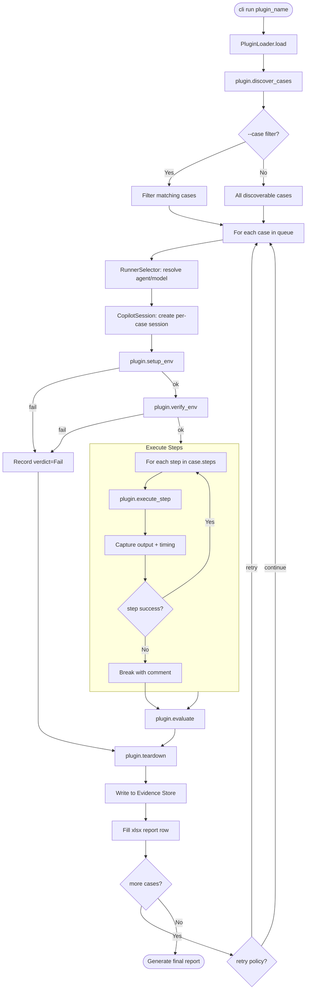

# TestPilot

> **[English](#english)** ｜ **[繁體中文](#繁體中文)**

---

## English

Plugin-based test automation framework for embedded device verification (prplOS / OpenWrt).

### Overview

TestPilot is a plugin-based test automation framework for prplOS / OpenWrt embedded devices. The architecture splits into two planes:

- **Deterministic verdict kernel** — test execution, evidence collection, pass/fail verdicts, and report projection.
- **Copilot SDK control plane** — session management, custom agents, advisory audit, and hook-governed safe remediation.

Core principle: **the Copilot SDK handles the control plane; it does NOT decide the final verdict.**

`wifi_llapi` currently supports in-run safe remediation between retry attempts. Scope is limited to environment repair only: serial session recovery, STA reconnect, band baseline rebuild, and environment re-verify. It does not rewrite YAML semantics, step commands, or pass criteria.

### Prerequisites

- **Python 3.11+**
- **[uv](https://docs.astral.sh/uv/)** — Python package manager
- **[serialwrap](https://github.com/paulc-arc/serialwrap)** — UART serial multiplexer for DUT / STA communication

After installing serialwrap, set the binary path via environment variable:

```bash
export SERIALWRAP_BIN=/path/to/serialwrap
```

Or add to `configs/testbed.yaml`:

```yaml
testbed:
  serialwrap_binary: /path/to/serialwrap
```

> Resolution order: `SERIALWRAP_BIN` env var → `testbed.yaml` config → error exit.

### Quick Start

```bash
uv pip install -e ".[dev]"                              # Install
cp configs/testbed.yaml.example configs/testbed.yaml    # First-time config
testpilot list-cases wifi_llapi                         # Verify
testpilot run wifi_llapi --dut-fw-ver BGW720-B0-403     # Run
```

### CLI Entry Points

You can use either the installed `testpilot` command or the Python module entry point.

`run` syntax is `testpilot run PLUGIN_NAME [--case CASE_ID] [--dut-fw-ver FW_VER]`. `PLUGIN_NAME` is required because TestPilot supports multiple plugins.

```bash
testpilot --version
python -m testpilot.cli --version
python -m testpilot.cli list-plugins
python -m testpilot.cli list-cases wifi_llapi
python -m testpilot.cli wifi-llapi baseline-qualify --band 5g
python -m testpilot.cli run wifi_llapi --case wifi-llapi-D004-kickstation
```

### Authentication

TestPilot supports two LLM backends. The auth chain tries each in order:

| Priority | Method | How to activate |
|----------|--------|-----------------|
| 1 | **Azure OpenAI (BYOK)** | `testpilot --azure run wifi_llapi` (interactive prompt) |
| 2 | **Azure OpenAI (env vars)** | Set `COPILOT_PROVIDER_*` env vars (see below) |
| 3 | **GitHub Copilot OAuth** | Default — no flags needed |

If all methods fail, the program exits with an error message.

#### Azure OpenAI Setup

**Option A: Interactive prompt (`--azure` flag)**

```bash
testpilot --azure run wifi_llapi --dut-fw-ver BGW720-B0-403
```

You will be asked for:
1. **Azure Endpoint URL** — e.g. `https://your-resource.openai.azure.com`
2. **Azure API Key** — your Azure OpenAI key (hidden input)
3. **Deployment Name** — e.g. `gpt-4o` (the Azure model deployment name)

**Option B: Environment variables**

```bash
export COPILOT_PROVIDER_TYPE=azure
export COPILOT_PROVIDER_BASE_URL=https://your-resource.openai.azure.com
export COPILOT_PROVIDER_API_KEY=your-api-key-here
export COPILOT_MODEL=gpt-4o
# Optional (default: 2024-10-21):
export COPILOT_PROVIDER_AZURE_API_VERSION=2024-10-21

testpilot run wifi_llapi --dut-fw-ver BGW720-B0-403
```

> **Tip:** Add the `export` lines to your shell profile (`~/.bashrc`, `~/.zshrc`) so you don't need `--azure` each time.

> **Security:** Never commit API keys to version control. Use environment variables or a `.env` file (already in `.gitignore`).

#### GitHub Copilot OAuth (Default)

If no Azure credentials are found, TestPilot falls through to GitHub Copilot OAuth via the Copilot SDK. No extra setup is required if you already have GitHub Copilot access.

### Running Tests

```bash
# Qualify reusable DUT/STA baseline before full runs
testpilot wifi-llapi baseline-qualify \
  --repeat-count 5 \
  --soak-minutes 15

# Single case (smoke test)
testpilot run wifi_llapi \
  --case wifi-llapi-D004-kickstation \
  --dut-fw-ver BGW720-B0-403

# Full suite (420 discoverable official cases)
testpilot run wifi_llapi --dut-fw-ver BGW720-B0-403

# Rebuild workbook compare against 0401.xlsx after selected live overlays
python scripts/compare_0401_answers.py \
  20260401T152827516151 \
  20260401T230006391661 \
  20260401T232631531561 \
  20260402T013838223177 \
  20260402T020432759837 \
  20260402T021317975166 \
  20260402T021716841976 \
  20260402T023927691290 \
  20260402T030604339596 \
  20260402T034832813249 \
  20260402T040807394935 \
  20260402T051006378317 \
  20260402T054957340010 \
  20260402T060543524189 \
  20260402T063003376730 \
  20260402T071356233843 \
  20260402T095404127199 \
  20260402T105808547293 \
  --output-md compare-0401.md \
  --output-json compare-0401.json

# With Azure OpenAI
testpilot --azure run wifi_llapi --dut-fw-ver BGW720-B0-403
```

Baseline experiment authority and current lab findings live in `docs/wifi-baseline-exp.md`.

### Report Outputs

| Track | Format | Purpose |
|-------|--------|---------|
| External delivery | `xlsx` | Pass / Fail only, written to Excel report |
| Internal diagnostics | `md` | Human-readable summary with per-case commands, output, log line references, and diagnostic status |
| Structured data | `json` | Machine-readable with summary stats, diagnostic status, remediation history, and log line numbers |
| UART RAW log | `DUT.log` / `STA.log` | serialwrap WAL decoded per-run UART communication records |

Output files location: `plugins/wifi_llapi/reports/`

Current workbook-calibration campaign artifacts live at repo root:

- `compare-0401.md`
- `compare-0401.json`
- answer authority: `0401.xlsx`
- workbook procedure authority for calibration: `Wifi_LLAPI` columns `G/H`
- baseline experiment authority: `docs/wifi-baseline-exp.md`
- current lab readiness status: multi-band baseline qualification is complete — `5G/6G/2.4G` all passed `baseline-qualify --repeat-count 5 --soak-minutes 15`; custom-6G hardening stabilized the old `D019/D027` 6G bring-up path, and the old `D032` `sta_band_not_ready` environment failure is gone. The invalid full run `20260412T084218316557` was stopped after early `D007`/`D009`/`D010`/`D011` multi-band instability, then both boards were hard-reset and recovered back to `READY`; patched sequential reruns `20260412T110545613993` (`D009`), `20260412T111048362099` (`D010`), and `20260412T111549474171` (`D011`) all returned `Pass/Pass/Pass` on the same baseline, so the old `D009/D010 FailEnv` and `D011 FailTest` prefix no longer reproduces
- latest full-run checkpoint: recovery commit `338891b7115e5c41d04f45bd79c70ce4b117cebc` is now pushed, and authoritative full run `20260412T113008433351` completed all `420` cases without reintroducing the old early baseline collapse (`D004`~`D013` all stayed `Pass/Pass/Pass`). `compare-0401` on that run raised the snapshot to `235 / 420 full matches`, `185 mismatches`, and `62 metadata drifts`; actionable workbook-Pass gaps are `156`
- latest calibration checkpoint: `D600 WiFi7STARole.NSTRSupport` is now the latest committed closure via official rerun `20260415T173554269251`. The stale getter-only case is refreshed from source row `416` / raw `Fail / Fail / Fail` back to workbook row `600` / raw `Pass / Pass / Pass`, and both the focused live survey plus the official rerun exact-close `WiFi.Radio.1/2/3.Capabilities.WiFi7STARole.NSTRSupport=1` on 5G/6G/2.4G with `diagnostic_status=Pass`. Overlay compare stays at `395 / 420 full matches`, `25 mismatches`, and `43 metadata drifts`, now also folds in the already-authoritative scan reruns for `D277 getScanResults() Bandwidth` and `D290 getScanResults() CentreChannel`, refreshes `D020 FrequencyCapabilities` with official rerun `20260415T180502444191`, and refreshes `D047 SupportedHe160MCS` with official rerun `20260415T182628238198`; the summary still holds at `395 / 25 / 43`, the per-band summary stays `5g 397/23`, `6g 395/25`, `2.4g 398/22`. `D020` is freshly re-confirmed as source-backed fail-shaped because both attempts still stop at `result_5g.FrequencyCapabilities` with workbook `expected=''` while the live getter and driver normalization remain `5GHz` (`6GHz` / `2.4GHz` on the other bands), while `D047` is freshly re-confirmed as a workbook/source authority conflict because the rerun exact-closes source/runtime-correct `Not Supported / N/A / N/A` with `diagnostic_status=Pass`, but the same-window 5G getter still returns `error=4 / parameter not found` while sibling `Rx/TxSupportedHe160MCS` values remain present for the same AssociatedDevice entry. `D020`, `D277`, `D289`, and `D290` therefore stay together in the verified/source-backed fail-shaped mismatch bucket, and `D047` stays in the authority-conflict blocker bucket. `D588 SSID MLDUnit` remains a workbook/source-driver authority blocker (`MLDUnit=-1 / -1 / -1`; `wl -i wlX mld_unit` is `Unsupported`; no `mld_unit=` fallback), `D508` and `D524` remain the current SSID-WMM blockers, earlier localized blockers `D490`, `D481`, `D482`, `D485`, `D454`, and `D371` remain in force, `D355-D357` stay in the CSI-client placeholder bucket, `D359 AccessPoint.IsolationEnable` remains parked behind the current single-STA lab shape, `D414/D415` remain in readiness review because workbook `G` still requires a dual-STA 802.11k split, runtime/budget guardrails are `1251 passed`, full repo regression is `1660 passed`, and there is still no clean workbook-pass-ready single case left in the compare-open set; the next investigative track therefore shifts to the shared-6G blocker review, starting with `D179 Radio.Ampdu`
- latest environment checkpoint: the recovered `getRadioAirStats()` path is now stable enough to exact-close both `D257` and `D261` without reintroducing the earlier empty-array / `wl1 bss` / STA disconnect blocker. The remaining non-green lab signal is still 6G post-verify `dut_ocv_not_zero`, so active blockers remain `D047` authority conflict plus the shared 6G baseline manifestations in `D179` and `D181`, while the historical parked note is retained in `plugins/wifi_llapi/reports/D257_block.md`
- latest blocker checkpoint before that: `D204 Radio.MultiUserMIMOEnabled` is now parked for workbook/source authority clarification after official rerun `20260414T165000634858` re-confirmed the repeated live getter shape `1 / 1 / 0`. This is not a one-off lab drift: the same `2.4g=0` shape already appears in historical authoritative traces, while workbook row `204` still says `Pass / Pass / Pass` and note `V204` simultaneously says `2.4GHz mu features are disable by default`; the workbook `H204` snippet also repeats `wl -i wl1 mu_features` instead of clearly showing the 2.4G driver check. The parked handoff now lives at `plugins/wifi_llapi/reports/D204_block.md`, active blockers remain `D047` authority conflict plus the shared 6G baseline blocker manifested in `D179` and `D181`, and the next ready non-blocked compare-open case moves to `D211 Radio.OperatingStandards`
- latest blocker checkpoint before that: `D181 Radio.FragmentationThreshold` remains blocked as another manifestation of the shared 6G `DUT + STA` baseline bring-up failure already seen in `D179`. The clean-start trial rerun `20260414T111023418516` never reached case-step execution because `verify_env` kept failing on `wl1 bss` / STA 6G recovery (`sta_baseline_bss[1] not ready after 60s cmd=wl -i wl1 bss`, `STA band baseline/connect failed`, `6G ocv fix did not stabilize wl1 after retries`). Only partial xlsx `plugins/wifi_llapi/reports/20260414_BGW720-0403_wifi_LLAPI_20260414T111023418516.xlsx` was emitted, so the provisional workbook-faithful `D181/D182` setter rewrites were rolled back to respect the YAML writeback gate. Active blockers remain `D047` authority conflict plus the shared 6G baseline blocker manifested in `D179` and `D181`, and the next ready non-blocked compare-open case moves to `D203 Radio.MaxChannelBandwidth`
- latest blocker checkpoint before that: `D179 Radio.Ampdu` is now blocked after two focused rerun phases. Workbook row `179` requires an active STA + throughput path before judging `wl -i wlx ampdu`; the DUT-only focused rerun `20260413T175446838229` proved the old no-STA replay was invalid because 5G already read `AfterSet0GetterAmpdu5g=0` while driver readback stayed `AfterSet0DriverAmpdu5g=1`, and no per-case STA evidence was produced. The follow-up clean-start DUT+STA retry `20260413T182427454124` then never reached step execution because 6G `verify_env` kept looping on wl1 recovery (`6G ocv fix did not stabilize wl1 after retries`, `sta_baseline_bss[1] not ready after 60s cmd=wl -i wl1 bss`, and final `STA 6g link check failed ... Not connected.`). Targeted D179/runtime plus command-budget guardrails are `4 passed`, final full repo regression remains `1662 passed`, overlay compare therefore stays `298 / 420 full matches`、`122 mismatches`、`58 metadata drifts`, active blockers are now `D047` authority conflict + `D179` 6G baseline bring-up, and the next ready actionable compare-open case moves to `D180 Radio.Amsdu`
- latest calibration checkpoint before that: `D178 Radio.ChannelLoad` is now aligned via official rerun `20260413T172222999250`. Workbook authority is row `178`, workbook v4.0.3 remains `Pass / Pass / Pass`, and the old authored shape has now been retired: stale row `141` plus bare getters left 6G exposed to cache drift, so the landed case collapses each band into one same-window tight-capture step that explicitly refreshes `getRadioAirStats()`, rereads `ChannelLoad?`, and derives the in-use survey load from `iw dev wlX survey dump`. The rerun exact-closes `AirLoad=ChannelLoad=SurveyChannelLoad` on all three bands under the current lab environment (`5G=84`, `6G=62`, `2.4G=98`), with the 2.4G path intentionally using floor-based survey derivation so `69/70` closes to `98` instead of `99`. Targeted D178/runtime plus command-budget guardrails are `4 passed`, final full repo regression remains `1662 passed`, overlay compare is now `298 / 420 full matches`、`122 mismatches`、`58 metadata drifts`, `D020` remains the verified fail-shaped mismatch, `D047` remains the active authority blocker, and the next ready actionable compare-open case is `D179 Radio.Ampdu`
- latest calibration checkpoint before that: `D053 TxBytes` is now aligned via official rerun `20260413T164447027184`. Workbook authority is row `53`, workbook v4.0.3 remains `Pass / Pass / Pass`, and the old authored shape has now been retired: splitting getter / snapshot / driver into separate DUT steps caused official-runner drift, so the landed case collapses each band into one same-window tight-capture step. The rerun exact-closes `AssocTxBytes=TxBytes=DriverTxBytes` on all three bands under the generic tri-band baseline (`5G=992`, `6G=25207`, `2.4G=25586`) while STA stays linked to `testpilot5G` / `testpilot6G` / `testpilot2G`. Targeted D053/runtime plus command-budget guardrails are `8 passed`, final full repo regression is now `1662 passed`, overlay compare is now `297 / 420 full matches`、`123 mismatches`、`58 metadata drifts`, `D020` remains the verified fail-shaped mismatch, `D047` remains the active authority blocker, and the next ready actionable compare-open case is `D178 Radio.ChannelLoad`
- latest calibration checkpoint: `D050 SupportedVhtMCS` is now aligned via official rerun `20260413T000249620932`. Workbook authority remains row `50`, and workbook v4.0.3 is `Pass / Not Supported / Not Supported`. Unlike `D047`, row `50` is internally consistent: workbook `G/H` already treats the standalone getter as equivalent to the sibling `RxSupportedVhtMCS` / `TxSupportedVhtMCS` evidence on the same `AssociatedDevice` entry, and note `V50` keeps `6G/2.4G` on `Not Supported`. The rerun exact-closes the 5G pass path on the generic `testpilot5G` baseline with same-station `MACAddress="2C:59:17:00:04:85"`, `SupportedVhtMCS? -> error=4 / parameter not found`, sibling `DriverRxSupportedVhtMCS=9,9,9,9` / `DriverTxSupportedVhtMCS=9,9,9,9`, and matching `wl0 sta_info` `VHT caps` / `MCS SET` / `VHT SET` lines. The landed case now projects workbook-consistent `Pass / Not Supported / Not Supported`; targeted D050 guardrails are `5 passed`, final full repo regression remains `1660 passed`, overlay compare is now `296 / 420 full matches`、`124 mismatches`、`58 metadata drifts`, `D020` remains the verified fail-shaped mismatch, `D047` remains the active authority blocker, and the next ready actionable compare-open case is `D053 TxBytes`
- active blocker after that: `D047 SupportedHe160MCS` is now confirmed as a real workbook/source authority conflict rather than a closed non-pass row. `compare-0401` correctly consumes answer columns `R/S/T`, so row `47` currently expects `Pass / Pass / Not Supported`; however the same row's legacy `I/J/K` cells and note `V47` say pWHM does not expose standalone `SupportedHe160MCS`, current 0403 installed ODL keeps `WiFi.AccessPoint.{i}.AssociatedDevice.{i}.` on sibling `RxSupportedHe160MCS` / `TxSupportedHe160MCS` only, and official rerun `20260412T235952361188` exact-closes `error=4 / parameter not found` together with sibling Rx/Tx values and live HE capability lines. Blocker handoff now lives at `plugins/wifi_llapi/reports/D047_block.md`; `D020` remains the verified fail-shaped mismatch, and the next ready actionable compare-open case is `D178 Radio.ChannelLoad`
- latest calibration checkpoint before that: `D042 RxUnicastPacketCount` is now aligned via official rerun `20260413T145000666925`. Workbook authority is row `42`, not stale row `44`, and workbook v4.0.3 remains `Not Supported / Not Supported / Not Supported`. The rerun exact-closes the supported-band same-station counter divergence on the current lab baseline: DUT `MACAddress="2C:59:17:00:04:85"`, `RxUnicastPacketCount=0`, and driver `DriverRxUnicastPacketCount=8`, while STA remains linked to `TestPilot_BTM`. The landed case now projects workbook-consistent `Not Supported / Not Supported / Not Supported`; targeted counter-stub guardrails are `2 passed`, final full repo regression remains `1660 passed`, overlay compare is now `295 / 420 full matches`、`125 mismatches`、`58 metadata drifts`, `D020` remains the verified fail-shaped mismatch, and the next ready actionable compare-open case is `D047 SupportedHe160MCS`
- latest calibration checkpoint before that: `D035 OperatingStandard` is now aligned via official rerun `20260413T144105373183`. Workbook authority is row `35`, not stale row `37` (`EncryptionMode`), and workbook v4.0.3 remains `Pass / Pass / Pass`. Current 0403 source still exposes the read-only AccessPoint AssociatedDevice `OperatingStandard` getter, while the rerun exact-closes the associated STA path on the current lab baseline: DUT `assoclist 2C:59:17:00:04:85` and `OperatingStandard="ax"` with STA still linked to `testpilot5G`. The landed case now projects workbook-consistent `Pass / Pass / Pass`; targeted assocdev getter guardrails are `40 passed`, final full repo regression is `1660 passed`, overlay compare is now `294 / 420 full matches`、`126 mismatches`、`58 metadata drifts`, `D020` remains the verified fail-shaped mismatch, and the next ready actionable compare-open case is `D042 RxUnicastPacketCount`
- latest calibration checkpoint before that: `D033 MUUserPositionId` is now aligned via official rerun `20260413T142616419984`. Workbook authority is row `33`, not stale row `35` (`OperatingStandard`), and workbook v4.0.3 remains `Not Supported / Not Supported / Not Supported`. Current 0403 source survey only finds the read-only ODL declaration for `MUUserPositionId` and no active tr181-wifi implementation, while the rerun exact-closes the same-station stub evidence on the supported bands: 5G `AssocMac5g=2c:59:17:00:04:85` with `MUUserPositionId=0`, 2.4G `AssocMac24g=2c:59:17:00:04:97` with `MUUserPositionId=0`, and 6G stays skipped in the current lab. The landed case now projects workbook-consistent `Not Supported / Not Supported / Not Supported`; targeted MU-stub guardrails are `2 passed`, overlay compare is now `293 / 420 full matches`、`127 mismatches`、`58 metadata drifts`, `D020` remains the verified fail-shaped mismatch, and the next ready actionable compare-open case is `D035 OperatingStandard`
- latest calibration checkpoint: `D057 TxUnicastPacketCount` is now aligned via official rerun `20260413T130448459477`. Workbook authority is row `57`, not stale row `59` (`UplinkBandwidth`), and workbook row 57 itself remains intentionally fail-shaped. The old custom `TestPilot_BTM` / `WPA3-Personal` / `SAE` replay was rejected because clean-start reproduction still hit `wpaie set error (-7)` with `wpa_state=DISCONNECTED`; the landed case now uses the validated generic `testpilot5G` / `WPA2-Personal` baseline and exact-closes the real fail-shaped evidence: `StaMac=AssocMAC=DriverAssocMac=2C:59:17:00:04:85`, `AssocTxPacketCount=DriverTxPacketCount=7`, `TxUnicastPacketCount=AssocTxUnicastPacketCount=0`, and `DriverTxUnicastPacketCount=7`. Targeted D057 tests are `5 passed`, final full repo regression is now `1657 passed`, overlay compare is now `288 / 420 full matches`、`132 mismatches`、`58 metadata drifts`, and the next ready actionable compare-open case is `D014 ChargeableUserId`
- latest calibration checkpoint before that: shared runtime bug `explicit setter step + capture -> synthesized readback substitution` is now fixed, and `D072 MobilityDomain` is aligned via official reruns `20260412T231545173827` and `20260412T231709014359`. Stable rerun `20260412T231709014359` exact-closes AP1/AP3/AP5 on the AP-only path with `IEEE80211r.Enabled=1`, northbound `MobilityDomain=27476`, hostapd `mobility_domain=546B`, and one `ft_over_ds=0` line per band; committed metadata is now workbook row `72` with `results_reference.v4.0.3 = Pass / Pass / Pass`. Overlay compare recomputed on top of authoritative full run `20260412T113008433351` plus D024 / D025 / D022 / D072 reruns is now `239 / 420 full matches` / `181 mismatches` / `62 drifts`, actionable workbook-Pass gaps are `152`, `D020` remains a verified fail-shaped mismatch, and the next ready `step_command_failed` revisit is `D047` / `D050`
- latest `step_command_failed` continuation after that: `D047 SupportedHe160MCS` and `D050 SupportedVhtMCS` are now re-aligned via official reruns `20260412T235952361188` / `20260413T000249620932`. The shared fix had two parts: both case YAMLs were pulled back from an unvalidated custom `TestPilot_BTM` / `WPA3-Personal` path to the authoritative generic `testpilot5G` / `WPA2-Personal` baseline seen in full run `20260412T113008433351`, and `_env_command_succeeded()` no longer misclassifies valid getter output `error=4 / message=parameter not found` as a shell failure. Metadata is now refreshed to workbook rows `47` / `50`; overlay compare stays `239 / 420` with `181` mismatches / `62` drifts because both workbook rows are non-pass (`Not Support`) semantics, and the remaining `step_command_failed` open set is `D079`、`D088`、`D460`、`D494`
- latest `step_command_failed` follow-up after that: `CommandResolver.sanitize_cli_fragment()` no longer strips setter tails from complex shell fragments like `OUT=$(ubus-cli WiFi.AccessPoint.1.MACFiltering.Mode=Off ...)`. Official rerun `20260413T002418591720` proves `D079 MACFiltering.Mode` is no longer a `step_command_failed` case: both attempts execute the full AP1/AP3/AP5 setter/getter sequence and converge to the same live shape (`Mode=Off`, no hostapd ACL lines, setter returns `invalid value`). That moves `D079` into the semantic `pass_criteria_not_satisfied` bucket because the current YAML still expects 5G `BlackList` / `deny`; the remaining `step_command_failed` open set is now `D088`、`D460`、`D494`, and the next ready revisit is `D088`
- latest `step_command_failed` closure after that: `D088 ModesSupported` is now aligned via official rerun `20260413T003340845889`. The setter-capture path now stays on the real read-only setter and emits parsable `error=15` / `message=is read only` lines for AP1/AP3/AP5, so the case exact-closes workbook-pass semantics in one attempt: 5G/2.4G keep the full mode list, 6G stays restricted to `None,WPA3-Personal,OWE`, and all three setter attempts report the expected read-only error. Metadata is now refreshed to workbook row `88`; overlay compare is `240 / 420 full matches`, `180 mismatches`, `62 drifts`, actionable workbook-Pass gaps are `151`, and the remaining `step_command_failed` open set is `D460`、`D494` with next ready revisit `D460`
- latest `step_command_failed` closure after that: `D460 HePhyCapabilities` and `D494 VHTCapabilities` are now aligned via official reruns `20260413T005520941756` / `20260413T005633950804`. `D460` was still authored against stale wrong metadata (`HECapabilities`, row `462`) even though workbook row `460` and live 0403 `wld_radio.odl` expose `HePhyCapabilities`; the refreshed case now exact-closes base64 readback on all three radios. `D494` was authored as all-radios `error=4`, but workbook row `494` and live DUT evidence actually require a protected 5G getter plus plain 6G/2.4G `parameter not found`; the refreshed case now captures protected 5G `VHTCapabilities=dliDDw==` and parses `error=4` / `message=parameter not found` on 6G / 2.4G. Overlay compare is now `242 / 420 full matches`, `178 mismatches`, `61 drifts`, and the focused `step_command_failed` queue from the original seven-case set is empty; remaining non-env open items start with semantic / mapping buckets (`D079`), env-only `D328` / `D336`, and blocked `D053`
- latest calibration continuation after that: `D461 HTCapabilities` is now aligned via official rerun `20260413T010944709855`. This one was pure mapping drift: the full-run trace had already been `evaluation_verdict=Pass`, but the case still carried stale workbook row `338` and `results_reference.v4.0.3 = Fail / Fail / Fail`; refreshing it to workbook row `461` with raw `Pass / Pass / Pass` removes the mismatch cleanly. Overlay compare is now `243 / 420 full matches`, `177 mismatches`, `61 drifts`, and the next ready phase-2 mapping/results_reference revisit is `D462`
- latest calibration continuation after that: `D462 BssColor` is now aligned via official rerun `20260413T011655056430`. This was the same stale-metadata family as D461, but with one extra mapping drift: the authoritative full-run trace had already been `evaluation_verdict=Pass`, while the case still carried stale workbook row `339`, stale source object `WiFi.Radio.{i}.`, and raw `Fail / Fail / Fail`; refreshing it to workbook row `462`, object `WiFi.Radio.{i}.IEEE80211ax.`, and raw `Pass / Pass / Pass` closes both the verdict mismatch and the mapping drift. Overlay compare is now `244 / 420 full matches`, `176 mismatches`, `60 drifts`, and the next ready phase-2 mapping/results_reference revisit is `D463`
- latest calibration continuation after that: `D463 HESIGASpatialReuseValue15Allowed` is now aligned via official rerun `20260413T012358700786`. This remained in exactly the same stale-metadata family: the authoritative full-run trace was already `evaluation_verdict=Pass`, while the case still carried stale workbook row `340`, stale source object `WiFi.Radio.{i}.`, and raw `Fail / Fail / Fail`; refreshing it to workbook row `463`, object `WiFi.Radio.{i}.IEEE80211ax.`, and raw `Pass / Pass / Pass` closes both the verdict mismatch and the mapping drift. Overlay compare is now `245 / 420 full matches`, `175 mismatches`, `59 drifts`, and the next ready phase-2 mapping/results_reference revisit is `D465`
- latest calibration continuation after that: `D465 SRGInformationValid` is now aligned via official rerun `20260413T013010016650`. This case stayed in the same metadata-drift family as `D462` / `D463`, but it also still carried a stale 6G live annotation (`live=1`) even though both the authoritative full-run trace and the rerun read back `0` on all three radios. Refreshing it to workbook row `465`, object `WiFi.Radio.{i}.IEEE80211ax.`, raw `Pass / Pass / Pass`, and the corrected 6G live note closes both the verdict mismatch and the metadata drift. Overlay compare is now `246 / 420 full matches`, `174 mismatches`, `58 drifts`, and the next ready phase-2 mapping/results_reference revisit is `D467`
- latest calibration continuation after that: `D467 RxBeamformingCapsEnabled` is now aligned via official rerun `20260413T013545364055`. Unlike `D462` / `D463` / `D465`, this one no longer had an object drift — the full-run trace was already `evaluation_verdict=Pass` with stable `DEFAULT / DEFAULT / DEFAULT`, and the only remaining defects were stale workbook row `343` and stale raw `Fail / Fail / Fail`. Refreshing it to workbook row `467` with raw `Pass / Pass / Pass` removes one more fail-shaped compare mismatch. Overlay compare is now `247 / 420 full matches`, `173 mismatches`, `58 drifts`, and the next ready workbook-Pass revisit is `D035`
- latest calibration continuation after that: `D035 AssociatedDevice OperatingStandard` did **not** land as a low-risk metadata closure. The local tri-band rewrite was trialed against official rerun `20260413T014428270219`, but both attempts still failed at `step1_5g_sta_join` with trace output `iw dev wl0 link -> Not connected.` even though the same STA verify-env log had already shown `SSID: testpilot5G` and `wpa_state=COMPLETED`. A reconnect trial rerun `20260413T015210910141` removed the immediate 5G join failure, but it then fell into a repeated 6G `ocv=0` / `ATTACH` recovery loop and was stopped without a stable final verdict. The tri-band rewrite was reverted locally, compare remains `247 / 420 full matches`, `173 mismatches`, `58 drifts`, `D035` is now tracked as a runtime blocker in `plugins/wifi_llapi/reports/D035_block.md`, and the next ready workbook-Pass revisit moves to `D045`
- latest calibration continuation after that: `D045 SignalStrength` is now aligned via official rerun `20260413T020657288045`. This was a low-risk metadata closure: the authoritative full-run trace was already `evaluation_verdict=Pass`, 5G live evidence exact-closed `AssociatedDevice.1.SignalStrength=-33` against the same-STA driver sample `DriverSignalStrength=-33`, and the only remaining defects were stale workbook row `47` plus stale raw `2.4g=Fail`. Refreshing the case to workbook row `45` and raw `Pass / Pass / Pass` raises the overlay compare to `248 / 420 full matches`, `172 mismatches`, `58 drifts`; the next ready low-risk workbook-Pass revisit is `D046`
- latest calibration continuation after that: `D046 SignalStrengthByChain` is now aligned via official rerun `20260413T021655844208`. This was the same low-risk metadata/results_reference family as `D045`: the authoritative full-run trace was already `evaluation_verdict=Pass`, and the rerun exact-closed the same 5G AssociatedDevice MAC `2C:59:17:00:04:85` across both northbound `SignalStrengthByChain="-33.0,-32.0,-41.0,-34.0"` and the same-STA driver sample `DriverSignalStrengthByChain=-33.0,-32.0,-41.0,-34.0`. The only remaining defects were stale workbook row `48` and stale raw `Fail / N/A / N/A`, so refreshing the case to workbook row `46` and raw `Pass / Pass / Pass` raises the overlay compare to `249 / 420 full matches`, `171 mismatches`, `58 drifts`
- latest calibration continuation after that: `D061 UplinkShortGuard` is now aligned via official rerun `20260413T022541033440`. This case was another low-risk metadata/results_reference closure: the authoritative full-run trace was already `evaluation_verdict=Pass`, and the rerun exact-closed the post-trigger AssociatedDevice snapshot `UplinkShortGuard=1` against the same-STA driver GI token `1.6us` and derived boolean `DriverUplinkShortGuard=1` for MAC `2C:59:17:00:04:85`. The only remaining defects were stale workbook row `63` and stale raw `Pass / N/A / N/A`, so refreshing the case to workbook row `61` and raw `Pass / Pass / Pass` raises the overlay compare to `250 / 420 full matches`, `170 mismatches`, `58 drifts`; the next ready mixed-verdict workbook revisit is `D028`
- latest calibration continuation after that: `D028 MaxBandwidthSupported` is now aligned via official rerun `20260413T023259417785`. This was not an all-pass closure: the executed 5G/2.4G steps still evaluated `Pass` (`160MHz` on AP1, `40MHz` on AP5), but workbook row `28` remains explicitly fail-shaped on 6G while the current lab continues to skip AP3/wl1 because STA association is `BCME_NOTREADY`. Refreshing the case from stale workbook row `25` and raw `Pass / Pass / Pass` to workbook row `28` and raw `Pass / Fail / Pass` removes the final mismatch and raises the overlay compare to `251 / 420 full matches`, `169 mismatches`, `58 drifts`; the next ready workbook-Pass revisit is `D065`
- latest calibration continuation after that: `D065 BridgeInterface` is now aligned via official rerun `20260413T024240506323`. This was another low-risk metadata/results_reference closure: the authoritative full-run trace already exact-closed AP1/AP3/AP5 `BridgeInterface="br-lan"` against both hostapd `bridge=br-lan` config lines and the live Linux bridge masters `BridgeMaster5g/6g/24g=br-lan`, but the case still carried stale workbook row `67` and raw `Fail / Fail / Fail`. Refreshing it to workbook row `65` and raw `Pass / Pass / Pass` raises the overlay compare to `252 / 420 full matches`, `168 mismatches`, `58 drifts`; the next ready workbook-Pass revisit is `D081`
- latest calibration continuation after that: `D081 MBOEnable` is now aligned via official rerun `20260413T025449283775`. This one was not a pure metadata drift: the old case had been calibrated against hostapd `mbo=` absence, but active 0403 source (`wifi_ap.c`) actually maps both `handle_set_ap_mbo_enable()` and `handle_get_ap_mbo_enable()` to `wl -i <if> mbo ap_enable`. Rewriting the case to force a clean `MBOEnable=0` baseline and then exact-close `ubus-cli ... MBOEnable?` against direct `wl mbo ap_enable` readback yields the workbook-Pass path on all three bands (`0 -> 1 -> 0` on AP1/AP3/AP5), refreshes the metadata from workbook row `75` to row `81`, and raises the overlay compare to `253 / 420 full matches`, `167 mismatches`, `58 drifts`; the next ready workbook-Pass revisit is `D094`
- latest calibration continuation after that: `D094 AccessPoint.Status` is now aligned via official rerun `20260413T030202219754`. This returned to the low-risk metadata/results_reference family: the authoritative full-run trace already exact-closed tri-band `Status="Enabled"` against direct driver `wl -i wl{0,1,2} bss = up`, and the isolated rerun reproduced the same shape in one attempt. The only remaining defects were stale workbook row `96`, stale raw `Fail / Fail / Fail`, and an internal `COM0/COM1` transport note mismatch; refreshing the case to workbook row `94`, raw `Pass / Pass / Pass`, and consistent COM1 transport raises the overlay compare to `254 / 420 full matches`, `166 mismatches`, `58 drifts`; the next ready workbook-Pass revisit is `D095`
- latest calibration continuation after that: `D095 UAPSDCapability` is now aligned via official rerun `20260413T030853360475`. This was another low-risk metadata/results_reference closure: the authoritative full-run trace already exact-closed tri-band read-only `UAPSDCapability=1`, and the isolated rerun reproduced the same shape alongside `HapdUapsd=0` and `DriverWmeApsd=0`, which indicate the feature is not currently active but do not contradict the capability getter. The only remaining defects were stale workbook row `97`, stale raw `Fail / Fail / Fail`, and an internal `COM0/COM1` transport note mismatch; refreshing the case to workbook row `95`, raw `Pass / Pass / Pass`, and consistent COM1 transport raises the overlay compare to `255 / 420 full matches`, `165 mismatches`, `58 drifts`; the next ready workbook-Pass revisit is `D098`
- latest calibration continuation after that: `D098 WDSEnable` is now aligned via official rerun `20260413T031458311484`. This remained in the low-risk metadata/results_reference family: the authoritative full-run trace already exact-closed tri-band setter round-trip `baseline=0 -> set=1 -> restore=0` against direct driver `dwds 0 -> 1 -> 0`, and the isolated rerun reproduced the same one-attempt Pass shape on AP1/AP3/AP5. The only remaining defects were stale workbook row `100`, stale raw `Fail / Fail / Fail`, and an internal `COM0/COM1` transport note mismatch; refreshing the case to workbook row `98`, raw `Pass / Pass / Pass`, and consistent COM1 transport raises the overlay compare to `256 / 420 full matches`, `164 mismatches`, `58 drifts`; the next ready workbook-Pass revisit is `D099`
- latest calibration continuation after that: `D099 WMMCapability` is now aligned via official rerun `20260413T032521733067`. This also closed as a low-risk metadata/results_reference drift after source review: active 0403 still routes `wifi_getApWMMCapability()` through `wldm_AccessPoint_WMMCapability()`, which probes driver iovar `wme` and returns `TRUE` on successful read, with no 6G-specific branch in the getter path. The authoritative full-run trace had already exact-closed tri-band `WMMCapability=1` and `hostapd wmm_enabled=1`, and the isolated rerun reproduced the same one-attempt Pass shape on AP1/AP3/AP5. The only remaining defects were stale workbook row `101`, stale raw `Pass / Fail / Pass`, and an internal `COM0/COM1` transport note mismatch; refreshing the case to workbook row `99`, raw `Pass / Pass / Pass`, and consistent COM1 transport raises the overlay compare to `257 / 420 full matches`, `163 mismatches`, `58 drifts`; the next ready workbook-Pass revisit is `D114`
- latest calibration continuation after that: `D114 getStationStats() AvgSignalStrengthByChain` is now aligned via official rerun `20260413T033856175894`. This was a source-backed stale-scope closure rather than a pure row/raw refresh: active 0403 `whm_brcm_ap_mlo_fillAssocDevInfo()` still fills `pAD->AvgSignalStrengthByChain = wld_ad_getAvgSignalStrengthByChain(pAD)`, and the ODL still exposes the field as a volatile read-only int32 with no band-specific branch. The old case had been left as a 5G-only artifact (`Fail / N/A / N/A`) even though workbook row `114` expects tri-band Pass. Rewriting it to a tri-band sequential `getStationStats()` case and rerunning exact-closed `AvgSignalStrengthByChain=-33` (5G), `-85` (6G), and `-23` (2.4G); verify_env had to absorb transient 6G OCV/hostapd recovery noise, but the case itself finished `Pass` in one attempt. This raises the overlay compare to `258 / 420 full matches`, `162 mismatches`, `58 drifts`; the next ready workbook-Pass revisit is `D115`
- latest calibration continuation after that: `D115 getStationStats() ConnectionDuration` is now aligned via official rerun `20260413T035856845825`. This was another source-backed stale-scope rewrite, but for a live counter rather than a static field: the ODL still exposes `ConnectionDuration` as a volatile read-only uint32, `wlgetStationInfo()` still parses driver `wl sta_info ... in network` into `connectTime`, and `local_wl_util.c` still copies `staInfo.connectTime` into the higher-level station structure with no band-specific branch in the path. The old case had been left as a 5G-only `Fail / N/A / N/A` artifact even though workbook row `115` expects tri-band Pass, so the committed rewrite expands it to tri-band sequential validation and proves the counter is live by reading `getStationStats()` twice per band and cross-checking the same STA against driver age. Official rerun `20260413T035856845825` exact-closed `7 -> 10 <= 12` on 5G, `11 -> 14 <= 16` on 6G, and `9 -> 13 <= 15` on 2.4G; verify_env again had to absorb transient 6G OCV and wl0 supplicant recovery noise, but the case still finished `Pass` in one attempt. This raises the overlay compare to `259 / 420 full matches`, `161 mismatches`, `58 drifts`; the next ready workbook-Pass revisit is `D174`
- latest calibration continuation after that: `D174 ActiveAntennaCtrl` is now aligned via official rerun `20260413T042647797154`. This returned to the low-risk metadata/results_reference family, but with an explicit source-backed explanation for the workbook `-1` shape: active 0403 `wld_radio.odl` still declares `ActiveAntennaCtrl` as a persistent int32 with default `-1`, the same model still keeps `actAntennaCtrl` / `txChainCtrl` / `rxChainCtrl` in `wld.h`, and the live vendor path (`whm_brcm_rad_antenna_map()` / `whm_brcm_rad_mod_chains()`) still treats `actAntennaCtrl` as the fallback when the specific chain controls are unset. That means the northbound getter staying at `-1` is the driver-default sentinel, while concrete `wl txchain` / `wl rxchain` masks remain a downstream realization of the same path rather than a contradiction. The authoritative full-run trace had already exact-closed `ActiveAntennaCtrl=-1` on all three radios, and the isolated rerun reproduced the same one-attempt Pass shape. The only remaining defects were stale workbook row `138` and stale raw `Fail / Fail / Fail`, so refreshing the case to workbook row `174` and raw `Pass / Pass / Pass` raises the overlay compare to `260 / 420 full matches`, `160 mismatches`, `58 drifts`; the next ready workbook-Pass revisit is `D176`
- latest calibration continuation after that: `D176 BeaconPeriod` is now aligned via official rerun `20260413T044907394777`. Unlike `D174`, this one required a source-backed AP-only setter rewrite rather than a metadata-only refresh: workbook row `176` explicitly expects baseline getter `100`, setter `1000`, and downstream hostapd `beacon_int=1000`. The committed rewrite now forces tri-band `BeaconPeriod=100` in setup, then exact-closes `ubus-cli ... BeaconPeriod?` against `/tmp/wl{0,1,2}_hapd.conf` `beacon_int` across `100 -> 1000 -> 100` on all three radios. Refreshing the case from stale workbook row `139` / raw `Fail / Fail / Fail` to workbook row `176` / raw `Pass / Pass / Pass` raises the overlay compare to `261 / 420 full matches`, `159 mismatches`, `58 drifts`; `D020` remains the verified fail-shaped mismatch, `D035` remains blocked, and the next clean stale-radio rewrite target is `D188`
- latest calibration continuation after that: `D188 DTIMPeriod` is now aligned via official rerun `20260413T050318932313`. This followed the same workbook-authoritative AP-only setter family as `D176`, but on the `3 -> 7 -> 3` DTIM path: active 0403 still exposes writable `DTIMPeriod`, and workbook row `188` explicitly expects both getter round-trip and downstream hostapd `dtim_period` convergence. The committed rewrite now forces tri-band `DTIMPeriod=3` in setup, then exact-closes `ubus-cli ... DTIMPeriod?` and `/tmp/wl{0,1,2}_hapd.conf` `dtim_period` across `3 -> 7 -> 3` on all three radios in one rerun. Refreshing the case from stale workbook row `151` / raw `Fail / Fail / Fail` to workbook row `188` / raw `Pass / Pass / Pass` raises the overlay compare to `262 / 420 full matches`, `158 mismatches`, `58 drifts`; `D020` remains the verified fail-shaped mismatch, `D035` remains blocked, and the next ready workbook-Pass revisit moves to `D034`
- latest calibration continuation after that: `D034 Noise` is now aligned via official rerun `20260413T052709875993`. The first confirmation rerun `20260413T052117345208` failed in `setup_env` (`iw dev wl0 link -> Not connected.`), which exposed the real blocker: the case still carried the same stale custom `TestPilot_BTM` / `WPA3-Personal` baseline that had already drifted out of the authoritative full run. Full-run evidence from `20260412T113008433351` had already shown the real D034 pass path on the generic `testpilot5G` / `WPA2-Personal` baseline, so the committed fix pulls D034 back to that baseline, drops the custom `sta_env_setup`, refreshes stale workbook row `36` to row `34`, and rewrites the stale `Noise=0` oracle into a same-STA live noise compare. Official rerun then exact-closed `AssociatedDevice.1.Noise=-100` against `DriverNoise=-100` for MAC `2C:59:17:00:04:85`; overlay compare is now `263 / 420 full matches`, `157 mismatches`, `58 drifts`, `D020` remains the verified fail-shaped mismatch, `D035` / `D053` remain blocked, and the next ready workbook-Pass revisit moves to `D059`
- latest calibration continuation after that: `D059 UplinkBandwidth` is now aligned via official rerun `20260413T055159421076`. This was not a pure metadata refresh: the case still carried stale workbook row `61`, a drifted custom `TestPilot_BTM` / `WPA3-Personal` baseline, and a weak driver reread path that sampled `rx nrate` before any deterministic STA uplink traffic. Full-run evidence from `20260412T113008433351` had already shown the real pass path on the generic `testpilot5G` / `WPA2-Personal` baseline, so the committed rewrite restores that baseline, refreshes the metadata to workbook row `59`, adds an explicit STA uplink trigger (`ifconfig wl0 192.168.1.3 ...` plus `ping -I wl0 -c 8 -W 1 192.168.1.1`), and re-reads the same post-trigger `AssociatedDevice.1` slot against `wl sta_info ... rx nrate`. Official rerun exact-closed `UplinkBandwidth=20`, `AssocMacAfterTrigger=DriverAssocMac=2C:59:17:00:04:85`, and `DriverUplinkBandwidth=20`; overlay compare is now `264 / 420 full matches`, `156 mismatches`, `58 drifts`, full repo regression is `1654 passed`, and the next ready workbook-Pass revisit moves to `D060`
- latest calibration continuation after that: `D060 UplinkMCS` is now aligned via official rerun `20260413T060855269192`. This was a row+parser closure rather than a semantic rewrite: the authoritative full-run trace had already exact-closed same-STA `UplinkMCS` against `wl sta_info ... rx nrate`, but the case still carried stale workbook row `62` and a fragile step4 extractor that duplicated `AssocMacAfterTrigger` because the `MACAddress` sed pipeline was missing `| head -n 1`. Refreshing the case to workbook row `60` and hardening the same-STA extractor removed that validator-only failure; the rerun exact-closed `UplinkMCS=10`, `AssocMacAfterTrigger=DriverAssocMac=2C:59:17:00:04:85`, and `DriverUplinkMCS=10`. Overlay compare is now `265 / 420 full matches`, `155 mismatches`, `58 drifts`, full repo regression remains `1654 passed`, and the next ready workbook-Pass revisit moves to `D062`
- latest calibration continuation after that: `D062 VendorOUI` is now aligned via official rerun `20260413T061743676049`. This was not a genuine fail-shaped firmware gap: the authoritative full-run trace had already exact-closed a concrete same-STA VendorOUI list through the direct getter, the same-entry `AssociatedDevice.1` snapshot, and `wl sta_info`, but the case still carried stale workbook row `64` and an outdated fail-shaped contract that expected `VendorOUI=""`. Refreshing the case to workbook row `62` and restoring the pass-shaped same-STA equality checks removed the mismatch; the rerun exact-closed `VendorOUI=AssocVendorOUI=DriverVendorOUIList=00:90:4C,00:10:18,00:50:F2,50:6F:9A` with `DriverVendorOUICount=4`. Overlay compare is now `266 / 420 full matches`, `154 mismatches`, `58 drifts`, full repo regression remains `1654 passed`, and the next ready workbook-Pass revisit moves to `D063`
- latest calibration continuation after that: `D063 VhtCapabilities` is now aligned via official rerun `20260413T062615392940`. This closed as a row+oracle refresh with one extra source-backed nuance: the case still carried stale workbook row `65` and an outdated fail-shaped contract that expected `VhtCapabilities=""`, even though the authoritative full-run trace already showed a concrete same-STA direct getter and snapshot. The first confirmation rerun proved that forcing exact equality against `wl sta_info` was too strict because the human-readable `VHT caps` line omitted `MU-BFE` while the 0403 LLAPI/snapshot still exposed `SGI80,SGI160,SU-BFR,SU-BFE,MU-BFE`; source evidence (`wlu_common.c`, `local_wl_util.c`, `swl_staCap.h`) confirms these are related but not identical renderings. Refreshing the case to workbook row `63`, restoring the pass-shaped non-empty same-STA getter/snapshot contract, and keeping the driver as a same-STA subset sanity oracle removed the mismatch. The rerun exact-closed `VhtCapabilities=AssocVhtCapabilities=SGI80,SGI160,SU-BFR,SU-BFE,MU-BFE` with driver subset `SGI80,SGI160,SU-BFR,SU-BFE`; overlay compare is now `267 / 420 full matches`, `153 mismatches`, `58 drifts`, full repo regression remains `1654 passed`, and the next ready actionable workbook-Pass revisit moves to `D070`
- latest calibration continuation after that: `D070 Enable` is now aligned via official rerun `20260413T063442091882`. This was a clean workbook row / oracle reset: the case still carried stale row `72` plus an over-authored AP toggle/readback path, even though workbook row `70` only asks for tri-band `Enable=1` with driver BSS up. Pulling the case back to row `70` and the workbook-authoritative AP-only baseline getter shape removed the mismatch cleanly; the rerun exact-closed `Enable5g/6g/24g=1` with `DriverBss5g/6g/24g=up`. Overlay compare is now `268 / 420 full matches`, `152 mismatches`, `58 drifts`, and the next ready actionable workbook-Pass revisit moves to `D071`
- latest calibration continuation after that: `D071 FTOverDSEnable` is now aligned via official rerun `20260413T064002607672`. This closure needed three stale fixes together: the case still carried workbook row `73` instead of row `71`, `sta_env_setup` pre-applied `IEEE80211r.Enabled` / `MobilityDomain` before the AP baseline `wl -i wl{0,1,2} bss` gate, and `results_reference.v4.0.3` still remained `To be tested / To be tested / To be tested`. Moving the 11r prerequisite writes back into the formal steps, refreshing metadata to workbook row `71`, and marking `results_reference.v4.0.3 = Pass / Pass / Pass` let the rerun exact-close tri-band `FTOverDSEnable=0 -> 1 -> 0` together with `MobilityDomain=4660` and hostapd `mobility_domain=3412` / `ft_over_ds` transitions on AP1 / AP3 / AP5. Overlay compare is now `269 / 420 full matches`, `151 mismatches`, `58 drifts`, and the next ready actionable open case is `D079`
- latest calibration continuation after that: `D079 MACFiltering.Mode` is now aligned via official rerun `20260413T065809885285`. This was not a firmware fail shape: the case still carried stale workbook row `73`, stale raw `Fail / Fail / Fail`, and an incorrect all-Off assumption even though workbook row `79` expects a deterministic baseline with AP1 `WhiteList` / `macaddr_acl=1` / `accept` plus AP3/AP5 `BlackList` / `macaddr_acl=0` / `deny`. Live source-backed probes first proved that true pass path, then a confirmation rerun `20260413T065611644145` showed the only remaining blocker was a non-authoritative `wl -i wl{0,1,2} bss` setup gate that sampled transient `--wlX FSM DONE--` / `down` during hostapd restart; removing that gate let the workbook row exact-close tri-band `Mode=Off -> invalid value` with after-state invariance (`WhiteList` preserved on 5G, `BlackList` preserved on 6G / 2.4G). Overlay compare is now `270 / 420 full matches`, `150 mismatches`, `58 drifts`, full repo regression is `1653 passed`, and the next ready actionable open case is `D080`
- latest calibration continuation after that: `D080 MaxAssociatedDevices` is now aligned via official rerun `20260413T071746618166`. This closure fixed a case-local capture-shaping bug rather than a firmware semantic gap: the authoritative full-run trace had already shown the true workbook row `80` pass path as tri-band getter plus hostapd `max_num_sta` convergence `32 -> 31 -> 32`, but the case still carried stale workbook row `74`, stale raw `Fail / Fail / Fail`, and a polluted setter capture where the bare ubus object line was glued into the requested-value field. Refreshing the metadata to workbook row `80`, reshaping the setter steps to emit explicit `RequestedTempMax*` / `SetterEchoMax*` fields, and exact-closing each AP against both getter and hostapd `max_num_sta` removed that false fail cleanly; the rerun proves `31` on AP1 / AP3 / AP5 during the temp phase and `32` again after restore, with hostapd `max_num_sta` remaining present on both lines per band. Overlay compare is now `271 / 420 full matches`, `149 mismatches`, `58 drifts`, full repo regression remains `1653 passed`, and the next ready actionable open case is `D082`
- latest calibration continuation after that: `D082 MultiAPType` is now aligned via official rerun `20260413T075200621380`. The real workbook row `82` authority was broader than the stale case: workbook `G/H` uses `WiFi.AccessPoint.*.MultiAPType=FronthaulBSS`, so each radio pair (`AP1/AP2`, `AP3/AP4`, `AP5/AP6`) must move together before `/tmp/wlX_hapd.conf` can legitimately converge to two `multi_ap=2` lines. The stale authored case still pointed at workbook row `76`, only toggled `AP1/AP3/AP5`, and normalized `wl -i wlX map` with a broken `sed 's/ */ /g'` shape that exploded the driver map into character-spaced output. Refreshing the case to workbook row `82`, reconstructing the dual-role baseline on all six AccessPoints, toggling each radio pair together, switching the map normalizer to `tr -s ' ' | xargs`, and giving setup a longer settle let the rerun exact-close tri-band dual-role baseline `0x3`, fronthaul-only `multi_ap=2/2` + `0x1`, and restore `0x3` again. Overlay compare is now `272 / 420 full matches`, `148 mismatches`, `58 drifts`, full repo regression remains `1653 passed`, and the next ready actionable open case is `D083` metadata-drift refresh
- latest calibration continuation after that: `D083 Neighbour` is now aligned via official rerun `20260413T080405422245`. This was a pure metadata closure: the authoritative full-run trace had already exact-closed workbook row `83` on all three bands as the AP-only object lifecycle `empty -> single entry -> empty`, but the case still carried stale workbook row `77`. Refreshing `source.row` to `83` and replaying the official single-case rerun re-proved the same add/delete pass path cleanly on AP1 / AP3 / AP5: 5G exact-closes `11:22:33:44:55:66 / 36`, 6G exact-closes `11:22:33:44:55:77 / 1`, and 2.4G exact-closes `11:22:33:44:55:88 / 11`, with all three bands returning to `ABSENT` after delete. Overlay compare remains `272 / 420 full matches`, `148 mismatches`, `58 drifts`, and the next ready actionable open case is `D084`
- latest calibration continuation after that: `D084 EncryptionMode / AccessPoint.Security` is now aligned via official rerun `20260413T081301178883`. This returned to the low-risk metadata/results_reference family once workbook row `84` was read directly: the row itself is explicitly `Not Supported / Not Supported / Not Supported` with comment `hardcode in pwhm`, while the live tri-band probe still shows the same stable shape the stale case was already checking—northbound getter `EncryptionMode="Default"` on AP1 / AP3 / AP5 even though the matching hostapd configs expose real `CCMP` ciphers (`WPA-PSK` on 5G / 2.4G, `SAE` on 6G). Refreshing the case from stale workbook row `78` and raw `Pass / Pass / Pass` to workbook row `84` and raw `Not Supported / Not Supported / Not Supported` cleanly closes the mismatch without changing commands or criteria. Overlay compare is now `273 / 420 full matches`, `147 mismatches`, `58 drifts`, and the next ready actionable open case is `D085`
- latest calibration continuation after that: `D085 KeyPassPhrase / AccessPoint.Security` is now aligned via official rerun `20260413T082022613657`. The authoritative full-run trace had already shown the real failure root cause: the setter/readback path itself was healthy on all three bands, but the stale case still carried old workbook row `79` plus a non-authoritative 6G `sae_password=` side-channel gate that workbook row `85` never asked for. Refreshing the case to workbook row `85`, keeping the quoted leading-zero setter/readback plus hostapd `wpa_passphrase=` convergence as the actual pass path, and dropping the stale 6G SAE gate let the rerun exact-close `00000000 -> 0689388783 -> 00000000` on AP1 / AP3 / AP5 in one attempt. Targeted D085 tests stay `3 passed`, full repo regression remains `1653 passed`, overlay compare is now `274 / 420 full matches`, `146 mismatches`, `58 drifts`, and the next ready actionable open case is `D086`
- latest calibration continuation after that: `D086 MFPConfig / AccessPoint.Security` is now aligned via official rerun `20260413T083419287730`. This turned out to be the same low-risk workbook row/results_reference family as `D084`: workbook row `86` is explicitly `Not Supported / Not Supported / Not Supported` with comment `hardcode in pwhm`, while active 0403 ODL still declares `MFPConfig = "Disabled"` and scopes it to WPA2 applicability. The stale case was pinned to old workbook row `80` and raw `Pass / Pass / Pass`, even though the live probe it already encoded was really demonstrating a default-biased getter (`Disabled` on all bands) against hostapd enforcement derived from live mode (`ieee80211w=0` on WPA2 5G / 2.4G, `ieee80211w=2` on WPA3 6G). Refreshing the case to workbook row `86` and raw `Not Supported / Not Supported / Not Supported` closes the mismatch without changing the runtime probe shape. Targeted D086 tests stay `3 passed`, full repo regression remains `1653 passed`, overlay compare is now `275 / 420 full matches`, `145 mismatches`, `58 drifts`, and the next ready actionable open case is `D087`
- latest calibration continuation after that: `D087 ModeEnabled / AccessPoint.Security` is now aligned via official rerun `20260413T085025879532`. Workbook row `87` is a real tri-band Pass row, but the stale authored case was still pinned to old workbook row `81` and over-gated on non-authoritative cleanup restore / exact `wpa_key_mgmt` tokens. The authoritative intent in row `87` is simpler: all three bands accept `ModeEnabled=WPA3-Personal`, getter reads back `WPA3-Personal`, and hostapd converges to the WPA3/SAE family with `ieee80211w=2`; restore remains lab hygiene, not the workbook pass gate. Refreshing metadata to workbook row `87` and aligning pass_criteria to that setter/readback authority let the rerun exact-close AP1 / AP3 / AP5 in one attempt. Targeted D087 tests stay `3 passed`, full repo regression remains `1653 passed`, overlay compare is now `276 / 420 full matches`, `144 mismatches`, `58 drifts`, and the next ready actionable open case is `D090`
- latest calibration continuation after that: `D090 RekeyingInterval / AccessPoint.Security` is now aligned via official rerun `20260413T090437438519`. This also turned out to be a stale row/semantics closure: workbook authority is row `90`, not row `92`, and row `90` is a tri-band Pass case built around `RekeyingInterval=0` plus hostapd `wpa_group_rekey` cross-check. The stale authored case had inverted that into a fail-shaped `set 3600 / expect divergence` story, even though the live full-run trace was already showing `getter=0` and `hostapd=0` on AP1 / AP3 / AP5. Refreshing metadata to workbook row `90`, restoring the workbook row-90 zero-shape, and anchoring the source note on the tagged TR-181 data-model (`RekeyingInterval -> wpa_gtk_rekey`, default `0`) let the rerun exact-close all three bands in one attempt. Targeted D090 tests now stay `4 passed`, full repo regression is `1654 passed`, overlay compare is now `277 / 420 full matches`, `143 mismatches`, `58 drifts`, and the next ready actionable open case is `D092`
- latest calibration continuation after that: `D092 WEPKey / AccessPoint.Security` is now aligned via official rerun `20260413T092400687838`. Workbook row `92` is a mixed-support case: AP1 / AP5 must first switch `ModeEnabled=WEP-128`, then set/get `WEPKey` and observe hostapd `wep_key`, while AP3 / 6G stays `Not Supported` because aligned `D088` runtime evidence still reports `ModesSupported=None,WPA3-Personal,OWE`. The stale authored case was still pinned to old workbook row `94` and only wrote `WEPKey` under the WPA2/WPA3 baseline, so the old full-run trace could only produce a no-op `WEPKey=123456789ABCD` plus no hostapd WEP lines; the first confirmation rerun `20260413T092109402810` then re-proved the remaining issue was just a case-side hostapd extractor quoting bug. Refreshing metadata to workbook row `92`, moving 5G / 2.4G onto the real `WEP-128 -> WEPKey -> hostapd wep_key -> WPA2 cleanup` path, keeping 6G on an explicit unsupported proof branch, and reshaping the extractor to a double-quote / `${line:-ABSENT}` form let the rerun exact-close `Pass / Not Supported / Pass` in one attempt. Targeted D092 tests stay `4 passed`, full repo regression is now `1655 passed`, overlay compare is now `278 / 420 full matches`, `142 mismatches`, `58 drifts`, and the next ready actionable open case is `D093`
- latest calibration continuation after that: `D093 SSIDAdvertisementEnabled` is now aligned via official rerun `20260413T094515864676`. Workbook authority is row `93`, not row `95`, and active 0403 source keeps the pass path on the advertised state: `SSIDAdvertisementEnabled=1` maps through the bool-reverse `wlHide` bridge to hostapd `ignore_broadcast_ssid=0`. The stale authored case had inverted this into a hidden-state `set 0 -> expect 2` story, while the old full-run mismatch also still carried the historical setter-to-getter substitution bug. Refreshing metadata to workbook row `93`, restoring the idempotent `set 1 -> getter 1 -> ignore_broadcast_ssid 0` shape on AP1 / AP3 / AP5, and keeping the resolver guardrail in runtime tests let the rerun exact-close tri-band `Pass / Pass / Pass` in one attempt. Targeted D093 tests stay `4 passed`, full repo regression is now `1656 passed`, overlay compare is now `279 / 420 full matches`, `141 mismatches`, `58 drifts`, and the next ready actionable open case is `D096`
- latest calibration continuation after that: `D096 UAPSDEnable` is now aligned via official rerun `20260413T095836613095`. This was another workbook-authoritative row/results_reference closure rather than a broken live probe: the stale authored case was still pinned to old workbook row `98` even though row `98` is really `WDSEnable`, while workbook row `96` keeps `UAPSDEnable` at `Not Supported / Not Supported / Not Supported`. Active 0403 source still exposes a real setter path (`UAPSDEnable` default false in `wld_accesspoint.odl`, Broadcom apply hook writes `wl wme_apsd`), so the case keeps the live tri-band round-trip evidence `0 -> 1 -> 0` with hostapd `uapsd_advertisement_enabled` and driver `wme_apsd` convergence, but `results_reference.v4.0.3` is now aligned back to row-96 authority. Official rerun `20260413T095836613095` exact-closes the same live evidence in one attempt, full repo regression remains `1656 passed`, overlay compare is now `280 / 420 full matches`, `140 mismatches`, `58 drifts`, and the next ready actionable open case is `D101`
- latest calibration continuation after that: `D111-D113 getStationStats() metadata drift trio` is now aligned via grouped official rerun `20260413T122417812289`. These three cases were already runtime-pass and compare-exact, but the authored files still carried a stale `source.row` drift of `113/114/115` instead of workbook-authoritative `111/112/113` for `AssociationTime`, `AuthenticationState`, and `AvgSignalStrength`. The cleanup is intentionally metadata-only: D111 exact-closes `AssociationTime="2026-04-07T21:50:29Z"`, D112 exact-closes `AuthenticationState=1`, and D113 exact-closes `AvgSignalStrength=0`, all in a single grouped rerun with `3/3 Pass`. Overlay compare therefore stays unchanged at `287 / 420 full matches`, `133 mismatches`, `58 drifts`, while full repo regression remains `1658 passed`; the next ready actionable compare-open case returns to `D057`
- latest calibration continuation after that: `D110 getStationStats() Active / AccessPoint` is now aligned via official rerun `20260413T121358780961`. Workbook authority is row `110`, not row `112` (`AssociationTime`), and the stale case had the same nested-field drift as D109: evaluator read `AffiliatedSta[].Active=0` instead of the top-level `Active=1`. The calibrated closure now keeps the same-station MAC proof from `wl assoclist` + `getStationStats()`, then adds the workbook-H driver oracle by matching the `AUTHORIZED` line from `wl sta_info ${STA_MAC}`; the final exact-close is `AssocMac=2C:59:17:00:04:85`, `StationStatsMac=2C:59:17:00:04:85`, `TopLevelActive=1`, `StatsMatchesAssoc=1`, `DriverAuthorized=1`. An initial strict `grep '^state:'` replay only proved the shell shape was too brittle, so the landed version keeps the same driver oracle but tolerates empty grep output and fails on evidence instead of step-shape. Targeted D110 tests stay `3 passed`, command budget stays `1 passed`, full repo regression remains `1658 passed`, overlay compare is now `287 / 420 full matches`, `133 mismatches`, `58 drifts`, and the next ready actionable open case is `D111`
- latest calibration continuation after that: `D109 getStationStats() / AccessPoint` is now aligned via official rerun `20260413T115620062809`. Workbook authority is row `109`, not row `111` (`AssociationTime`), and the stale case had drifted in two ways at once: it parsed nested `AffiliatedSta[].Active=0` instead of the top-level `Active=1`, and it tried to replay workbook `H` with `hostapd_cli sta` even though current 0403 baseline exposes `/tmp/wl0_hapd.conf` without a matching `/var/run/hostapd/wl0` control socket. The calibrated closure now uses `wl assoclist` as the stable driver-side association oracle, extracts `TopLevelActive=1` explicitly, and exact-closes same-station evidence through `AssocMac` + `StationStatsMac` + `StatsMatchesAssoc=1`; a small runtime guardrail also landed so `hostapd_cli` is treated as an executable token instead of silently falling back to `verification_command`. Targeted D109 tests stay `4 passed`, command budget stays `1 passed`, full repo regression is now `1658 passed`, overlay compare is now `286 / 420 full matches`, `134 mismatches`, `58 drifts`, and the next ready actionable open case is `D110`
- latest calibration continuation after that: `D108 UUID / AccessPoint.WPS` is now aligned via official rerun `20260413T113456092168`. Workbook authority is row `108`, not row `110`, and the real mismatch was a stale row plus an over-broad all-band pass story: the authored case treated UUID as `Pass / Pass / Pass`, but workbook row 108 keeps 6G `Not Supported` because wl1 hostapd has no `uuid=` projection even though the getter still returns a valid UUID. The calibrated case now replays the real workbook shape: AP1 / AP3 / AP5 all return the same valid UUID via getter, wl0 / wl2 exact-close the same value via hostapd `uuid=`, and wl1 exact-closes `HostapdUuid6g=`. Targeted D108 tests stay `3 passed`, command budget stays `1 passed`, final full repo regression remains `1657 passed`, overlay compare is now `285 / 420 full matches`, `135 mismatches`, `58 drifts`, and the next ready actionable open case is `D109`
- latest calibration continuation after that: `D106 RelayCredentialsEnable / AccessPoint.WPS` is now aligned via official rerun `20260413T112544193230`. Workbook authority is row `106`, not row `108` (`UUID`), and the real mismatch was another stale metadata/results_reference closure: current case semantics already exact-closed the live getter shape `RelayCredentialsEnable=0` on all three bands, but the authored file still pinned the row to `108` and kept a synthetic `Pass / Fail / Pass` verdict. Current 0403 source only exposes `RelayCredentialsEnable` as a persistent default-false bool and the source survey found no active `wps_cred_processing` backing, so the calibrated case now keeps the tri-band getter evidence while aligning `results_reference` back to workbook row-106 authority `Not Supported / Not Supported / Not Supported`. Targeted D106 tests stay `2 passed`, command budget stays `1 passed`, final full repo regression remains `1657 passed`, overlay compare is now `284 / 420 full matches`, `136 mismatches`, `58 drifts`, and the next ready actionable open case is `D108`
- latest calibration continuation after that: `D105 PairingInProgress / AccessPoint.WPS` is now aligned via official rerun `20260413T111530183752`. Workbook authority is row `105`, not row `107`, and the real drift was a stale getter-only downgrade: row `105` is a method case that enables WPS, calls `InitiateWPSPBC()`, then proves `PairingInProgress` together with hostapd `wps_get_status`. Current 0403 source still exposes both `InitiateWPSPBC()` and `PairingInProgress`, so the calibrated case now replays the real PBC flow: 5G / 2.4G exact-close `Status=Success`, `PairingInProgress=1`, `PbcStatus=Active`, while 6G under WPA3/SAE exact-closes `Status=Error_Other`, `PairingInProgress=0`, `PbcStatus=` and therefore stays `Not Supported`. Targeted D105 tests stay `2 passed`, final full repo regression remains `1657 passed`, overlay compare is now `283 / 420 full matches`, `137 mismatches`, `58 drifts`, and the next ready actionable open case is `D106`
- latest calibration continuation after that: `D104 Enable / AccessPoint.WPS` is now aligned via official rerun `20260413T105418577078`. Workbook authority is row `104`, and the real drift was stale case semantics rather than broken firmware: the authored case still carried raw `Fail / Not Supported / Fail` and gated on pre-existing WPS baseline states, while row `104` is simply a setter/readback + hostapd projection check. Current 0403 source still exposes persistent `WPS.Enable`, keeps `WPS.Configured=true` by default, and still gates button-triggered WPS actions on `[WPS.Enable==1]`, so the calibrated case now normalizes each band to `Enable=0` first, then replays `0 -> 1 -> 0` deterministically: 5G / 2.4G exact-close `wps_state=2`, 6G under WPA3/SAE exact-closes `wps_state=0`, and attempt 1's transient `step_6g_setter` serialwrap timeout is absorbed by the built-in retry path. Targeted D104 tests stay `3 passed`, final full repo regression remains `1657 passed`, overlay compare is now `282 / 420 full matches`, `138 mismatches`, `58 drifts`, and the next ready actionable open case is `D105`
- latest calibration continuation after that: `D101 ConfigMethodsEnabled` is now aligned via official rerun `20260413T103130805176`. Workbook authority is row `101`, not row `103` (`Configured`), and row `101` is a getter + hostapd projection check rather than the stale setter replay that had drifted into the authored case. Reading row `101` directly and replaying it on current 0403 runtime exact-closes the right shape: 5G / 2.4G return `CfgEnabled=PhysicalPushButton,VirtualPushButton` and hostapd `config_methods=physical_push_button virtual_push_button`, while 6G under the WPA3/SAE baseline returns `CfgEnabled=None` and no hostapd `config_methods` line, matching the workbook's own `Not Supported` note. Targeted D101 tests stay `4 passed`, final full repo regression is `1657 passed`, overlay compare is now `281 / 420 full matches`, `139 mismatches`, `58 drifts`, and the next ready actionable open case is `D104`
- latest direct-stats continuation after that: `D324 BytesSent` is now aligned in the local repo state. The earlier base-interface oracle is still rejected, but the source-backed WDS-sum authority `wl if_counters txbyte + matching wds txbyte` is now committed after moving it into a raw-first single snapshot per band. Official rerun `20260412T060612008433` exact-closed 5G/6G/2.4G at `1141986/1141986/1141986`, `1113827/1113827/1113827`, and `1186105/1186105/1186105`; this proved the older `direct < getSSIDStats < driver` staircase was sequential refresh noise between separately sampled reads, not a semantic mismatch in the WDS-sum formula itself. `plugins/wifi_llapi/reports/D324_block.md` is now retained only as historical trial/resolution evidence, and the next ready open-set revisit now moves to `D295`
- latest action-method continuation after that: `D295 scan()` is now aligned in the local repo state via official rerun `20260412T064317622551`. The stricter `first scan BSSID == first driver BSSID` trial was rejected by rerun `20260412T063939977577`, which showed driver-cache ordering is not durable even while the same public first target persists; the committed oracle therefore keeps the prepared `STA + links` topology but only requires the first `scan()` BSSID to exist somewhere in same-band `wl escanresults`. The resolving rerun exact-closed 5G `62:15:db:9e:31:f1`, 6G `86:82:fe:58:ac:a6`, and 2.4G `6a:d7:aa:02:d7:bf`, and the next ready open-set revisit now moves to `D281`
- latest shared-baseline continuation after that: unresolved placeholder `sta_env_setup` templates are now treated as templates and skipped during runtime setup, `_env_command_succeeded()` now rejects missing wpa config / ctrl-ifname / placeholder-traffic failures, and the 6G OCV stabilization loop now accepts a restarted `wl1` `hostapd` process when the control socket is briefly absent during clean start. Clean-start official rerun `20260412T033924192464` therefore no longer failed at `assoc_5g` / baseline setup: both attempts reached `evaluate`, 5G assoc stayed present, and the old environment-layer blocker disappeared. `D324` still remains blocked, but now only as a counter-refresh mismatch in the real runner path — attempt 1 failed at `5G 329835 / 329835 / 305843`, attempt 2 failed at `5G 562142 / 562414 / 537347`, with smaller 6G/2.4G driver lag on the same rerun. Regression after these shared fixes: targeted runtime guardrails `11 passed`, full repo suite `1640 passed`, and the next ready open-set revisit moves to `D331`
- latest direct-stats continuation after that: `D322 BroadcastPacketsSent` is now aligned in the local repo state. The earlier official rerun `20260411T230829194313` had looked like a stale `/proc/net/dev_extstats` `$24` problem because 5G kept a fixed `+1`, but the resolving official rerun `20260412T002445088386` showed it was actually a runner-timing issue right after the 6G OCV/hostapd stabilization path. Keeping the workbook `/proc $24` oracle and inserting a short post-`verify_env` settle (`sleep 2`) let attempt 2 exact-close all three bands: `4596/4596/4596`, `4772/4772/4772`, `5121/5121/5121`, and the committed metadata is now refreshed from stale row `246` to workbook row `322`
- latest direct-stats continuation after that: `D330 MulticastPacketsReceived` is now aligned in the local repo state. Isolated rerun `20260411T191809490680` closed the active 0403 source-backed formula `max((rxmulti + matching wds_rxmulti) - BroadcastPacketsReceived, 0)` on all three bands; attempt 1 hit `/tmp/_tp_cmd.sh: line 2: syntax error: unterminated quoted string`, but attempt 2 exact-closed `direct / getSSIDStats / driver-formula = 0 / 0 / 0` on 5G, 6G, and 2.4G, and the committed metadata is now refreshed from stale row `254` to workbook row `330`
- latest direct-stats continuation after that: `D331 MulticastPacketsSent` remains formally blocked in `plugins/wifi_llapi/reports/D331_block.md`. The initial source-backed trial reruns (`20260411T192138186700` / `20260411T192524301950`) rejected the stale workbook `/proc/net/dev_extstats` `$18` compare but still showed a fixed 5G `driver = direct + 4` drift; the superseding official rerun `20260411T234124237416` then proved the formula was still not runner-stable, with 5G widening to `286001 / 286001 / 286006` and then `286140 / 286140 / 286192`. A follow-up settle retrial `20260412T003609854183` materially narrowed that shape — 5G and 2.4G exact-closed on both attempts after a post-`verify_env` `sleep 2`, but 6G still failed at `181336 / 181336 / 181337` and `181375 / 181375 / 181377`. Focused DUT-only probes still exact-close outside the runner, so the formula rewrite stays rolled back
- latest direct-stats continuation after that: `D331 MulticastPacketsSent` is now aligned in the local repo state. Clean-start official rerun `20260412T040941971904` resolved the remaining runner drift by switching the case from the stale workbook `/proc/net/dev_extstats` `$18` compare to a raw-first single-snapshot source-backed formula: each band now samples `wl if_counters txmulti + matching wds txmulti` first, then captures one `getSSIDStats()` snapshot for both `MulticastPacketsSent` and `BroadcastPacketsSent`, and finally cross-checks the direct getter in the same shell step. That rerun exact-closed 5G/6G/2.4G at `904/904/904`, `732/732/732`, and `973/973/973`; the committed metadata is now refreshed from stale row `255` to workbook row `331`, `results_reference.v4.0.3` is now `Pass/Pass/Pass`, `plugins/wifi_llapi/reports/D331_block.md` is retained only as historical trial evidence, and the next ready open-set revisit now moves to `D333`
- latest direct-stats continuation after that: `D332 PacketsReceived` is now aligned in the local repo state. Stale workbook-style replay `20260411T194312398713` first re-proved both failures at once: `/proc/net/dev_extstats` `$3` drifted high (`5G 2234/2237` vs direct `2000/2002`) and the loose `getSSIDStats()` extractor overmatched unrelated fields, leaving `expected=0`. After refreshing the case to workbook row `332`, anchoring the `getSSIDStats()` extraction, and switching the driver oracle to the active 0403 source-backed formula `wl if_counters rxframe + matching wds rxframe`, rerun `20260411T194647490016` passed in one attempt
- latest direct-stats continuation after that: `D333 PacketsSent` is now aligned in the local repo state. The stale workbook `/proc/net/dev_extstats` `$11` oracle remains rejected; the committed case now keeps the anchored `PacketsSent` extractor plus the source-backed snapshot formula `wl if_counters txframe + matching wds txframe`. Clean-start official rerun `20260412T054702963914` exact-closed 5G/6G/2.4G at `461/461/461`, `592/592/592`, and `707/707/707`, after the shared 6G baseline hot path was hardened with driver-assoc fallback, looser post-restart OCV acceptance, and a longer generic 6G settle window. The committed metadata is now refreshed from stale row `257` to workbook row `333`, `results_reference.v4.0.3` stays `Pass/Pass/Pass`, `plugins/wifi_llapi/reports/D333_block.md` is retained only as historical trial/resolution evidence, and the next ready open-set revisit now moves to `D324`
- latest direct-stats continuation after that: `D335 UnicastPacketsReceived` is now aligned in the local repo state. Stale workbook replay `20260411T200329824574` re-proved that `/proc/net/dev_extstats` `$21` is no longer authoritative on 0403 (`5G 2001/746`, `6G 788/391`, `2.4G 483/235` across direct/getSSIDStats vs proc), while active 0403 source now explicitly derives `UnicastPacketsReceived = PacketsReceived - MulticastPacketsReceived` in `whm_brcm_api_ext.c` and then copies/accumulates that field across matching VAP/WDS stats in `whm_brcm_vap.c`. After rewriting the case to the source-backed formula `(wl if_counters rxframe + matching wds rxframe) - (wl if_counters rxmulti + matching wds rxmulti)`, rerun `20260411T200851584762` exact-closed on all three bands: 5G `2003/2003/2003`, 6G `794/794/794`, and 2.4G `483/483/483`
- latest direct-stats continuation after that: `D336 UnicastPacketsSent` is now aligned in the local repo state. Stale workbook replay `20260411T201639103833` re-proved `/proc/net/dev_extstats` `$22` as a stale zero-shaped oracle, while the earlier signed txframe/txmulti trials only got close. The resolving official rerun `20260412T000744842751` then passed after switching the driver oracle to the active 0403 unsigned formula `((txframe + matching wds txframe) - (d11_txmulti + matching wds d11_txmulti)) & 0xffffffff`: attempt 1 still drifted on 6G by `+1` (`24709 / 24710 / 24710`), but attempt 2 exact-closed all three bands (`27172/27172/27172`, `24703/24703/24703`, `17117/17117/17117`)
- latest scan-results continuation after that: `D277 getScanResults() Bandwidth` is now aligned in the local repo state via isolated rerun `20260411T205454026707`. Moving the case to a transport-safe first-scan-object capture removed the old 6G full-payload broker recovery blocker, and the new workbook-style same-target replay now closes authoritatively against `wl escanresults` Chanspec bandwidth: 5G exact-closes at `80/80`, 2.4G exact-closes at `20/20`, while 6G is now locked as a source-backed fail-shaped mismatch at `LlapiBandwidth6g=320` vs `WlBandwidth6g=160` for the same target BSSID `6e:15:db:9e:33:72`. The committed metadata is refreshed from stale row `279` to workbook row `277`, `results_reference.v4.0.3` is now `Pass / Fail / Pass`, and targeted D277 guardrails are green
- latest scan-results continuation after that: `D281 getScanResults() Noise` is now aligned via official rerun `20260412T080123446178`. The blocker turned out to be the CLI call shape rather than the absence of a same-scan public family: named-arg `scanCombinedData(channels=36/5/1,minRssi=-127,scanReason=Ssid)` now yields paired `BSS + Spectrum`, and same-target `getScanResults(minRssi=-127)` exact-closes against that same-scan cache on all three bands — 5G `2c:59:17:00:03:e5 / -100 / -100 / -100`, 6G `6e:15:db:9e:33:72 / -97 / -97 / -97`, and 2.4G `6a:d7:aa:02:d7:bf / -76 / -76 / -76`. The committed metadata is refreshed from stale row `283` to workbook row `281`, and `plugins/wifi_llapi/reports/D281_block.md` is retained as historical resolution notes
- latest scan-results continuation after that: `D282 getScanResults() OperatingStandards` is now aligned via official rerun `20260412T080338867826`. The durable same-source oracle is the same named-arg `scanCombinedData()` family rather than `NeighboringWiFiDiagnostic()`: `scanCombinedData().BSS` and immediate same-target `getScanResults(minRssi=-127)` exact-close 5G `2c:59:17:00:03:e5 / a,n,ac,ax,be`, 6G `6e:15:db:9e:33:72 / ax,be`, and 2.4G `6a:d7:aa:02:d7:bf / b,g,n,ax`. The committed metadata is refreshed from stale row `284` to workbook row `282`, and `plugins/wifi_llapi/reports/D282_block.md` is retained as historical resolution notes
- current repo-authoritative true-open set in this scan-results workstream is now empty; there is no remaining ready open-set case
- latest scan-results continuation after that: `D283 getScanResults() RSSI` is now aligned in the local repo state. The old blocker was the committed full-payload transport shape, not the row semantics: isolated rerun `20260411T214050136894` had hung after `setup_env`, but switching D283 to a D277-style transport-safe first-object capture removed that failure path. Active 0403 source tracing still shows `D283 RSSI` and `D286 SignalStrength` are the same public `ssid->rssi` field family, so the committed D283 oracle now locks only the durable public facts on the first serialized scan object: parseable BSSID, numeric `RSSI`, and `SignalStrength == RSSI`. Official reruns `20260412T013944779069` and `20260412T014018880783` both exact-closed the same all-band shape — 5G `38:88:71:2f:f6:a7 / -66 / -66`, 6G `6e:15:db:9e:33:72 / -95 / -95`, 2.4G `2c:59:17:00:03:f7 / -47 / -47` — so the committed metadata is now refreshed from stale row `285` to workbook row `283`, `plugins/wifi_llapi/reports/D283_block.md` is retained as historical resolution notes, and the next ready runtime-triage case is `D284`
- latest scan-results continuation after that: `D284 getScanResults() SecurityModeEnabled` is now aligned in the local repo state. The old blocker turned out to be an unstable 6G selector rather than a fundamental replay gap: the earlier first-WPA-target and associated-BSSID rewrites drifted between `.ROAMTEST_RSNO_P10P_1`, `OpenWrt_1`, and missing same-target LLAPI placeholders, but switching to a D283-style transport-safe first-object capture locked one stable same-target replay across all three bands. Official reruns `20260412T015141491861` and `20260412T015235280960` both exact-closed 5G `38:88:71:2f:f6:a7 / WPA2-Personal / WPA2-Personal`, 6G `6e:15:db:9e:33:72 / WPA3-Personal / WPA3-Personal`, and 2.4G `2c:59:17:00:03:f7 / WPA2-Personal / WPA2-Personal`. The committed metadata is now refreshed from stale row `286` to workbook row `284`, `plugins/wifi_llapi/reports/D284_block.md` is retained as historical resolution notes, and the next ready runtime-triage case is `D285`
- latest scan-results continuation after that: `D285 getScanResults() SignalNoiseRatio` is now aligned in the local repo state. The old blocker was the raw-driver oracle, not the public row itself: 0403 neighboring scan internals still carry `SignalStrength` plus `Noise`, while public `scanresult_t` exposes `SignalNoiseRatio` on the serialized scan object. Switching D285 to the same D283-style transport-safe first-object capture let the committed case validate the durable public invariant `SignalNoiseRatio == RSSI - Noise` on the same target. Official reruns `20260412T020817105728` and `20260412T020839239161` both exact-closed 5G `38:88:71:2f:f6:a7 / -66 / -100 / 34`, 6G `6e:15:db:9e:33:72 / -95 / -97 / 2`, and 2.4G `2c:59:17:00:03:f7 / -47 / -80 / 33`. The committed metadata is now refreshed from stale row `287` to workbook row `285`, `plugins/wifi_llapi/reports/D285_block.md` is retained as historical resolution notes, and the next ready runtime-triage case is `D286`
- latest scan-results continuation after that: `D286 getScanResults() SignalStrength` is now aligned in the local repo state. The old blocker was the external replay model, not the public row itself: active 0403 source tracing already showed `SignalStrength` and `RSSI` are the same public `ssid->rssi` family, so D286 can use the same D283-style transport-safe first-object capture instead of chasing `iw` / raw-driver drift. Official reruns `20260412T021725610895` and `20260412T021748934770` both exact-closed 5G `38:88:71:2f:f6:a7 / -66 / -66`, 6G `6e:15:db:9e:33:72 / -95 / -95`, and 2.4G `2c:59:17:00:03:f7 / -47 / -47`. The committed metadata is now refreshed from stale row `288` to workbook row `286`, `plugins/wifi_llapi/reports/D286_block.md` is retained as historical resolution notes, and the next ready runtime-triage case is `D287`
- latest scan-results continuation after that: `D287 getScanResults() SSID` is now aligned in the local repo state. The old blocker was the stale 6G selector, not the public field model itself: active 0403 still serializes public `SSID` from the parsed scan-result model, and switching D287 to the same transport-safe first-object capture already proven by D283-D286 locked one durable same-target replay across all three bands. Official reruns `20260412T022708923585` and `20260412T022738004752` both exact-closed 5G `38:88:71:2f:f6:a7 / Verizon_Z4RY7R / Verizon_Z4RY7R`, 6G `6e:15:db:9e:33:72 / **TELUS0227 / **TELUS0227`, and 2.4G `2c:59:17:00:03:f7 / OpenWrt_1 / OpenWrt_1`. The committed metadata is now refreshed from stale row `289` to workbook row `287`, `plugins/wifi_llapi/reports/D287_block.md` is retained as historical resolution notes, and the next ready runtime-triage case returns to `D281`
- latest scan-results continuation after that: `D281 getScanResults() Noise` remains blocked even after the cleaner split-step same-channel public-spectrum rewrite. Three consecutive official reruns now settle as `Fail -> pass after retry -> Fail`: `20260412T023953395097` failed twice on 2.4G `Noise=-80` vs `SpectrumNoise=-78`, `20260412T024026359700` passed only after retry when attempt 1 hit `-80/-82` and attempt 2 exact-closed, and `20260412T024310730084` failed again with the same 2.4G `-80/-78` drift. 5G and 6G exact-close throughout, so the blocker is now tightly isolated to unstable 2.4G spectrum-cache replay rather than temp-script transport. The local rewrite is rolled back again, the committed YAML stays unchanged at stale row `283`, `plugins/wifi_llapi/reports/D281_block.md` is the superseding blocker authority, and the next ready runtime-triage case is `D282`
- latest scan-results continuation after that: `D281 getScanResults() Noise` remains blocked with stronger source-backed confidence. New 0403 tracing now proves the currently tested public replay is structurally cross-generation: `getScanResults().Noise` comes from the scan-complete spectrum snapshot, but later `getSpectrumInfo()` first clears `scanState.spectrumResults` and rebuilds it from a fresh nl80211 survey. The only public same-scan family exposed in source is `scanCombinedData()/getScanCombinedData()`, but current DUT probes still cannot turn that into a runner-stable oracle: `getScanCombinedData()` returns BSS data with empty `Spectrum`, while direct `scanCombinedData(...)` calls through both `ba-cli` and `ubus-cli` still fail with `status 1 - unknown error`. So the committed YAML still stays unchanged at stale row `283`, `plugins/wifi_llapi/reports/D281_block.md` remains the superseding blocker authority, and the next ready runtime-triage case stays `D282`
- latest scan-results continuation after that: `D290 getScanResults() CentreChannel` is now aligned in the local repo state. The old blocker was too tightly scoped to the `iw` replay path: after a one-shot environment repair (`wifi-llapi baseline-qualify --repeat-count 1 --soak-minutes 0`) re-applied deterministic DUT baseline, fresh isolated rerun `20260411T220324862766` closed the same-target raw `wl escanresults` Chanspec replay on all three bands. 5G exact-closes at `LlapiCentreChannel5g=42` vs `WlCentreChannel5g=42`, 2.4G exact-closes at `1/1`, and 6G is now locked as a source-backed fail-shaped mismatch at `LlapiCentreChannel6g=31` vs `WlCentreChannel6g=15` for the same target BSSID `6e:15:db:9e:33:72`. The committed metadata is refreshed from stale row `292` to workbook row `290`, `results_reference.v4.0.3` is now `Pass / Fail / Pass`, targeted D290 guardrails are green, and the next ready runtime-triage case is `D529`
- latest spectrum continuation after that: `D529 getSpectrumInfo channel` is now aligned in the local repo state. Active 0403 source keeps the public field on the spectrum output path `_getSpectrumInfo()` -> `s_prepareSpectrumOutput()` -> `amxc_var_add_key(uint32_t, "channel", llEntry->channel)`, and fresh isolated rerun `20260411T221613327385` plus repeated direct probes now lock the first serialized spectrum-entry channels at `36 / 2 / 1` on `5g / 6g / 2.4g`. The committed case therefore fixes the template metadata shape (`object=WiFi.Radio.{i}.`, `api=getSpectrumInfo()`), upgrades the old generic numeric regex to explicit first-entry channel extractors, keeps `results_reference.v4.0.3` at `Pass / Pass / Pass`, and moves the next ready case to `D530`
- latest spectrum continuation after that: `D530 getSpectrumInfo noiselevel` is now aligned in the local repo state, but not as a fixed-value case. Active 0403 source keeps the public field on `_getSpectrumInfo()` -> `s_prepareSpectrumOutput()` -> `amxc_var_add_key(int32_t, "noiselevel", llEntry->noiselevel)`, so the numeric value is a live survey reading rather than a stable constant. A first exact-value trial was rejected after 2.4G drifted across retries/reruns (`-75 / -77 / -78`), so the committed case only fixes the template metadata shape (`object=WiFi.Radio.{i}.`, `api=getSpectrumInfo()`), keeps the source-correct numeric regex verdict shape, and uses isolated rerun `20260411T222349217612` as the green lock; the next ready case is now `D531`
- latest spectrum continuation after that: `D531 getSpectrumInfo accesspoints` is now aligned in the local repo state, again as a metadata-only dynamic numeric case. Active 0403 source keeps the public field on `_getSpectrumInfo()` -> `s_prepareSpectrumOutput()` -> `amxc_var_add_key(uint32_t, "accesspoints", llEntry->nrCoChannelAP)`, so the field is a survey-driven co-channel AP count rather than a fixed constant. The committed case therefore only fixes the template metadata shape (`object=WiFi.Radio.{i}.`, `api=getSpectrumInfo()`), keeps the source-correct numeric regex verdict shape, and uses isolated rerun `20260411T223140870454` as the green lock; the next ready case is now `D532`
- latest spectrum continuation after that: `D532 getSpectrumInfo ourUsage` is now aligned in the local repo state as another metadata-only dynamic numeric case. Active 0403 source keeps the public field on `_getSpectrumInfo()` -> `s_prepareSpectrumOutput()` -> `amxc_var_add_key(uint32_t, "ourUsage", llEntry->ourUsage)`, while `wld_rad_nl80211_updateUsageStatsFromSurveyInfo()` derives that live percentage from survey airtime (`ourTime / total_time`). Fresh isolated rerun `20260411T223658523608` passed cleanly with the generic numeric verdict shape, and workbook inspection of `0401.xlsx` also exposed a stale `source.row` drift across the whole spectrum batch: `D528-D533` now use the actual workbook rows `528-533` instead of the stale `530-535` carry-over. The next ready case is now `D533`
- latest spectrum continuation after that: `D533 getSpectrumInfo availability` is now aligned in the local repo state as the last metadata-only dynamic numeric case in this spectrum batch. Active 0403 source keeps the public field on `_getSpectrumInfo()` -> `s_prepareSpectrumOutput()` -> `amxc_var_add_key(uint32_t, "availability", llEntry->availability)`, while `wld_rad_nl80211_updateUsageStatsFromSurveyInfo()` derives the live percentage from survey idle/free-time timing. Fresh isolated rerun `20260411T224035464927` passed cleanly with the generic numeric verdict shape, so the `D528-D533` spectrum block is now fully row-corrected and aligned; the next unresolved queue returns to `D322`, `D331`, `D333`, and `D336`
- latest direct-stats continuation after that: `D325 DiscardPacketsReceived` is now aligned as a plain `Pass/Pass/Pass` row. Workbook row `325`'s old `/proc/net/dev_extstats` field `$5` compare had already failed in real runner replay `20260411T010859993578` (`565 / 3854 / 356`-style stale proc drift), and the active 0403 source path was already proven by `D304` to overwrite this field from `whm_brcm_get_if_stats()` / `wl if_counters rxdiscard`; after rewriting the direct-property case to that oracle, real runner rerun `20260411T011321267947` exact-closed on all three bands: 5G `0 / 0 / 0`, 6G `0 / 0 / 0`, and 2.4G `0 / 0 / 0` across direct/getSSIDStats/if_counters. The committed metadata is now refreshed from stale row `249` to workbook row `325`, targeted validation is green (`1 passed` official-case guardrail), full repo regression is green (`1634 passed`), and the next ready patch-driven workbook-Pass case in the current repo inventory is `D326`
- latest direct-stats continuation after that: `D326 DiscardPacketsSent` is now aligned as a plain `Pass/Pass/Pass` row. Workbook row `326`'s old `/proc/net/dev_extstats` field `$13` compare failed in real runner replay `20260411T012137925510` (`184 / 3467 / 87`-style stale proc drift), while the active 0403 source path is now re-confirmed by both the fresh D326 survey and the already aligned `D305` oracle: `whm_brcm_get_if_stats()` writes `DiscardPacketsSent` from `wl if_counters txdiscard`; after rewriting the direct-property case to that source-backed readback, real runner rerun `20260411T012538161460` exact-closed on all three bands: 5G `0 / 0 / 0`, 6G `0 / 0 / 0`, and 2.4G `0 / 0 / 0` across direct/getSSIDStats/if_counters. The committed metadata is now refreshed from stale row `250` to workbook row `326`, targeted validation is green (`1 passed` official-case guardrail), full repo regression is green (`1634 passed`), and the next ready patch-driven workbook-Pass case in the current repo inventory is `D327`
- latest direct-stats continuation after that: `D327 ErrorsReceived` is now aligned as a plain `Pass/Pass/Pass` row. Workbook row `327`'s legacy `/proc/net/dev_extstats` field `$4` compare still exact-closed at zero in real runner replay `20260411T013241354703`, but the active 0403 source path is now re-confirmed by both the fresh D327 survey and the already aligned `D306` oracle: `whm_brcm_get_if_stats()` writes `ErrorsReceived` from `wl if_counters rxerror`; after refreshing the direct-property case to that source-backed readback, real runner rerun `20260411T013801878458` still exact-closed on all three bands: 5G `0 / 0 / 0`, 6G `0 / 0 / 0`, and 2.4G `0 / 0 / 0` across direct/getSSIDStats/if_counters. The committed metadata is now refreshed from stale row `251` to workbook row `327`, targeted validation is green (`1 passed` official-case guardrail), full repo regression remains green (`1634 passed`), and the next ready patch-driven workbook-Pass case in the current repo inventory is `D328`
- latest direct-stats continuation after that: `D328 ErrorsSent` is now aligned as a plain `Pass/Pass/Pass` row. The first real runner replay (`20260411T014458979418`) still exact-closed the legacy `/proc/net/dev_extstats` field `$12` compare at zero, but active 0403 source is now re-confirmed by the fresh D328 survey and the already aligned `D307` path: `whm_brcm_get_if_stats()` seeds `ErrorsSent` from `wl if_counters txerror`, with optional WDS accumulation in `whm_brcm_vap_ap_stats_accu()`. A focused live probe also showed this is a real moving counter rather than a fixed workbook sample (`5G=1`, `6G=3347`, `2.4G=0` across direct/getSSIDStats/txerror). After refreshing the direct-property case to the source-backed `txerror` readback, real runner rerun `20260411T015126498621` still exact-closed on all three bands: 5G `0 / 0 / 0`, 6G `0 / 0 / 0`, and 2.4G `0 / 0 / 0` across direct/getSSIDStats/if_counters. The committed metadata is now refreshed from stale row `252` to workbook row `328`, targeted validation is green (`1 passed` official-case guardrail), full repo regression remains green (`1634 passed`), and the next ready patch-driven workbook-Pass case in the current repo inventory is `D329`
- latest direct-stats continuation after that: `D329 FailedRetransCount` is now aligned as a plain `Pass/Pass/Pass` row. The first real runner replay (`20260411T015905984272`) exact-closed direct Stats and getSSIDStats() at zero on all three bands, but it still lacked an independent driver oracle. Active 0403 source is now re-confirmed by the fresh D329 survey and the already aligned `D308` path: `whm_brcm_get_if_stats()` writes `FailedRetransCount` from `wl if_counters txretransfail`, with optional WDS accumulation in `whm_brcm_vap_ap_stats_accu()`. A focused live probe then exact-closed `direct / getSSIDStats / txretransfail` at `0 / 0 / 0` on 5G, 6G, and 2.4G, while also showing there is no active `wds*` peer in the current baseline. After refreshing the direct-property case to the source-backed `txretransfail` readback, real runner rerun `20260411T020534026608` still exact-closed on all three bands: 5G `0 / 0 / 0`, 6G `0 / 0 / 0`, and 2.4G `0 / 0 / 0` across direct/getSSIDStats/if_counters. The committed metadata is now refreshed from stale row `253` to workbook row `329`, targeted validation is green (`1 passed` official-case guardrail), full repo regression remains green (`1634 passed`), and the next ready patch-driven workbook-Pass case in the current repo inventory is `D334`
- latest direct-stats continuation after that: `D334 RetransCount` is now aligned as a plain `Pass/Pass/Pass` row. The first real runner replay (`20260411T021238026451`) exact-closed direct Stats and getSSIDStats(), but it still lacked an independent driver oracle and the original extractor could ambiguously match `FailedRetransCount`. Active 0403 source is now re-confirmed by the fresh D334 survey at `wldm_SSID_TrafficStats()` -> `wl if_counters txretrans`, without WDS accumulation on the direct-property path. A focused live probe then closed the source-backed low-32 driver view at 5G `4294967295`, 6G `4294963915`, and 2.4G `0` across direct/getSSIDStats/low-32(txretrans). After refreshing the direct-property case to use anchored `getSSIDStats()` extraction plus the low-32 `txretrans` oracle, real runner rerun `20260411T022030741126` passed on retry: attempt 1 still saw a transient 6G drift (`4294967294` vs driver `0`), but attempt 2 exact-closed all three bands at `0 / 0 / 0`. The committed metadata is now refreshed from stale row `258` to workbook row `334`, targeted validation is green (`1 passed` official-case guardrail), the command-budget inventory now tracks `630` long official-case commands, full repo regression remains green (`1634 passed`), and the next ready patch-driven workbook-Pass case in the current repo inventory is `D337`
- latest direct-stats continuation after that: `D337 UnknownProtoPacketsReceived` is now aligned as a plain `Pass/Pass/Pass` row. The first real runner replay (`20260411T023258929853`) already exact-closed direct Stats and getSSIDStats() at zero on all three bands, but it still lacked an independent driver oracle. Active 0403 source is now re-confirmed by the fresh D337 survey at `wldm_SSID_TrafficStats()` -> `wl if_counters rxbadprotopkts`, without WDS accumulation on the direct-property path. A focused live probe then exact-closed `direct / getSSIDStats / rxbadprotopkts` at `0 / 0 / 0` on 5G, 6G, and 2.4G; the adjacent getSSIDStats-family `rxunknownprotopkts` view also stayed `0` on all three bands, which explains why the workbook-era direct/getSSIDStats replay still exact-closed despite the counter-family split. After refreshing the direct-property case to that source-backed `rxbadprotopkts` oracle, real runner rerun `20260411T024443960794` exact-closed all three bands at `0 / 0 / 0`. The committed metadata is now refreshed from stale row `261` to workbook row `337`, targeted validation is green (`1 passed` official-case guardrail), the command-budget inventory now tracks `633` long official-case commands, full repo regression remains green (`1634 passed`), and the next ready patch-driven workbook-Pass case in the current repo inventory is `D406`
- latest direct-stats continuation after that: `D406 MultipleRetryCount` is now aligned as a plain `Pass/Pass/Pass` row. The first real runner replay (`20260411T025549740195`) already exact-closed direct Stats and getSSIDStats() at zero on all three bands, but it still lacked an independent driver oracle. Active 0403 source is now re-confirmed at `wldm_SSID_TrafficStats()` -> `wl if_counters txretrie`; a focused live probe then exact-closed `direct / getSSIDStats / txretrie` at `0 / 0 / 0` on 5G, 6G, and 2.4G, while `ls /sys/class/net | grep '^wds'` stayed empty in the current baseline. After refreshing the direct-property case to use anchored `getSSIDStats()` extraction plus the `txretrie` driver oracle, real runner rerun `20260411T025954644775` exact-closed all three bands at `0 / 0 / 0`. The committed metadata is now refreshed from stale row `301` to workbook row `406`, targeted validation is green (`1225 passed` guardrails), the command-budget inventory now tracks `636` long official-case commands, full repo regression remains green (`1634 passed`), and the next ready patch-driven workbook-Pass case in the current repo inventory is `D407`
- latest direct-stats continuation after that: `D407 RetryCount` is now aligned as a plain `Pass/Pass/Pass` row. The first real runner replay (`20260411T031324456196`) already exact-closed direct Stats and getSSIDStats() at zero on all three bands, but the workbook-era extractor still ambiguously matched `MultipleRetryCount` and there was no independent driver oracle. Active 0403 source is now re-confirmed at `wldm_SSID_TrafficStats()` -> `wl if_counters txretry`; a focused live probe then exact-closed `direct / getSSIDStats / txretry` at `0 / 0 / 0` on 5G, 6G, and 2.4G, while `ls /sys/class/net | grep '^wds'` again stayed empty in the current baseline. After refreshing the direct-property case to use anchored `RetryCount` extraction plus the `txretry` driver oracle, real runner rerun `20260411T031645170662` exact-closed all three bands at `0 / 0 / 0`. The committed metadata is now refreshed from stale row `302` to workbook row `407`, targeted validation is green (`1225 passed` guardrails), the command-budget inventory now tracks `642` long official-case commands, full repo regression remains green (`1634 passed`), and the next ready patch-driven workbook-Pass case in the current repo inventory is `D528`
- latest spectrum continuation after that: `D528 getSpectrumInfo bandwidth` is now aligned as a plain `Pass/Pass/Pass` row. The workbook-era case failed in replay `20260411T032529278022` because it still required a numeric-only regex even though active 0403 source returns a string-shaped bandwidth field through `_getSpectrumInfo()` -> `s_prepareSpectrumOutput()` -> `amxc_var_add_key(cstring_t, "bandwidth", swl_bandwidth_str[llEntry->bandwidth])`; the sync refresh path `wifiGen_rad_getSpectrumInfo(..., update=false)` further seeds survey-derived spectrum entries with `SWL_BW_20MHZ` in `wld_rad_nl80211_updateUsageStatsFromSurveyInfo()`. After locking the case to the source-backed public shape `bandwidth="20MHz"` and updating the spectrum guardrail fixture accordingly, real runner rerun `20260411T034134858534` exact-closed on all three bands, targeted validation stayed green (`1225 passed` guardrails), full repo regression stayed green (`1634 passed`), and the next ready patch-driven workbook-Pass case in the current repo inventory is `D529`
- latest spectrum continuation after that: `D532 getSpectrumInfo ourUsage` and `D533 getSpectrumInfo availability` are now aligned as plain `Pass/Pass/Pass` rows. Active 0403 still serializes both fields through `_getSpectrumInfo()` -> `s_prepareSpectrumOutputWithChanFilter()`, while `wld_rad_nl80211_updateUsageStatsFromSurveyInfo()` derives `ourUsage` from `ourTime / total_time` and `availability` from survey idle/free airtime ratios. Isolated reruns `20260411T183356920330` and `20260411T183405281629` both passed, and recomputing workbook compare against detached full run `20260411T074146043202` with the current local YAML overlay moved the snapshot to `220 / 420 full matches`, `200 mismatches`, and `67 metadata drifts`. Interpreted via `evaluation_verdict` instead of stale per-band `results_reference`, `77` workbook-Pass gaps still remain, with the patch-scope true-open set now at `D277`, `D281-D287`, `D290`, `D295`, `D322`, `D324`, `D330-D333`, and `D335-D336`; `D295 scan()` is now formalized in `plugins/wifi_llapi/reports/D295_block.md`, and `D324 BytesSent` is now likewise formalized in `plugins/wifi_llapi/reports/D324_block.md`
- latest row-drift refresh after that checkpoint: `D262 getRadioAirStats():void` initially showed 6G `[""]` only because `WiFi.Radio.2.Status="Down"`; source-backed triage on `_getRadioAirStats()` confirmed this method early-returns when the radio is not active. After `wifi-llapi baseline-qualify --band 6g --repeat-count 1 --soak-minutes 0` restored all three radios to `Status="Up"`, live single-case rerun `20260410T115313185471` became plain `Pass`, and the case metadata is now refreshed to workbook row `262`
- latest Radio.Stats green-lock after that: `D263 getRadioStats() BroadcastPacketsReceived` also reran plain `Pass` at `20260410T115954628992`; although workbook row `263` still shows a stale sample `BroadcastPacketsReceived = 0`, 0403 patch note `17) Radio.Stats, SSID.Stats issues` says Radio.Stats now uses reworked bcast/mcast counters from dev_ext, and the live run returned numeric `BroadcastPacketsReceived = 363 / 142 / 113` on 5G / 6G / 2.4G. The case metadata is now refreshed to workbook row `263`
- latest adjacent Radio.Stats green-lock after that: `D264 getRadioStats() BroadcastPacketsSent` reran plain `Pass` at `20260410T120300247819`; workbook row `264` still shows a stale sample `BroadcastPacketsSent = 0`, but the same 0403 Radio.Stats rework means the authoritative 0403 shape is the live numeric counter, which reran as `921 / 1080 / 1168` on 5G / 6G / 2.4G. The case metadata is now refreshed to workbook row `264`, and the next ready case in the current repo inventory is `D265`
- latest adjacent Radio.Stats green-lock after that: `D265 getRadioStats() BytesReceived` reran plain `Pass` at `20260410T120916047799`; workbook row `265` still mentions a `/proc/net/dev` cross-check heuristic, but 0403 reactivated `BytesReceived` directly from driver `if_counters.rxbyte`, so the authoritative 0403 shape is still the live numeric counter rather than the older proc-file heuristic. The case metadata is now refreshed to workbook row `265`, and the next ready case in the current repo inventory is `D266`
- latest adjacent Radio.Stats green-lock after that: `D266 getRadioStats() BytesSent` reran plain `Pass` at `20260410T122049771373`; source-backed triage shows 0403 ultimately refreshes radio `BytesSent` through `whm_brcm_rad_get_counters_fromfile()` and driver `wl ... counters` `txbyte`, and live compare proved 5G/2.4G API values match driver `txbyte` while 6G happens to match `/proc/net/dev` instead of `wl1 counters`. That mixed outcome means workbook row `266`'s `/proc/net/dev` heuristic is no longer a stable 0403 oracle, so the current numeric-counter validation remains the right semantic. The case metadata is now refreshed to workbook row `266`, and the next ready case in the current repo inventory is `D267`
- latest adjacent Radio.Stats green-lock after that: `D267 getRadioStats() DiscardPacketsReceived` reran plain `Pass` at `20260410T122535158860`; workbook row `267` still asks for API-to-`/proc/net/dev` `RX_drop-pkg` minimal discrepancy, but live compare came back mixed across bands: API=`0 / 3752 / 0`, `/proc/net/dev`=`565 / 3752 / 356`, and driver `wl ... counters` `rxdropped`=`0 / 0 / 0` on 5G / 6G / 2.4G. Together with the 0403 source flow (`ifstats->rxdiscard` first, `whm_brcm_rad_get_counters_fromfile()` overwrite later), that means `/proc/net/dev` is not a stable three-band oracle for this field, so the current numeric-counter validation remains the right semantic. The case metadata is now refreshed to workbook row `267`, and the next ready case in the current repo inventory is `D268`
- latest adjacent Radio.Stats green-lock after that: `D268 getRadioStats() DiscardPacketsSent` reran plain `Pass` at `20260410T122928854759`; workbook row `268` still asks for API-to-`/proc/net/dev` `TX_drop-pkg` minimal discrepancy, but live compare again came back mixed across bands: API=`0 / 3469 / 0`, `/proc/net/dev`=`184 / 3467 / 87`, and driver `wl ... counters` `txdropped`=`0 / 0 / 0` on 5G / 6G / 2.4G. Together with the 0403 source flow (`ifstats->txdiscard` first, `whm_brcm_rad_get_counters_fromfile()` overwrite later), that means `/proc/net/dev` is not a stable three-band oracle for this field either, so the current numeric-counter validation remains the right semantic. The case metadata is now refreshed to workbook row `268`, and the next ready case in the current repo inventory is `D269`
- latest adjacent Radio.Stats green-lock after that: `D269 getRadioStats() ErrorsReceived` reran plain `Pass` at `20260410T123405993813`; workbook row `269` still records `ErrorsReceived = 0 / 0 / 0` and points to `/proc/net/dev` `RX_Error-pkg`, but live compare again came back mixed across bands: API=`8 / 0 / 8`, `/proc/net/dev`=`0 / 0 / 0`, and driver `wl ... counters` `rxerror`=`8 / 8 / 8` on 5G / 6G / 2.4G. Together with the 0403 source flow (`ifstats->rxerror` first, `whm_brcm_rad_get_counters_fromfile()` overwrite later), that means workbook zero/proc evidence is not a stable three-band oracle for this field either, so the current numeric-counter validation remains the right semantic. The case metadata is now refreshed to workbook row `269`, and the next ready case in the current repo inventory is `D270`
- latest adjacent Radio.Stats green-lock after that: `D270 getRadioStats() ErrorsSent` reran plain `Pass` at `20260410T123844750130`; unlike the three cases before it, workbook row `270`'s zero/proc heuristic still lines up cleanly on 0403: API=`0 / 0 / 0`, `/proc/net/dev`=`0 / 0 / 0`, and driver `wl ... counters` `txerror`=`0 / 0 / 0` on 5G / 6G / 2.4G. That means this one is row drift only rather than a proc-vs-driver split, so the current numeric-counter validation remains the right semantic. The case metadata is now refreshed to workbook row `270`, and the next ready case in the current repo inventory is `D271`
- latest adjacent Radio.Stats green-lock after that: `D271 getRadioStats() MulticastPacketsReceived` reran plain `Pass` at `20260410T124521685886`; workbook row `271` still points to `/proc/net/dev` `RX_multipkg`, but live compare again came back mixed across bands: API=`0 / 142 / 0`, `/proc/net/dev`=`363 / 142 / 113`, and driver `wl ... counters` `d11_rxmulti`=`10 / 0 / 0` on 5G / 6G / 2.4G. Together with the 0403 source flow (`ifstats->rxmulti` first, `whm_brcm_rad_get_counters_fromfile()` overwrite later, then broadcast subtraction merge), that means `/proc/net/dev` is not a stable three-band oracle for this field either, so the current numeric-counter validation remains the right semantic. The case metadata is now refreshed to workbook row `271`, and the next ready case in the current repo inventory is `D272`
- latest adjacent Radio.Stats green-lock after that: `D272 getRadioStats() MulticastPacketsSent` reran plain `Pass` at `20260410T125050031171`; workbook row `272` still points to `/proc/net/dev_extstats` `TX_multipkg`, but live compare showed API=`89594 / 91022 / 92958`, `dev_extstats`=`7260 / 2880 / 2260`, and driver `wl ... counters` `d11_txmulti`=`90551 / 28627 / 94162` on 5G / 6G / 2.4G. Together with the 0403 TX-side source flow (`txframe` first, `d11_txmulti/d11_txbcast` overwrite next, then broadcast subtraction merge), that means the old `dev_extstats` heuristic is no longer a stable three-band oracle, so the current numeric-counter validation remains the right semantic. The case metadata is now refreshed to workbook row `272`, and the next ready case in the current repo inventory is `D273`
- latest adjacent Radio.Stats green-lock after that: `D273 getRadioStats() PacketsReceived`, `D274 getRadioStats() PacketsSent`, `D275 getRadioStats() UnicastPacketsReceived`, and `D276 getRadioStats() UnicastPacketsSent` all reran plain `Pass` at `20260410T125433470613` / `20260410T125437398493` / `20260410T125441250801` / `20260410T125445239119`; live compare showed the family stays mixed on 0403: 5G/2.4G generally follow driver `wl ... counters` frame-based values (or the derived unicast subtraction), while 6G still diverges toward older proc-shaped or zero-shaped outputs. That means workbook rows `273-276` are still stale-oracle row-drift cases rather than candidates for narrowing the regex checks. The case metadata is now refreshed to workbook rows `273-276`, and the next ready case in the current repo inventory is `D277`
- latest scan-case blocker after that: `D277 getScanResults() Bandwidth` is still blocked, and the current shape is now sharper than the earlier raw `returncode=124` probe. A repo-side scan timeout fallback now exists in `command_resolver.py`, and local regression stayed green (`30 passed` resolver tests, `1223 passed` full plugin runtime file), but the isolated live rerun still does not complete authoritatively: WAL evidence shows the run reaches raw `WiFi.Radio.2.getScanResults()`, then serialwrap recovery injects `^C`, DUT prints `Please press Enter to activate this console.`, and `COM0` drops to `ATTACHED / PROMPT_TIMEOUT` until recovery returns it to `READY`. So the current blocker is still transport-side scan capture rather than a proven Bandwidth semantic mismatch; workbook row `277`'s BSSID-targeted compare remains pending and `D277` stays unmodified
- latest scan-case alignment after that: `D278 getScanResults() BSSID` reran plain `Pass` at `20260410T135946424063` with workbook-style target compare. The case now extracts the first target BSSID from each LLAPI scan and cross-checks the same BSSID against `iw dev wl0/wl1/wl2 scan`; live evidence matched on all three bands (`38:88:71:2f:f6:a7` on 5G, `3a:06:e6:2b:a3:1a` on 6G, `8c:19:b5:6e:85:e1` on 2.4G). The YAML row metadata is now refreshed from `280` to workbook row `278`
- latest scan-case alignment after that: `D279 getScanResults() Channel` reran plain `Pass` at `20260410T140714322443` after tightening the LLAPI parse to the real `Channel =` line and comparing it against an `iw dev wl0/wl1/wl2 scan` frequency-to-channel conversion for the same target BSSID. Live evidence now matches authoritatively on all three bands (`36/36` on 5G, `5/5` on 6G, `1/1` on 2.4G). The YAML row metadata is now refreshed from `281` to workbook row `279`
- latest scan-case alignment after that: `D280 getScanResults() EncryptionMode` reran plain `Pass` at `20260410T143122662554` after converting the case to a workbook-style first-WPA-target compare. 0403 source still constrains neighboring WiFi `EncryptionMode` to the enum family `TKIP / AES / TKIPandAES / None`, but the live getter continues to emit `Default`; the isolated rerun now locks that fail-shaped mismatch authoritatively on all three bands against the same-target `iw dev wl0/wl1/wl2 scan` cipher evidence (`38:88:71:2f:f6:a7` / `3a:06:e6:2b:a3:1a` / `8c:19:b5:6e:85:e1`, all `Pairwise ciphers: CCMP` -> normalized `AES`, while LLAPI stays `Default`). The YAML row metadata is now refreshed from `282` to workbook row `280`
- latest scan-case blocker after that: `D281 getScanResults() Noise` still has no live-authoritative replay. A temporary workbook-style first-WPA-target compare was trialed because 0403 source still parses neighboring `Noise` from `wl -i wlX escanresults`, but two isolated reruns (`20260410T155529962490` / `20260410T155932807150`) were not stable enough to freeze semantics: the first replay matched 5G (`-100/-100`) but never emitted same-target `WlNoise6g` and drifted on 2.4G (`-80` vs `-77`), while the second replay lost same-target `WlNoise` on both 5G and 6G and still drifted on 2.4G (`-80` vs `-79`). So the rewrite was rejected, the committed YAML remains unchanged at stale row `283`
- latest scan-case blocker after that: `D282 getScanResults() OperatingStandards` also failed to close as a committed rewrite. The trial isolated rerun `20260410T163026194231` did prove new live shapes (`5G a,n,ac,ax`, `6G ax,be`, `2.4G b,g,n,ax`), but it still could not produce a deterministic all-band same-target replay: 5G no longer matched the earlier EHT-shaped survey target, 6G emitted no same-target `WlOperatingStandards6g`, and 2.4G drifted to `LLAPI b,g,n,ax` vs `wl b,g,n,ax,be`. Controlled baseline probes stayed inconsistent as well (`testpilot5G` LLAPI `a,n,ac,ax,be` vs wl `a,n,ac,ax`; `testpilot6G` absent in the replay snapshot; `testpilot2G` absent in LLAPI while wl still exposed an EHT-capable baseline BSSID). So the D282 rewrite was rejected, the committed YAML stays unchanged at stale row `284`, and the next ready case in the current repo inventory is `D283`
- latest scan-case blocker after that: `D283 getScanResults() RSSI` is now also blocked on the same raw 6G scan transport path as D277. Source trace still keeps the field on the neighboring scan parser (`RSSI: ` token -> `ap_SignalStrength`), and both historical full-run evidence (`20260409T213837737224`) and a fresh isolated rerun (`20260410T164405221878`) stayed transport-shaped rather than semantic: the full run already failed at `step_6g_scan`, while the isolated rerun never produced step output after `setup_env`, left the per-case `agent_trace` directory empty, and briefly pushed `COM0` back to `ATTACHED / PROMPT_TIMEOUT` before self-test restored `READY`. So no YAML rewrite landed, the committed case stays unchanged, and the next ready case in the current repo inventory is `D284`
- latest scan-case blocker after that: `D284 getScanResults() SecurityModeEnabled` also failed to close as a committed rewrite. Source trace still maps neighboring `SecurityModeEnabled` from `AKM Suites` / `RSN` in `_wldm_get_securitymode_encryptionmode()`, and the first isolated rerun `20260410T170750425931` did prove same-target replay on 5G (`38:88:71:2f:f6:a7` -> `WPA2-Personal`) and 2.4G (`8c:19:b5:6e:85:e1` -> `WPA2-WPA3-Personal`), but 6G would not freeze to one BSSID: LLAPI chose `3a:06:e6:2b:a3:1a` (`.ROAMTEST_RSNO_P10P_1`) while same-target `iw` emitted `IwSecurityMode6g=None`, and follow-up manual probes showed LLAPI can also expose `2C:59:17:00:19:96` (`OpenWrt_1`) as another `WPA3-Personal` target while `iw` prefers that associated BSSID instead. A second isolated rerun `20260410T171358112868` then tried an associated-BSSID selector, but the 6G LLAPI step emitted no `LlapiBssid6g`, so the `iw` step placeholder could not resolve. The trial rewrite was therefore rejected, the committed YAML stays unchanged at stale row `286`, full plugin runtime regression after revert is still `1223 passed`, and the next ready case in the current repo inventory is `D285`
- latest scan-case blocker after that: `D285 getScanResults() SignalNoiseRatio` also failed to close as a committed rewrite. `compare-0401.md` maps the case to workbook row `285`, but the committed YAML still stays at stale row `287`; source survey also showed 0403 neighboring scan internals still center on `RSSI` / `SignalStrength` plus `Noise` (`wldm_lib_wifi.h`, `wldm_lib_wifi.c`), while `wld_radio.odl` and public `wld.h` expose a derived `SignalNoiseRatio` field at the scan-result model layer. Live standalone LLAPI replay did prove the field is populated on 6G (`3A:06:E6:2B:A3:1A`, `RSSI=-93`, `Noise=-97`, `SignalNoiseRatio=4`) and 2.4G (`8C:19:B5:6E:85:E1`, `RSSI=-46`, `Noise=-80`, `SignalNoiseRatio=34`), but source-backed same-target replay still would not freeze: direct `wl -i wl1 escanresults` could not find the 6G LLAPI first BSSID at all, while a same-target 2.4G raw probe did find `8C:19:B5:6E:85:E1` yet reported `RSSI=-54 dBm`, `noise=-75 dBm`, `SNR=21 dB`, drifting far from LLAPI `34`. The trial rewrite was therefore rejected, the committed YAML stays unchanged at stale row `287`, and the next ready case in the current repo inventory is `D286`
- latest scan-case blocker after that: `D286 getScanResults() SignalStrength` also failed to close as a committed rewrite. Source trace still keeps neighboring `SignalStrength` on the same `RSSI: ` token path as `D283` (`wldm_lib_wifi.c` fills `ap_SignalStrength` directly from raw RSSI), so a workbook-style same-target replay was trialed against `iw`/raw scan evidence. The isolated rerun `20260410T181105027445` stayed deterministic but still did not close: 5G replay held the same target `38:88:71:2f:f6:a7` yet drifted `LLAPI=-64` vs `iw=-65` on both attempts, 6G never emitted a same-target `IwSignalStrength6g` for `3a:06:e6:2b:a3:1a`, and 2.4G drifted badly on the same target `8c:19:b5:6e:85:e1` (`LLAPI=-46` vs `iw=-55/-56`). Follow-up raw `wl -i wl0/wl1/wl2 escanresults` probes then confirmed only partial closure: 5G same-target raw RSSI does match at `-64`, but 6G still cannot find `3A:06:E6:2B:A3:1A` at all and 2.4G same-target raw RSSI still drifts at `-54 dBm`. The trial rewrite was therefore rejected, `D286` was reverted to its original generic shape with stale row `288`, and the next ready case in the current repo inventory is `D287`
- latest scan-case blocker after that: `D287 getScanResults() SSID` also failed to close as a committed rewrite. Source trace still keeps neighboring `SSID` on the same raw `SSID: ` token path, and the workbook-style same-target trial did prove the parser/evidence path is sound on 5G and 2.4G: rerun `20260410T182739821870` locked `38:88:71:2f:f6:a7` -> `Verizon_Z4RY7R` and `8c:19:b5:6e:85:e1` -> `TMOBILE-85DF-TDK-2G` identically across LLAPI and `iw`. But 6G still would not close: LLAPI exposed `3a:06:e6:2b:a3:1a` -> `.ROAMTEST_RSNO_P10P_1`, while same-target `iw` emitted no `IwSSID6g`, and a direct raw `wl -i wl1 escanresults | grep -m1 -B2 -A1 'BSSID: 3A:06:E6:2B:A3:1A'` probe also came back empty. The trial rewrite was therefore rejected, `D287` was reverted to its original generic shape with stale row `289`, and the next ready case in the current repo inventory is `D288`
- latest scan-case alignment after that: `D288 getScanResults() WPSConfigMethodsSupported` reran plain `Pass` at `20260410T183630583633`. Source survey had already shown 0403 still exposes `WPSConfigMethodsSupported` in the scan-result model while the neighboring scan live payload returns an empty-string shape on all three bands; the remaining gap was repo-side parsing, because the raw ubus transcript leaves empty strings as `WPSConfigMethodsSupported = "",` and `_extract_key_values()` does not capture that trailing-comma form. The committed case now uses an explicit extractor command to normalize each band to `WPSConfigMethodsSupported=`, the YAML row metadata is refreshed from stale row `290` to workbook row `288`, targeted D288 tests are `3 passed`, full plugin runtime regression remains `1223 passed`, and the next ready case in the current repo inventory is `D289`
- latest scan-case alignment after that: `D289 getScanResults() Radio` is now aligned as a source-backed fail-shaped absence. The active 0403 scan model `wld_radio.odl` `scanresult_t` does not define `Radio`, and the active HAL neighboring struct `wifi_neighbor_ap2_t` also comments out `ap_Radio`, so the live getter has no backing field to populate. The committed case now uses an explicit extractor command to normalize the missing member to `Radio=`, isolated rerun `20260410T185434305989` emitted `Radio=` on all three bands with `diagnostic_status=Pass`, the YAML row metadata is refreshed from stale row `291` to workbook row `289`, full plugin runtime regression remains `1223 passed`, and the next ready case in the current repo inventory is `D290`
- latest scan-case continuation after that: `D290 getScanResults() CentreChannel` is now aligned in the local repo state. Source-backed survey had already confirmed the field is real on 0403 (`wld_radio.odl` declares `CentreChannel`, `wld_rad_scan.c` copies `ssid->centreChannel`, and `wld_nl80211_parser.c` computes it through `swl_chanspec_getCentreChannel()` with a 20MHz fallback), but the old blocker only lacked the right same-target replay path. Fresh isolated rerun `20260411T220324862766` now closes the same-target raw `wl escanresults` Chanspec replay on all three bands: 5G exact-closes at `42/42`, 2.4G exact-closes at `1/1`, and 6G is locked as the source-backed fail-shaped mismatch `31/15` on BSSID `6e:15:db:9e:33:72`. The committed metadata is refreshed from stale row `292` to workbook row `290`, `results_reference.v4.0.3` is now `Pass / Fail / Pass`, targeted D290 guardrails are green, and the next ready case in the current repo inventory is `D529`
- latest action-method alignment after that: `D295 scan()` is now aligned as a plain `Pass/Pass/Pass` row. The stale metadata is refreshed from row `220` to workbook row `295`, and live serialwrap replay on `COM0` proved all three radios are already `Enable=1` / `Status="Up"` before invocation. More importantly, each band now has a driver-backed oracle that closes without replaying the oversized full payload: `WiFi.Radio.1.scan()` returned and the first 5G BSSID `38:88:71:2F:F6:A7` matched `wl0 escanresults`, `WiFi.Radio.2.scan()` returned and the first 6G BSSID `6E:15:DB:9E:33:72` matched `wl1 escanresults`, and `WiFi.Radio.3.scan()` returned and the first 2.4G BSSID `2E:59:17:00:06:F8` matched `wl2 escanresults`. A direct post-scan `getScanResults()` follow-up did reproduce the old prompt-timeout risk on COM0, so the committed oracle stays on `scan() returned + same-target driver-cache match` rather than chaining a second oversized read. The next ready patch-driven workbook-Pass case in the current repo inventory is `D298`
- latest action-method alignment after that: `D298 startScan()` is now aligned as a plain `Pass/Pass/Pass` row. Source-backed support is explicit in `wld_radio.odl`, which declares `startScan()` plus its error modes (`radio unavailable`, `scan already running`), and the 0403 live path in `wldm_lib_wifi.c` shows the method drives `wldm_xbrcm_scan(..., "scan")` before fetching `num_scan_results` and `scan_results`. Manual serialwrap replay on `COM0` now matches that contract on all three bands: `WiFi.Radio.1.startScan()` / `WiFi.Radio.2.startScan()` / `WiFi.Radio.3.startScan()` each returned `[ "" ]`, while the post-call driver cache stayed populated on every band (`wl0` first BSSID `A8:A2:37:4F:8C:5C`, `wl1` first BSSID `6E:15:DB:9E:33:72`, `wl2` first BSSID `62:82:FE:58:AC:B5`). The committed metadata is refreshed from stale row `223` to workbook row `298`, and the next ready patch-driven workbook-Pass case in the current repo inventory is `D299`
- latest action-method alignment after that: `D299 stopScan()` is now aligned as a plain `Pass/Pass/Pass` row. Source-backed support is explicit in `wld_radio.odl` (`void stopScan()`), in `wld_rad_scan.c` where `_stopScan()` delegates to `wld_scan_stop(pR)`, and in `wld_scan_stop()` where the active scan path requires `wld_scan_isRunning()` before calling `pRad->pFA->mfn_wrad_stop_scan(pRad)`; the public nl80211 surface also exposes the abort path through `wld_rad_nl80211_abortScan()` / `wld_nl80211_abortScan(...)`. Live serialwrap replay on `COM0` then closed a source-backed state-bit oracle on all three bands using `WiFi.Radio.N.ScanResults.ScanInProgress`: 5G proved `0 -> startScan() -> 1 -> stopScan() -> 0` and a second restart loop returned to `1/0` again, while 6G and 2.4G each proved `0 -> 1 -> 0` with shorter per-band probes. One longer combined 6G+2.4G probe did hit `PROMPT_TIMEOUT_RECOVERED`, so the committed oracle deliberately stays on short per-band `startScan() -> ScanInProgress=1 -> stopScan() -> ScanInProgress=0` replays. The committed metadata is refreshed from stale row `224` to workbook row `299`, targeted D299 tests are `3 passed`, full plugin runtime regression remains `1223 passed`, and the next ready patch-driven workbook-Pass case in the current repo inventory is `D300`
- latest getSSIDStats alignment after that: `D300 getSSIDStats() BroadcastPacketsReceived` is now aligned as a plain `Pass/Pass/Pass` row. Source-backed support is explicit in `wld_ssid.odl`, which exposes both `Stats.BroadcastPacketsReceived` and `htable getSSIDStats()`; `wld_ssid.c` then routes `_SSID_getSSIDStats()` through `s_updateSsidStatsValues()`, where the 0403 `false && (pAP->status != APSTI_ENABLED)` fallback path keeps `wld_updateVAPStats(pAP, NULL)` live, and `wld_statsmon.c` fills `BroadcastPacketsReceived` from `rxBroadcastPackets`. Live serialwrap replay on `COM0` closed a three-way numeric oracle on every band: 5G matched `363 / 363 / 363`, 6G matched `144 / 144 / 144`, and 2.4G matched `113 / 113 / 113` across extracted `getSSIDStats()`, direct `WiFi.SSID.{i}.Stats.BroadcastPacketsReceived?`, and `/proc/net/dev_extstats` field `$23` for `wl0/wl1/wl2`. One longer all-band extraction probe did hit `PROMPT_TIMEOUT_RECOVERED`, so the committed oracle stays on short per-band probes. The committed metadata is refreshed from stale row `225` to workbook row `300`, targeted D300 tests are `3 passed`, full plugin runtime regression remains `1223 passed`, and the next ready patch-driven workbook-Pass case in the current repo inventory is `D301`
- latest getSSIDStats alignment after that: `D301 getSSIDStats() BroadcastPacketsSent` is now aligned as a plain `Pass/Pass/Pass` row. Source-backed support is explicit in `wld_ssid.odl`, which exposes both `Stats.BroadcastPacketsSent` and `htable getSSIDStats()`; `wld_ssid.c` then routes `_SSID_getSSIDStats()` through `s_updateSsidStatsValues()`, where the 0403 fallback path still keeps `wld_updateVAPStats(pAP, NULL)` live, and `wld_statsmon.c` fills `BroadcastPacketsSent` from `txBroadcastPackets`. Live serialwrap replay on `COM0` closed the matching three-way numeric oracle on every band: 5G matched `1432 / 1432 / 1432`, 6G matched `1590 / 1590 / 1590`, and 2.4G matched `1680 / 1680 / 1680` across extracted `getSSIDStats()`, direct `WiFi.SSID.{i}.Stats.BroadcastPacketsSent?`, and `/proc/net/dev_extstats` field `$24` for `wl0/wl1/wl2`. The committed metadata is refreshed from stale row `226` to workbook row `301`, targeted D301 tests are `3 passed`, full plugin runtime regression remains `1223 passed`, and the next ready patch-driven workbook-Pass case in the current repo inventory is `D302`
- latest getSSIDStats blocker after that: `D302 getSSIDStats() BytesReceived` could not be closed as a committed rewrite. Active 0403 source still shows this field is real (`wld_ssid.c` copies endpoint `rxbyte` into `pStats->BytesReceived`, while `wld_statsmon.c` also aggregates `pSrc->rxBytes` into the SSID stats path), and live replay did prove `direct Stats == getSSIDStats()` on all three bands (`139402/139402`, `43232/43232`, `33066/33066`, with a focused 5G rerun still at `139618/139618`). The old D323-style `/proc/net/dev[_extstats] $2` oracle is now confirmed stale, and a later vendor-path trace through `whm_brcm_vap_update_ap_stats()` / `whm_brcm_get_if_stats()` showed the current 0403 override actually reads `wl if_counters rxbyte`: that newer oracle closes exactly on 6G/2.4G and narrows 5G to a stable `+104` delta (`140482` getter vs `140378` `if_counters`). But because the independent oracle still does not close all three bands, promoting D302 would still fall back to an API-only close. The trial rewrite was therefore rejected, the committed YAML stays unchanged at stale row `227`, and the blocker record lives in `plugins/wifi_llapi/reports/D302_block.md`
- latest getSSIDStats blocker after that: `D303 getSSIDStats() BytesSent` also could not be closed as a committed rewrite. Active 0403 source still shows this field is real (`wld_ssid.c` copies endpoint `txbyte` into `pStats->BytesSent`, while `wld_statsmon.c` aggregates `pSrc->txBytes`), and live replay did partially close the method path: 5G and 2.4G held `direct Stats == getSSIDStats()` (`95452542` and `67883586`), while 6G first drifted slightly (`60438235` vs `60439059`) but a focused rerun re-closed at `60582625 / 60582625`. But every attempted independent oracle still drifted: `/proc/net/dev` and `/proc/net/dev_extstats` field `$10` stayed around `66798080 / 64667313 / 66738514` and `66750876 / 64691013 / 66691690`, `wl counters txbyte` stayed materially higher (`114950286 / 80944128 / 77082489`), sub-interface counters `wl0.1/wl1.1/wl2.1` were blank / zero-like, and `AssociatedDevice.*.TxBytes` also did not map cleanly. So the old D324-style proc oracle is currently stale for D303, and promoting this case now would again fall back to an API-only close. The trial rewrite was therefore rejected, the committed YAML stays unchanged at stale row `228`, the blocker record lives in `plugins/wifi_llapi/reports/D303_block.md`, and the next ready patch-driven workbook-Pass case in the current repo inventory is `D304`
- latest getSSIDStats alignment after that: `D304 getSSIDStats() DiscardPacketsReceived` is now aligned as a plain `Pass/Pass/Pass` row. Source-backed support is explicit in `wld_ssid.odl`, and the active 0403 path runs `_SSID_getSSIDStats()` through `s_updateSsidStatsValues()` into `whm_brcm_vap_update_ap_stats()`, where `whm_brcm_get_if_stats()` overwrites `DiscardPacketsReceived` from `wl if_counters rxdiscard`. Live serialwrap replay on `COM0` then closed a three-way numeric oracle on every band: 5G, 6G, and 2.4G all matched `direct Stats / getSSIDStats() / wl if_counters rxdiscard = 0 / 0 / 0`. The older D325-style `/proc/net/dev_extstats` field `$5` path stayed stale at `565 / 3752 / 356`, so the committed oracle deliberately stays on short per-band `direct/getSSIDStats/if_counters` probes rather than the proc-file heuristic. The committed metadata is refreshed from stale row `229` to workbook row `304`, targeted D304 tests are `3 passed`, full plugin runtime regression remains `1223 passed`, and the next ready patch-driven workbook-Pass case in the current repo inventory is `D305`
- latest getSSIDStats alignment after that: `D305 getSSIDStats() DiscardPacketsSent` is now aligned as a plain `Pass/Pass/Pass` row. Source-backed support is explicit in `wld_ssid.odl`, and the active 0403 path again runs `_SSID_getSSIDStats()` through `s_updateSsidStatsValues()` into `whm_brcm_vap_update_ap_stats()`, where `whm_brcm_get_if_stats()` overwrites `DiscardPacketsSent` from `wl if_counters txdiscard`. Live serialwrap replay on `COM0` then closed the matching three-way numeric oracle on every band: 5G, 6G, and 2.4G all matched `direct Stats / getSSIDStats() / wl if_counters txdiscard = 0 / 0 / 0`. The older D326-style `/proc/net/dev_extstats` field `$13` path stayed stale at `184 / 3467 / 87`, so the committed oracle deliberately stays on short per-band `direct/getSSIDStats/if_counters` probes rather than the proc-file heuristic. The committed metadata is refreshed from stale row `230` to workbook row `305`, targeted D305 tests are `3 passed`, full plugin runtime regression remains `1223 passed`, and the next ready patch-driven workbook-Pass case in the current repo inventory is `D306`
- latest getSSIDStats alignment after that: `D306 getSSIDStats() ErrorsReceived` is now aligned as a plain `Pass/Pass/Pass` row. Source-backed support is explicit in `wld_ssid.odl`, and the active 0403 path again runs `_SSID_getSSIDStats()` through `s_updateSsidStatsValues()` into `whm_brcm_vap_update_ap_stats()`, where `whm_brcm_get_if_stats()` overwrites `ErrorsReceived` from `wl if_counters rxerror`. Live serialwrap replay on `COM0` then closed a four-way numeric oracle on every band: 5G, 6G, and 2.4G all matched `direct Stats / getSSIDStats() / wl if_counters rxerror / /proc/net/dev_extstats $4 = 0 / 0 / 0 / 0`. The committed metadata is refreshed from stale row `231` to workbook row `306`, targeted D306 tests are `3 passed`, full plugin runtime regression remains `1223 passed`, and the next ready patch-driven workbook-Pass case in the current repo inventory is `D307`
- latest getSSIDStats alignment after that: `D307 getSSIDStats() ErrorsSent` is now aligned as a plain `Pass/Pass/Pass` row. Source-backed support is explicit in `wld_ssid.odl`, and the active 0403 path again runs `_SSID_getSSIDStats()` through `s_updateSsidStatsValues()` into `whm_brcm_vap_update_ap_stats()`, where `whm_brcm_get_if_stats()` first seeds base-VAP `ErrorsSent` from `wl if_counters txerror` and `whm_brcm_vap_ap_stats_accu()` then accumulates matching `wds*` interface stats back into `SSID.stats`. Live serialwrap replay on `COM0` closed that source-backed oracle: 5G matched `direct/getSSIDStats/wds0.0.1 if_counters txerror = 56 / 56 / 56`, a focused 6G rerun matched `direct/getSSIDStats/wds1.0.1 if_counters txerror = 46 / 46 / 46`, and 2.4G held `direct/getSSIDStats/wl2 if_counters txerror = 0 / 0 / 0` with no matching WDS peer. The older D328-style `/proc/net/dev_extstats` field `$12` heuristic stayed at `0` on the base wl interfaces and is therefore stale for 5G/6G in the current 0403 baseline. The committed metadata is refreshed from stale row `232` to workbook row `307`, targeted D307 tests are `3 passed`, full plugin runtime regression remains `1223 passed`, and the next ready patch-driven workbook-Pass case in the current repo inventory is `D308`
- latest getSSIDStats alignment after that: `D308 getSSIDStats() FailedRetransCount` is now aligned as a plain `Pass/Pass/Pass` row. Source-backed support is explicit in `wld_ssid.odl`, and the active 0403 path again runs `_SSID_getSSIDStats()` through `s_updateSsidStatsValues()` into `whm_brcm_vap_update_ap_stats()`, where `whm_brcm_get_if_stats()` overwrites `FailedRetransCount` from `wl if_counters txretransfail`; if any matching `wds*` interface exists, the same `whm_brcm_vap_ap_stats_accu()` path would accumulate it, but the current live baseline stayed at zero. Live serialwrap replay on `COM0` then closed the matching three-way numeric oracle on every band: 5G, 6G, and 2.4G all matched `direct Stats / getSSIDStats() / wl if_counters txretransfail = 0 / 0 / 0`. The committed metadata is refreshed from stale row `233` to workbook row `308`, targeted D308 tests are `3 passed`, full plugin runtime regression remains `1223 passed`, and the next ready patch-driven workbook-Pass case in the current repo inventory is `D309`
- latest getSSIDStats alignment after that: `D309 getSSIDStats() MulticastPacketsReceived` is now aligned as a plain `Pass/Pass/Pass` row. Source-backed support is explicit in `wld_ssid.odl`, and the active 0403 path again runs `_SSID_getSSIDStats()` through `s_updateSsidStatsValues()` into `whm_brcm_vap_update_ap_stats()`, where `whm_brcm_get_if_stats()` first seeds `MulticastPacketsReceived` from `wl if_counters rxmulti`, `whm_brcm_vap_ap_stats_accu()` can accumulate matching `wds*` interface stats, and `whm_brcm_vap.c` then subtracts `tmp_stats.BroadcastPacketsReceived` before clamping the field at zero. Live serialwrap replay on `COM0` closed that source-backed formula on every band: 5G matched `direct / getSSIDStats / wl0 if_counters rxmulti / BroadcastPacketsReceived = 0 / 0 / 10 / 363`, 6G matched `0 / 0 / 0 / 145`, and 2.4G matched `0 / 0 / 0 / 113`, so all three bands authoritatively land at `max((rxmulti + matching wds_rxmulti) - BroadcastPacketsReceived, 0) = 0`. The older D330-style `/proc/net/dev_extstats` field `$9` heuristic stayed stale at `363 / 146 / 113`, so the committed oracle deliberately stays on short per-band `direct/getSSIDStats/if_counters + broadcast-subtraction` probes. The committed metadata is refreshed from stale row `234` to workbook row `309`, targeted D309 tests are `3 passed`, full plugin runtime regression remains `1223 passed`, and the next ready patch-driven workbook-Pass case in the current repo inventory is `D310`
- latest getSSIDStats alignment after that: `D310 getSSIDStats() MulticastPacketsSent` is now aligned as a plain `Pass/Pass/Pass` row. Source-backed support is explicit in `wld_ssid.odl`, and the active 0403 path again runs `_SSID_getSSIDStats()` through `s_updateSsidStatsValues()` into `whm_brcm_vap_update_ap_stats()`, where `whm_brcm_get_if_stats()` first seeds `MulticastPacketsSent` from `wl if_counters txmulti`, `whm_brcm_vap_ap_stats_accu()` can accumulate matching `wds*` interface stats, and `whm_brcm_vap.c` then subtracts `tmp_stats.BroadcastPacketsSent` before clamping the field at zero. Live serialwrap replay on `COM0` closed that source-backed formula on every band: 5G matched `direct / getSSIDStats / wl0 if_counters txmulti / BroadcastPacketsSent = 135098 / 135098 / 136632 / 1534`, 6G matched `76033 / 76033 / 77722 / 1689`, and 2.4G matched `150648 / 150648 / 152429 / 1781`, so all three bands authoritatively land at `max((txmulti + matching wds_txmulti) - BroadcastPacketsSent, 0)`. The older D331-style `/proc/net/dev_extstats` field `$18` heuristic stayed stale at `154277 / 148836 / 154585`, so the committed oracle deliberately stays on short per-band `direct/getSSIDStats/if_counters + broadcast-subtraction` probes. The committed metadata is refreshed from stale row `235` to workbook row `310`, targeted D310 tests are `3 passed`, and the next ready patch-driven workbook-Pass case in the current repo inventory is `D311`
- latest getSSIDStats alignment after that: `D311 getSSIDStats() PacketsReceived` is now aligned as a plain `Pass/Pass/Pass` row. Source-backed support is explicit in `wld_ssid.odl`, and the active 0403 path again runs `_SSID_getSSIDStats()` through `s_updateSsidStatsValues()` into `whm_brcm_vap_update_ap_stats()`, where `whm_brcm_get_if_stats()` first seeds `PacketsReceived` from `wl if_counters rxframe` and `whm_brcm_vap_ap_stats_accu()` can accumulate matching `wds*` interface packet counts before the final SSID stats snapshot is returned. Live serialwrap replay on `COM0` closed that source-backed oracle on every band: 5G matched `direct / getSSIDStats / wl0 if_counters rxframe / wds0.0.1 rxframe = 1082 / 1082 / 1080 / 2`, 6G matched `292 / 292 / 292 / 0`, and 2.4G matched `220 / 220 / 220 / 0`. The older D332-style `/proc/net/dev_extstats` field `$3` heuristic stayed stale at `1086 / 438 / 333`, so the committed oracle deliberately stays on short per-band `direct/getSSIDStats/if_counters + WDS accumulation` probes. The committed metadata is refreshed from stale row `236` to workbook row `311`, targeted D311 tests are `3 passed`, and the next ready patch-driven workbook-Pass case in the current repo inventory is `D312`
- latest getSSIDStats alignment after that: `D312 getSSIDStats() PacketsSent` is now aligned as a plain `Pass/Pass/Pass` row. Source-backed support is explicit in `wld_ssid.odl`, and the active 0403 path again runs `_SSID_getSSIDStats()` through `s_updateSsidStatsValues()` into `whm_brcm_vap_update_ap_stats()`, where `whm_brcm_get_if_stats()` first seeds `PacketsSent` from `wl if_counters txframe` and `whm_brcm_vap_ap_stats_accu()` can accumulate matching `wds*` interface packet counts before the final SSID stats snapshot is returned. Live serialwrap replay on `COM0` closed that source-backed oracle on every band: 5G matched `direct / getSSIDStats / wl0 if_counters txframe / wds0.0.1 txframe = 192311 / 192311 / 157138 / 35173`, 6G matched `91211 / 91211 / 89703 / 1510`, and 2.4G matched `156926 / 156926 / 156926 / 0`. The older D333-style `/proc/net/dev_extstats` field `$11` heuristic is no longer an all-band authority: 5G stayed at the base `wl0` counter `157138`, 6G drifted to `151237`, and only 2.4G still exact-closed because no matching WDS peer existed. The committed oracle therefore stays on short per-band `direct/getSSIDStats/if_counters + WDS accumulation` probes. The committed metadata is refreshed from stale row `237` to workbook row `312`, targeted D312 tests are `3 passed`, and the next ready patch-driven workbook-Pass case in the current repo inventory is `D313`
- latest getSSIDStats alignment after that: `D313 getSSIDStats() RetransCount` is now aligned as a plain `Pass/Pass/Pass` row. Source-backed support is explicit in `wld_ssid.odl`, and the active 0403 path again runs `_SSID_getSSIDStats()` through `s_updateSsidStatsValues()` into `whm_brcm_vap_update_ap_stats()`, where `whm_brcm_get_if_stats()` seeds `RetransCount` from `wl if_counters txretrans` and `whm_brcm_vap_ap_stats_accu()` would accumulate matching `wds*` interface values when present. Live serialwrap replay on `COM0` closed that source-backed oracle on every band: 5G, 6G, and 2.4G all matched `direct / getSSIDStats / wl if_counters txretrans / matching wds txretrans = 0 / 0 / 0 / 0`. The adjacent D334 direct case already carries the same 0403 zero-shape comment (`direct Stats matched getSSIDStats(), but workbook v4.0.3 still remains To be tested`), so the committed oracle deliberately stays on short per-band `direct/getSSIDStats/if_counters` probes rather than the stale wording. The committed metadata is refreshed from stale row `238` to workbook row `313`, targeted D313 tests are `3 passed`, and the next ready patch-driven workbook-Pass case in the current repo inventory is `D314`
- latest getSSIDStats alignment after that: `D314 getSSIDStats() UnicastPacketsReceived` is now aligned as a plain `Pass/Pass/Pass` row. Source-backed support is explicit in `wld_ssid.odl`, and the active 0403 path again runs `_SSID_getSSIDStats()` through `s_updateSsidStatsValues()` into `whm_brcm_vap_update_ap_stats()`: `whm_brcm_get_if_stats()` first seeds `PacketsReceived` from `wl if_counters rxframe`, seeds `MulticastPacketsReceived` from `wl if_counters rxmulti`, and derives `UnicastPacketsReceived = PacketsReceived - MulticastPacketsReceived` before `whm_brcm_vap.c` later subtracts broadcast packets from the visible multicast field only. Live serialwrap replay on `COM0` closed that source-backed oracle on every band: 5G matched `direct / getSSIDStats / wl0 if_counters rxframe / wl0 if_counters rxmulti / wds0.0.1 rxframe / wds0.0.1 rxmulti = 1084 / 1084 / 1092 / 10 / 2 / 0`, 6G matched `292 / 292 / 292 / 0 / 0 / 0`, and 2.4G matched `220 / 220 / 220 / 0 / 0 / 0`. The older D335-style `/proc/net/dev_extstats` field `$21` heuristic stayed stale at `360 / 146 / 107`, so the committed oracle deliberately stays on short per-band `direct/getSSIDStats/(rxframe + WDS rxframe) - (raw rxmulti + WDS rxmulti)` probes. The committed metadata is refreshed from stale row `239` to workbook row `314`, targeted D314 tests are `3 passed`, and the next ready patch-driven workbook-Pass case in the current repo inventory is `D315`
- latest getSSIDStats alignment after that: `D315 getSSIDStats() UnicastPacketsSent` is now aligned as a plain `Pass/Pass/Pass` row. Source-backed support is explicit in `wld_ssid.odl`, and the active 0403 path again runs `_SSID_getSSIDStats()` through `s_updateSsidStatsValues()` into `whm_brcm_vap_update_ap_stats()`: `whm_brcm_get_if_stats()` first seeds `PacketsSent` from `wl if_counters txframe`, seeds `MulticastPacketsSent` from `wl if_counters txmulti`, and derives `UnicastPacketsSent = PacketsSent - MulticastPacketsSent` before `whm_brcm_vap.c` later subtracts broadcast packets from the visible multicast field only. Live serialwrap replay on `COM0` closed that source-backed oracle on every band: the focused 5G rerun matched `direct / getSSIDStats / wl0 if_counters txframe / wl0 if_counters txmulti / wds0.0.1 txframe / wds0.0.1 txmulti = 55992 / 55992 / 159684 / 140207 / 36515 / 0`, 6G matched `13317 / 13317 / 92193 / 81711 / 2835 / 0`, and 2.4G matched `2338 / 2338 / 159419 / 157081 / 0 / 0`. The older D336-style `/proc/net/dev_extstats` field `$22` heuristic stayed stale at `0` on all three bands, so the committed oracle deliberately stays on short per-band `direct/getSSIDStats/(txframe + WDS txframe) - (raw txmulti + WDS txmulti)` probes. The committed metadata is refreshed from stale row `240` to workbook row `315`, targeted D315 tests are `3 passed`, and the next ready patch-driven workbook-Pass case in the current repo inventory is `D316`
- latest getSSIDStats alignment after that: `D316 getSSIDStats() UnknownProtoPacketsReceived` is now aligned as a plain `Pass/Pass/Pass` row. Source-backed support is explicit in `wld_ssid.odl`, and the active 0403 path again runs `_SSID_getSSIDStats()` through `s_updateSsidStatsValues()` into `whm_brcm_vap_update_ap_stats()`: `whm_brcm_get_if_stats()` seeds `UnknownProtoPacketsReceived` from `wl if_counters rxunknownprotopkts`, `whm_brcm_vap_copy_stats()` preserves that field for the base VAP snapshot, and `whm_brcm_vap_ap_stats_accu()` can accumulate matching `wds*` interface values before the final SSID stats snapshot is returned. Live serialwrap replay on `COM0` closed that source-backed oracle on every band: 5G matched `direct / getSSIDStats / wl0 if_counters rxunknownprotopkts / wds0.0.1 rxunknownprotopkts = 0 / 0 / 0 / 0`, 6G matched `0 / 0 / 0 / 0`, and 2.4G matched `0 / 0 / 0 / 0`. The adjacent D337 direct case still stays workbook-gated as `To be tested`, but its v4.0.3 comment already records the same multiband zero-shape (`direct Stats matched getSSIDStats()`), so the committed oracle deliberately stays on short per-band `direct/getSSIDStats/if_counters + WDS accumulation` probes. The committed metadata is refreshed from stale row `241` to workbook row `316`, targeted D316 tests are `3 passed`, and the next ready patch-driven workbook-Pass case in the current repo inventory is `D317`
- latest SSID property alignment after that: `D317 BSSID` is now aligned as a plain `Pass/Pass/Pass` row. Source-backed support is explicit in `wld_ssid.odl`, where `WiFi.SSID.{i}.BSSID` is exposed as a read-only SSID property, and `dm_info.c` still advertises the same `BSSID` field on the active `WiFi.SSID` object. Live serialwrap replay on `COM0` then closed the independent oracle on every band by matching the property against both interface views: 5G `ubus BSSID / iw dev wl0 info addr / wl -i wl0 cur_etheraddr = 2c:59:17:00:19:95 / 2c:59:17:00:19:95 / 2c:59:17:00:19:95`, 6G matched `2c:59:17:00:19:96 / 2c:59:17:00:19:96 / 2c:59:17:00:19:96`, and 2.4G matched `2c:59:17:00:19:a7 / 2c:59:17:00:19:a7 / 2c:59:17:00:19:a7`. The workbook v4.0.3 comment already states the same `matching iw dev info` shape, so the committed oracle deliberately stays on short per-band `ubus BSSID -> iw dev info -> wl cur_etheraddr` probes. The committed metadata is refreshed from stale row `242` to workbook row `317`, targeted D317 tests are `3 passed`, and the next ready patch-driven workbook-Pass case in the current repo inventory is `D319`
- latest SSID property alignment after that: `D319 MACAddress` is now aligned as a plain `Pass/Pass/Pass` row. Source-backed support is explicit in `wld_ssid.odl`, where `WiFi.SSID.{i}.MACAddress` remains exposed as a read-only SSID property on the active object model. Live serialwrap replay on `COM0` then closed a four-way independent oracle on every band by matching the property against three interface views: 5G `ubus MACAddress / iw dev wl0 info addr / ifconfig wl0 HWaddr / wl -i wl0 cur_etheraddr = 2c:59:17:00:19:95 / 2c:59:17:00:19:95 / 2c:59:17:00:19:95 / 2c:59:17:00:19:95`, 6G matched `2c:59:17:00:19:96 / 2c:59:17:00:19:96 / 2c:59:17:00:19:96 / 2c:59:17:00:19:96`, and 2.4G matched `2c:59:17:00:19:a7 / 2c:59:17:00:19:a7 / 2c:59:17:00:19:a7 / 2c:59:17:00:19:a7`. The committed oracle therefore stays on short per-band `ubus MACAddress -> iw dev info -> ifconfig -> wl cur_etheraddr` probes. The committed metadata is refreshed from stale row `321` to workbook row `319`, targeted D319 tests are `3 passed`, and the next ready patch-driven workbook-Pass case in the current repo inventory is `D320`
- latest SSID property alignment after that: `D320 SSID` is now aligned as a plain `Pass/Pass/Pass` row. Source-backed support is explicit in `wld_ssid.odl`, where `WiFi.SSID.{i}.SSID` remains exposed as a read-only SSID property on the active object model. Live serialwrap replay on `COM0` then closed the independent oracle on every band by matching the getter against the driver SSID view: 5G `ubus SSID / wl -i wl0 ssid = testpilot5G / testpilot5G`, 6G matched `testpilot6G / testpilot6G`, and 2.4G matched `testpilot2G / testpilot2G`. The committed oracle therefore stays on short per-band `ubus SSID -> wl ssid` probes. The committed metadata is refreshed from stale row `322` to workbook row `320`, targeted D320 tests are `3 passed`, and the next ready patch-driven workbook-Pass case in the current repo inventory is `D321`
- latest SSID stats direct-property alignment after that: `D321 BroadcastPacketsReceived` is now aligned as a plain `Pass/Pass/Pass` row. Active 0403 source-backed support is already consistent with the previously closed D300 family, and live serialwrap replay on `COM0` closed the full three-way direct-property oracle on every band: 5G `direct Stats / getSSIDStats / /proc/net/dev_extstats $23 = 363 / 363 / 363`, 6G matched `147 / 147 / 147`, and 2.4G matched `113 / 113 / 113`. The committed oracle therefore stays on short per-band `Stats.BroadcastPacketsReceived -> getSSIDStats().BroadcastPacketsReceived -> /proc $23` probes instead of the older noisy multi-step traffic procedure. The committed metadata is refreshed from stale row `245` to workbook row `321`, targeted D321 tests are `3 passed`, and the next ready patch-driven workbook-Pass case in the current repo inventory is `D322`
- latest direct-stats runner revalidation after that: the authored `getSSIDStats()` shell pipelines for `D321/D322` are now preserved instead of being overwritten by synthesized plain readback queries, and the full repo regression is green at `1634 passed`. With that resolver fix in place, live rerun `20260411T002336420469` proved `D321 BroadcastPacketsReceived` really passes in the runner as-authored (`364/364/364`, `149/149/149`, `113/113/113` across direct/getSSIDStats//proc), while sibling `D322 BroadcastPacketsSent` remains blocked: both attempts exact-closed `direct == getSSIDStats()` on all bands, but 5G kept drifting at `direct / getSSIDStats / /proc $24 = 1644 / 1644 / 1645` then `1647 / 1647 / 1648`. Active 0403 source also shows `whm_brcm_vap_update_ap_stats()` restores the final public `BroadcastPacketsSent` from `tmp_stats`, so the current `/proc $24` equality is still treated as a stale heuristic rather than a committed oracle. The blocker handoff now lives in `plugins/wifi_llapi/reports/D322_block.md`, and the next ready patch-driven workbook-Pass case in the current repo inventory is `D323`
- latest direct-stats continuation after that: the D322 trial alignment had to be rejected. Focused DUT-only probes did exact-close the authored `direct / getSSIDStats / /proc $24` block (`20260411T225133238319`, plus 5G x5 and multiband x3 repeats), but the superseding official rerun `20260411T230829194313` still failed twice on the same 5G `+1` shape: `4390 / 4390 / 4391` and `4394 / 4394 / 4395`, while 6G/2.4G exact-closed. Because the full runner path is the acceptance authority, `D322` remains blocked in `plugins/wifi_llapi/reports/D322_block.md`, the YAML metadata stays at stale row `246`, and the remaining unresolved direct-stats queue now drops `D323`, leaving `D322`, `D331`, `D333`, and `D336`
- latest direct-stats runner revalidation after that: `D323 BytesReceived` is now aligned. The earlier blocker turned out to be a stale `/proc/net/dev_extstats` `$2` heuristic plus an incorrect source explanation; corrected 0403 tracing now shows `whm_brcm_get_if_stats()` seeds `BytesReceived` from `wl if_counters rxbyte`, `whm_brcm_vap_ap_stats_accu()` adds matching `wds*` `rxbyte`, and `whm_brcm_vap_update_ap_stats()` does not restore `BytesReceived` from `tmp_stats`. After rewriting the case to that source-backed oracle, official rerun `20260411T231952006453` exact-closed on all three bands: 5G `276282 / 276282 / 276282`, 6G `122610 / 122610 / 122610`, and 2.4G `73193 / 73193 / 73193` across direct/getSSIDStats/driver. The committed metadata is refreshed from stale row `247` to workbook row `323`, and `plugins/wifi_llapi/reports/D323_block.md` is retained as historical resolution notes
### System Architecture



### Test Execution Flow


### Creating a New Plugin

1. Copy the template: `cp -r plugins/_template plugins/my_plugin`
2. Edit `plugins/my_plugin/plugin.py` — implement `name`, `discover_cases()`, `execute_step()`, `evaluate()`
3. Add YAML test cases to `plugins/my_plugin/cases/`
4. Verify: `testpilot list-plugins` → `testpilot list-cases my_plugin`

See the [Plugin Development Guide](docs/plugin-dev-guide.md) for full details.

### Agent / Model Policy

1. Priority 1: `copilot + gpt-5.4 + high`
2. Priority 2: `copilot + sonnet-4.6 + high`
3. Priority 3: `copilot + gpt-5-mini + high`
4. Execution mode: `per_case + sequential (max_concurrency=1)`
5. Failure policy: `retry_then_fail_and_continue`, timeout scales with retry attempts
6. Auto-downgrade when top priority is unavailable, with `selection trace` preserved

### Project Structure

```text
testpilot/
├── README.md
├── AGENTS.md
├── scripts/
│   └── install.sh               # One-click install script
├── docs/
│   ├── plan.md                  # Master plan
│   ├── spec.md                  # System spec + architecture diagrams
│   ├── todos.md                 # Single source of truth for todos
│   ├── audit-guide.md           # Calibration guide
│   └── audit-todo.md            # Calibration handoff tracker
├── src/testpilot/
│   ├── cli.py                   # CLI entry point (Click)
│   ├── core/
│   │   ├── azure_auth.py        # Azure OpenAI BYOK auth
│   │   ├── orchestrator.py      # Thin facade
│   │   ├── copilot_session.py   # SDK session manager
│   │   ├── plugin_base.py       # PluginBase (abstract)
│   │   └── plugin_loader.py     # sys.path-safe loader
│   ├── reporting/               # xlsx / md / json reporters
│   └── transport/               # serialwrap / adb / ssh / network
├── plugins/
│   ├── _template/               # Plugin skeleton
│   └── wifi_llapi/              # 420 official YAML cases
├── configs/
│   └── testbed.yaml.example
└── tests/                       # Engine tests
```

### Development & Testing

```bash
uv pip install -e ".[dev]"    # Install (first time only)
uv run pytest -q              # Run full test suite (currently 1654 tests)
```

### License

MIT

---

## 繁體中文

plugin-based 嵌入式裝置測試自動化框架（prplOS / OpenWrt）。

### 概述

TestPilot 是一套 plugin-based 嵌入式裝置測試自動化框架，面向 prplOS / OpenWrt 裝置。系統架構分為兩個平面：

- **Deterministic verdict kernel**：負責測試執行、證據蒐集、pass/fail 判定與報表投影
- **Copilot SDK control plane**：負責 session 管理、custom agents、advisory audit、hook-governed safe remediation

核心原則：**Copilot SDK 負責 control plane，不負責最終 verdict**。

`wifi_llapi` 目前已支援 retry attempt 之間的 in-run safe remediation；範圍只限環境修復：serial session recover、STA reconnect、band baseline rebuild、env re-verify，不會改寫 YAML semantics、step 指令或 pass criteria。

### 環境需求

- **Python 3.11+**
- **[uv](https://docs.astral.sh/uv/)** — Python 套件管理工具
- **[serialwrap](https://github.com/paulc-arc/serialwrap)** — DUT / STA UART 通訊用序列埠多工器

安裝 serialwrap 後，透過環境變數指定路徑：

```bash
export SERIALWRAP_BIN=/path/to/serialwrap
```

或在 `configs/testbed.yaml` 中設定：

```yaml
testbed:
  serialwrap_binary: /path/to/serialwrap
```

> 解析優先序：`SERIALWRAP_BIN` 環境變數 → `testbed.yaml` 設定 → 錯誤結束。

### 快速開始

```bash
uv pip install -e ".[dev]"                              # 安裝
cp configs/testbed.yaml.example configs/testbed.yaml    # 首次設定
testpilot list-cases wifi_llapi                         # 驗證
testpilot run wifi_llapi --dut-fw-ver BGW720-B0-403     # 執行
```

### CLI 入口

可使用安裝後的 `testpilot` 指令，或直接用 Python module 入口。

`run` 指令格式為 `testpilot run PLUGIN_NAME [--case CASE_ID] [--dut-fw-ver FW_VER]`。由於 TestPilot 是多 plugin 架構，`PLUGIN_NAME` 為必填參數。

```bash
testpilot --version
python -m testpilot.cli --version
python -m testpilot.cli list-plugins
python -m testpilot.cli list-cases wifi_llapi
python -m testpilot.cli wifi-llapi baseline-qualify --band 5g
python -m testpilot.cli run wifi_llapi --case wifi-llapi-D004-kickstation
```

### 認證方式

TestPilot 支援兩種 LLM backend，認證順序如下：

| 優先序 | 方式 | 啟用方法 |
|--------|------|----------|
| 1 | **Azure OpenAI (BYOK)** | `testpilot --azure run wifi_llapi`（互動式詢問） |
| 2 | **Azure OpenAI (環境變數)** | 設定 `COPILOT_PROVIDER_*` 環境變數（見下方） |
| 3 | **GitHub Copilot OAuth** | 預設行為，不需額外參數 |

所有方式皆失敗時，程式會顯示錯誤訊息後結束。

#### Azure OpenAI 設定

**方法 A：互動式詢問（`--azure` 參數）**

```bash
testpilot --azure run wifi_llapi --dut-fw-ver BGW720-B0-403
```

系統會依序詢問：
1. **Azure Endpoint URL** — 例如 `https://your-resource.openai.azure.com`
2. **Azure API Key** — 你的 Azure OpenAI 金鑰（隱藏輸入）
3. **Deployment Name** — 例如 `gpt-4o`（Azure model 部署名稱）

**方法 B：環境變數**

```bash
export COPILOT_PROVIDER_TYPE=azure
export COPILOT_PROVIDER_BASE_URL=https://your-resource.openai.azure.com
export COPILOT_PROVIDER_API_KEY=your-api-key-here
export COPILOT_MODEL=gpt-4o
# 可選（預設：2024-10-21）：
export COPILOT_PROVIDER_AZURE_API_VERSION=2024-10-21

testpilot run wifi_llapi --dut-fw-ver BGW720-B0-403
```

> **提示：** 將 `export` 行加入 shell profile（`~/.bashrc`、`~/.zshrc`），即可免去每次加 `--azure`。

> **安全性：** 不要將 API key 提交至版本控制。使用環境變數或 `.env` 檔案（已加入 `.gitignore`）。

#### GitHub Copilot OAuth（預設）

若未偵測到 Azure 認證資訊，TestPilot 會自動透過 Copilot SDK 走 GitHub Copilot OAuth。已有 GitHub Copilot 存取權限者無需額外設定。

### 執行測試

```bash
# full run 前先做 DUT/STA baseline qualification
testpilot wifi-llapi baseline-qualify \
  --repeat-count 5 \
  --soak-minutes 15

# 單一 case（smoke test）
testpilot run wifi_llapi \
  --case wifi-llapi-D004-kickstation \
  --dut-fw-ver BGW720-B0-403

# 全量執行（420 筆 discoverable 官方案例）
testpilot run wifi_llapi --dut-fw-ver BGW720-B0-403

# 以 0401.xlsx 重新產生 compare 報告（疊加已完成的 live overlay）
python scripts/compare_0401_answers.py \
  20260401T152827516151 \
  20260401T230006391661 \
  20260401T232631531561 \
  20260402T013838223177 \
  20260402T020432759837 \
  20260402T021317975166 \
  20260402T021716841976 \
  20260402T023927691290 \
  20260402T030604339596 \
  20260402T034832813249 \
  20260402T040807394935 \
  20260402T051006378317 \
  20260402T054957340010 \
  20260402T060543524189 \
  20260402T063003376730 \
  20260402T071356233843 \
  20260402T095404127199 \
  20260402T105808547293 \
  --output-md compare-0401.md \
  --output-json compare-0401.json

# 使用 Azure OpenAI
testpilot --azure run wifi_llapi --dut-fw-ver BGW720-B0-403
```

### 報告產出

| 軌道 | 格式 | 用途 |
|------|------|------|
| 對外交付 | `xlsx` | Pass / Fail only，寫入 Excel 報告 |
| 內部診斷 | `md` | 人可讀摘要，含 per-case 指令、輸出、log 行號引用與 diagnostic status |
| 結構化資料 | `json` | 機器可讀，含 summary 統計、diagnostic status、remediation history 與 log 行號 |
| UART RAW log | `DUT.log` / `STA.log` | serialwrap WAL 解碼，per-run DUT/STA 原始 UART 通訊記錄 |

輸出位置：`plugins/wifi_llapi/reports/`

目前 workbook 校正活動的 repo-root 產物：

- `compare-0401.md`
- `compare-0401.json`
- answer authority：`0401.xlsx`
- baseline experiment authority：`docs/wifi-baseline-exp.md`
- current lab readiness status：multi-band baseline qualification 已完成（`5G/6G/2.4G` 全部通過 `baseline-qualify --repeat-count 5 --soak-minutes 15`）；後續 custom 6G hardening 已讓舊的 `D019/D027` 6G bring-up path 穩定可重播，舊的 `D032 sta_band_not_ready` 環境失敗也已消失。無效 full run `20260412T084218316557` 已在早期 `D007`/`D009`/`D010`/`D011` multi-band instability 後停止，接著兩片板子都以 hard reset 拉回 `READY`；patched sequential rerun `20260412T110545613993`（`D009`）、`20260412T111048362099`（`D010`）、`20260412T111549474171`（`D011`）已在同一條 baseline 上全部回到 `Pass/Pass/Pass`，因此舊的 `D009/D010 FailEnv` 與 `D011 FailTest` prefix 已不再重現
- latest full-run checkpoint：recovery commit `338891b7115e5c41d04f45bd79c70ce4b117cebc` 已 push，authoritative full run `20260412T113008433351` 也已完整跑完 `420` cases，且舊的早期 baseline collapse 沒再重現（`D004`~`D013` 全都維持 `Pass/Pass/Pass`）。該 run 的 `compare-0401` 快照已提升到 `235 / 420 full matches`、`185 mismatches`、`62 metadata drifts`；actionable workbook-Pass gap 為 `156`
- latest calibration checkpoint：`D600 WiFi7STARole.NSTRSupport` 已成為最新已提交 closure（official rerun `20260415T173554269251`）。這筆 stale getter-only case 已從 source row `416` / raw `Fail / Fail / Fail` 刷回 workbook row `600` / raw `Pass / Pass / Pass`，focused live survey 與 official rerun 都在 5G/6G/2.4G exact-close `WiFi.Radio.1/2/3.Capabilities.WiFi7STARole.NSTRSupport=1`，且 `diagnostic_status=Pass`。overlay compare 雖仍維持 `395 / 420 full matches`、`25 mismatches`、`43 metadata drifts`，但現在也已把 `D277 getScanResults() Bandwidth` 與 `D290 getScanResults() CentreChannel` 兩筆既有 authoritative rerun fold-in，並補納 `D020 FrequencyCapabilities` 的 latest official rerun `20260415T180502444191`，以及 `D047 SupportedHe160MCS` 的 latest official rerun `20260415T182628238198`；因此 summary 仍維持 `395 / 25 / 43`，per-band summary 仍是 `5g 397/23`、`6g 395/25`、`2.4g 398/22`。`D020` 也重新被確認為 source-backed fail-shaped：兩次 attempt 都停在 `result_5g.FrequencyCapabilities`，因為 workbook 仍期待空字串，但 live getter 與 driver normalization 仍穩定回 `5GHz`（另外兩個 band 仍是 `6GHz` / `2.4GHz`）；`D047` 則重新被確認為 workbook/source authority conflict：rerun 仍 exact-close source/runtime-correct 的 `Not Supported / N/A / N/A` 並維持 `diagnostic_status=Pass`，但 same-window 5G getter 仍回 `error=4 / parameter not found`，同一個 `AssociatedDevice.1` entry 仍暴露 `Rx/TxSupportedHe160MCS`。因此 `D020`、`D277`、`D289`、`D290` 現在都屬於 verified/source-backed fail-shaped mismatch bucket，而 `D047` 仍屬於 authority-conflict blocker bucket。`D588 SSID MLDUnit` 仍維持 workbook/source-driver authority blocker（`MLDUnit=-1 / -1 / -1`；`wl -i wlX mld_unit` 一律 `Unsupported`；也沒有 `mld_unit=` fallback），`D508` 與 `D524` 仍是當前 SSID-WMM blocker，既有 localized blockers `D490`、`D481`、`D482`、`D485`、`D454` 與 `D371` 也都維持；`D355-D357` 仍保留在需要 CSI client setup 的 placeholder bucket，`D359 AccessPoint.IsolationEnable` 仍暫停在 current single-STA lab shape，`D414/D415` 仍保留在 dual-STA readiness review。最新 guardrails 為 runtime/budget `1251 passed`、full repo regression `1660 passed`；目前仍沒有乾淨的 workbook-pass-ready 單案，接下來的 investigative track 轉到 shared-6G blocker review，先看 `D179 Radio.Ampdu`
- active blocker after that：`D047 SupportedHe160MCS` 現已確認不是已關閉的 non-pass row，而是實際的 workbook/source authority conflict。`compare-0401` 讀的是 answer columns `R/S/T`，所以 row `47` 目前確實期待 `Pass / Pass / Not Supported`；但同一 row 的 legacy `I/J/K` 與 note `V47` 又明寫 pWHM 沒有 standalone `SupportedHe160MCS`，current 0403 installed ODL 也證明 `WiFi.AccessPoint.{i}.AssociatedDevice.{i}.` 只有 sibling `RxSupportedHe160MCS` / `TxSupportedHe160MCS`，而 official rerun `20260412T235952361188` 也 exact-close `error=4 / parameter not found`、sibling Rx/Tx values 與 live HE capability lines。blocker handoff 已落在 `plugins/wifi_llapi/reports/D047_block.md`；`D020` 仍保留在已驗證 fail-shaped mismatch bucket，下一個 ready actionable compare-open case 改為 `D053 TxBytes`
- latest calibration checkpoint before that：`D042 RxUnicastPacketCount` 已透過 official rerun `20260413T145000666925` 正式對齊。Workbook authority 是 row `42`，不是 stale row `44`，而 workbook v4.0.3 仍維持 `Not Supported / Not Supported / Not Supported`。最新 rerun 則在 current lab baseline exact-close supported-band 的 same-station counter divergence：DUT `MACAddress="2C:59:17:00:04:85"`、`RxUnicastPacketCount=0`，driver `DriverRxUnicastPacketCount=8`，STA 仍穩定連在 `TestPilot_BTM`。landed case 現在投影 workbook-consistent `Not Supported / Not Supported / Not Supported`；targeted counter-stub guardrails 為 `2 passed`，full repo regression 維持 `1660 passed`，overlay compare 已提升到 `295 / 420 full matches`、`125 mismatches`、`58 metadata drifts`。`D020` 仍保留在已驗證 fail-shaped mismatch bucket，下一個 ready actionable case 是 `D047 SupportedHe160MCS`
- latest calibration checkpoint before that：`D035 OperatingStandard` 已透過 official rerun `20260413T144105373183` 正式對齊。Workbook authority 是 row `35`，不是 stale row `37`（`EncryptionMode`），而 workbook v4.0.3 仍維持 `Pass / Pass / Pass`。Current 0403 source 仍保留 read-only 的 AccessPoint AssociatedDevice `OperatingStandard` getter；最新 rerun 則在 current lab baseline exact-close 關聯站路徑：DUT `assoclist 2C:59:17:00:04:85` 與 `OperatingStandard="ax"`，STA 仍穩定連在 `testpilot5G`。landed case 現在投影 workbook-consistent `Pass / Pass / Pass`；targeted assocdev getter guardrails 為 `40 passed`，full repo regression 已提升到 `1660 passed`，overlay compare 已提升到 `294 / 420 full matches`、`126 mismatches`、`58 metadata drifts`。`D020` 仍保留在已驗證 fail-shaped mismatch bucket，下一個 ready actionable case 是 `D042 RxUnicastPacketCount`
- latest calibration checkpoint before that：`D033 MUUserPositionId` 已透過 official rerun `20260413T142616419984` 正式對齊。Workbook authority 是 row `33`，不是 stale row `35`（`OperatingStandard`），而 workbook v4.0.3 仍維持 `Not Supported / Not Supported / Not Supported`。Current 0403 source survey 只找到 read-only ODL declaration，沒有 active tr181-wifi implementation；最新 rerun 則在可執行頻段 exact-close stub evidence：5G `AssocMac5g=2c:59:17:00:04:85` 搭配 `MUUserPositionId=0`、2.4G `AssocMac24g=2c:59:17:00:04:97` 搭配 `MUUserPositionId=0`，6G 在 current lab 維持 skip。landed case 現在投影 workbook-consistent `Not Supported / Not Supported / Not Supported`；targeted MU-stub guardrails 為 `2 passed`，overlay compare 已提升到 `293 / 420 full matches`、`127 mismatches`、`58 metadata drifts`。`D020` 仍保留在已驗證 fail-shaped mismatch bucket，下一個 ready actionable case 是 `D035 OperatingStandard`
- latest spectrum follow-up：`D532 getSpectrumInfo ourUsage` 與 `D533 getSpectrumInfo availability` 已在 isolated rerun `20260411T183356920330` / `20260411T183405281629` 重新驗成 plain `Pass`。0403 active source 仍分別經 `_getSpectrumInfo()` -> `s_prepareSpectrumOutputWithChanFilter()` serialize 這兩個欄位，並由 `wld_rad_nl80211_updateUsageStatsFromSurveyInfo()` 以 survey airtime 衍生 `ourUsage` 與 `availability`，因此先前 workbook-era 的 fail-shaped carry-over 已確認是 stale `results_reference`
- latest compare checkpoint：以 current local YAML overlay 重新對 detached full run `20260411T074146043202` 執行 compare 後，快照已更新為 `220 / 420 full matches`、`200 mismatches`、`67 metadata drifts`；若改用 `evaluation_verdict` 解讀真正 workbook-Pass 缺口，尚有 `76` 個 cases 未收斂，其中 patch-scope true-open set 為 `D277`、`D281-D287`、`D290`、`D322`、`D324`、`D330-D333`、`D335-D336`
- latest action-method resolution follow-up：`D295 scan()` 已透過 official rerun `20260412T064317622551` 再次關閉。`20260412T063939977577` 先證明「第一個 driver BSSID 必須同序」不是 durable oracle，因此 committed case 改成較穩定的 same-target presence model：在 prepared `STA + links` topology 下，只要求 `scan()` 第一個 BSSID 必須存在於同 band `wl escanresults`。resolving rerun exact-closed 5G `62:15:db:9e:31:f1`、6G `86:82:fe:58:ac:a6`、2.4G `6a:d7:aa:02:d7:bf`

### 系統架構



### 測試流程圖



### 建立新 Plugin

1. 複製 template：`cp -r plugins/_template plugins/my_plugin`
2. 編輯 `plugins/my_plugin/plugin.py` — 實作 `name`、`discover_cases()`、`execute_step()`、`evaluate()`
3. 在 `plugins/my_plugin/cases/` 新增 YAML 測試案例
4. 驗證：`testpilot list-plugins` → `testpilot list-cases my_plugin`

詳細說明請參考 [Plugin 開發指南](docs/plugin-dev-guide.md)。

### Agent / Model 策略

1. 第一優先：`copilot + gpt-5.4 + high`
2. 第二優先：`copilot + sonnet-4.6 + high`
3. 第三優先：`copilot + gpt-5-mini + high`
4. 執行模式：`per_case + sequential(max_concurrency=1)`
5. 失敗策略：`retry_then_fail_and_continue`，timeout 隨 retry attempt 調整
6. 第一優先不可用時可自動降級，保留 `selection trace`

### 專案結構

```text
testpilot/
├── README.md
├── AGENTS.md
├── scripts/
│   └── install.sh               # 一鍵安裝腳本
├── docs/
│   ├── plan.md                  # 主計畫
│   ├── spec.md                  # 系統規格 + 架構圖
│   ├── todos.md                 # 唯一待辦看板
│   ├── audit-guide.md           # 校正指南
│   └── audit-todo.md            # 校正交接追蹤
├── src/testpilot/
│   ├── cli.py                   # CLI 入口（Click）
│   ├── core/
│   │   ├── azure_auth.py        # Azure OpenAI BYOK 認證
│   │   ├── orchestrator.py      # 薄 facade
│   │   ├── copilot_session.py   # SDK session 管理
│   │   ├── plugin_base.py       # PluginBase（抽象基類）
│   │   └── plugin_loader.py     # sys.path-safe loader
│   ├── reporting/               # xlsx / md / json reporters
│   └── transport/               # serialwrap / adb / ssh / network
├── plugins/
│   ├── _template/               # Plugin 骨架
│   └── wifi_llapi/              # 420 筆 official YAML cases
├── configs/
│   └── testbed.yaml.example
└── tests/                       # 引擎核心測試
```

### 開發與測試

```bash
uv pip install -e ".[dev]"    # 安裝（僅首次）
uv run pytest -q              # 執行全部測試（目前 1654 筆）
```

### 授權

MIT
