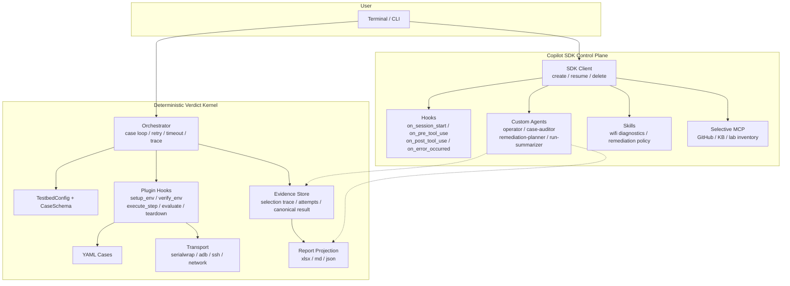
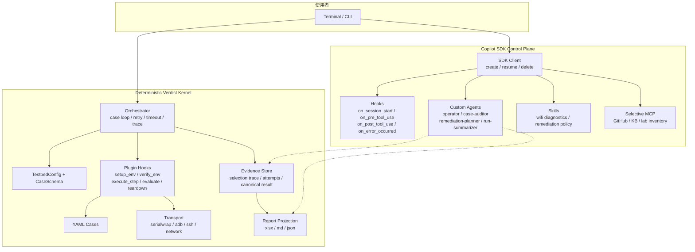

# TestPilot

> **[English](#english)** ｜ **[繁體中文](#繁體中文)**

---

## English

Plugin-based test automation framework for embedded device verification (prplOS / OpenWrt).

### Overview

TestPilot is a plugin-based test automation framework for prplOS / OpenWrt embedded devices. The architecture splits into two planes:

- **Deterministic verdict kernel** — test execution, evidence collection, pass/fail verdicts, and report projection.
- **Copilot SDK control plane** — session management, custom agents, advisory audit, and remediation planning.

Core principle: **the Copilot SDK handles the control plane; it does NOT decide the final verdict.**

### Quick Start

```bash
# 1. Install
bash scripts/install.sh
# — or manually —
uv venv && source .venv/bin/activate
uv pip install -e ".[dev]"

# 2. Activate virtualenv (required before each session)
source .venv/bin/activate

# 3. Configure testbed
cp configs/testbed.yaml.example configs/testbed.yaml
# Edit configs/testbed.yaml for your lab (DUT / STA / Endpoints)

# 4. Verify
testpilot --version
testpilot list-plugins
testpilot list-cases wifi_llapi
```

### Authentication

TestPilot supports two LLM backends. The auth chain tries each in order:

| Priority | Method | How to activate |
|----------|--------|-----------------|
| 1 | **Azure OpenAI (BYOK)** | `testpilot --azure run wifi_llapi` (interactive prompt) |
| 2 | **Azure OpenAI (env vars)** | Set `COPILOT_PROVIDER_*` env vars (see below) |
| 3 | **GitHub Copilot OAuth** | Default — no flags needed |

If all methods fail, the program exits with an error message.

#### Azure OpenAI Setup

**Option A: Interactive prompt (`--azure` flag)**

```bash
testpilot --azure run wifi_llapi --dut-fw-ver BGW720-B0-403
```

You will be asked for:
1. **Azure Endpoint URL** — e.g. `https://your-resource.openai.azure.com`
2. **Azure API Key** — your Azure OpenAI key (hidden input)
3. **Deployment Name** — e.g. `gpt-4o` (the Azure model deployment name)

**Option B: Environment variables**

```bash
export COPILOT_PROVIDER_TYPE=azure
export COPILOT_PROVIDER_BASE_URL=https://your-resource.openai.azure.com
export COPILOT_PROVIDER_API_KEY=your-api-key-here
export COPILOT_MODEL=gpt-4o
# Optional (default: 2024-10-21):
export COPILOT_PROVIDER_AZURE_API_VERSION=2024-10-21

testpilot run wifi_llapi --dut-fw-ver BGW720-B0-403
```

> **Tip:** Add the `export` lines to your shell profile (`~/.bashrc`, `~/.zshrc`) so you don't need `--azure` each time.

> **Security:** Never commit API keys to version control. Use environment variables or a `.env` file (already in `.gitignore`).

#### GitHub Copilot OAuth (Default)

If no Azure credentials are found, TestPilot falls through to GitHub Copilot OAuth via the Copilot SDK. No extra setup is required if you already have GitHub Copilot access.

### Running Tests

```bash
# Single case (smoke test)
testpilot run wifi_llapi \
  --case wifi-llapi-D004-kickstation \
  --dut-fw-ver BGW720-B0-403

# Full suite (420 discoverable cases)
testpilot run wifi_llapi --dut-fw-ver BGW720-B0-403

# With Azure OpenAI
testpilot --azure run wifi_llapi --dut-fw-ver BGW720-B0-403
```

### Report Outputs

| Track | Format | Purpose |
|-------|--------|---------|
| External delivery | `xlsx` | Pass / Fail only, written to Excel report |
| Internal diagnostics | `md` | Human-readable summary with per-case commands, output, and log line references |
| Structured data | `json` | Machine-readable with summary stats and log line numbers |
| UART RAW log | `DUT.log` / `STA.log` | serialwrap WAL decoded per-run UART communication records |

Output files location: `plugins/wifi_llapi/reports/`

### System Architecture



### Test Execution Flow


### Creating a New Plugin

1. Copy the template: `cp -r plugins/_template plugins/my_plugin`
2. Edit `plugins/my_plugin/plugin.py` — implement `name`, `discover_cases()`, `execute_step()`, `evaluate()`
3. Add YAML test cases to `plugins/my_plugin/cases/`
4. Verify: `testpilot list-plugins` → `testpilot list-cases my_plugin`

See the [Plugin Development Guide](docs/plugin-dev-guide.md) for full details.

### Agent / Model Policy

1. Priority 1: `copilot + gpt-5.4 + high`
2. Priority 2: `copilot + sonnet-4.6 + high`
3. Priority 3: `copilot + gpt-5-mini + high`
4. Execution mode: `per_case + sequential (max_concurrency=1)`
5. Failure policy: `retry_then_fail_and_continue`, timeout scales with retry attempts
6. Auto-downgrade when top priority is unavailable, with `selection trace` preserved

### Project Structure

```text
testpilot/
├── README.md
├── AGENTS.md
├── scripts/
│   └── install.sh               # One-click install script
├── docs/
│   ├── plan.md                  # Master plan
│   ├── spec.md                  # System spec + architecture diagrams
│   ├── todos.md                 # Single source of truth for todos
│   ├── audit-guide.md           # Calibration guide
│   └── audit-todo.md            # Calibration handoff tracker
├── src/testpilot/
│   ├── cli.py                   # CLI entry point (Click)
│   ├── core/
│   │   ├── azure_auth.py        # Azure OpenAI BYOK auth
│   │   ├── orchestrator.py      # Thin facade
│   │   ├── copilot_session.py   # SDK session manager
│   │   ├── plugin_base.py       # PluginBase (abstract)
│   │   └── plugin_loader.py     # sys.path-safe loader
│   ├── reporting/               # xlsx / md / json reporters
│   └── transport/               # serialwrap / adb / ssh / network
├── plugins/
│   ├── _template/               # Plugin skeleton
│   └── wifi_llapi/              # 420 official YAML cases
├── configs/
│   └── testbed.yaml.example
└── tests/                       # Engine tests
```

### Development & Testing

```bash
# Install dev dependencies
uv pip install -e ".[dev]"

# Run all tests
uv run pytest -q

# Run plugin-specific tests
uv run pytest plugins/wifi_llapi/tests/ -q
```

### License

MIT

---

## 繁體中文

plugin-based 嵌入式裝置測試自動化框架（prplOS / OpenWrt）。

### 概述

TestPilot 是一套 plugin-based 嵌入式裝置測試自動化框架，面向 prplOS / OpenWrt 裝置。系統架構分為兩個平面：

- **Deterministic verdict kernel**：負責測試執行、證據蒐集、pass/fail 判定與報表投影
- **Copilot SDK control plane**：負責 session 管理、custom agents、advisory audit、remediation planning

核心原則：**Copilot SDK 負責 control plane，不負責最終 verdict**。

### 快速開始

```bash
# 1. 安裝
bash scripts/install.sh
# — 或手動安裝 —
uv venv && source .venv/bin/activate
uv pip install -e ".[dev]"

# 2. 啟用虛擬環境（每次開新 terminal 都要執行）
source .venv/bin/activate

# 3. 設定 testbed
cp configs/testbed.yaml.example configs/testbed.yaml
# 依實際環境修改 configs/testbed.yaml（DUT / STA / Endpoint）

# 4. 驗證
testpilot --version
testpilot list-plugins
testpilot list-cases wifi_llapi
```

### 認證方式

TestPilot 支援兩種 LLM backend，認證順序如下：

| 優先序 | 方式 | 啟用方法 |
|--------|------|----------|
| 1 | **Azure OpenAI (BYOK)** | `testpilot --azure run wifi_llapi`（互動式詢問） |
| 2 | **Azure OpenAI (環境變數)** | 設定 `COPILOT_PROVIDER_*` 環境變數（見下方） |
| 3 | **GitHub Copilot OAuth** | 預設行為，不需額外參數 |

所有方式皆失敗時，程式會顯示錯誤訊息後結束。

#### Azure OpenAI 設定

**方法 A：互動式詢問（`--azure` 參數）**

```bash
testpilot --azure run wifi_llapi --dut-fw-ver BGW720-B0-403
```

系統會依序詢問：
1. **Azure Endpoint URL** — 例如 `https://your-resource.openai.azure.com`
2. **Azure API Key** — 你的 Azure OpenAI 金鑰（隱藏輸入）
3. **Deployment Name** — 例如 `gpt-4o`（Azure model 部署名稱）

**方法 B：環境變數**

```bash
export COPILOT_PROVIDER_TYPE=azure
export COPILOT_PROVIDER_BASE_URL=https://your-resource.openai.azure.com
export COPILOT_PROVIDER_API_KEY=your-api-key-here
export COPILOT_MODEL=gpt-4o
# 可選（預設：2024-10-21）：
export COPILOT_PROVIDER_AZURE_API_VERSION=2024-10-21

testpilot run wifi_llapi --dut-fw-ver BGW720-B0-403
```

> **提示：** 將 `export` 行加入 shell profile（`~/.bashrc`、`~/.zshrc`），即可免去每次加 `--azure`。

> **安全性：** 不要將 API key 提交至版本控制。使用環境變數或 `.env` 檔案（已加入 `.gitignore`）。

#### GitHub Copilot OAuth（預設）

若未偵測到 Azure 認證資訊，TestPilot 會自動透過 Copilot SDK 走 GitHub Copilot OAuth。已有 GitHub Copilot 存取權限者無需額外設定。

### 執行測試

```bash
# 單一 case（smoke test）
testpilot run wifi_llapi \
  --case wifi-llapi-D004-kickstation \
  --dut-fw-ver BGW720-B0-403

# 全量執行（420 discoverable cases）
testpilot run wifi_llapi --dut-fw-ver BGW720-B0-403

# 使用 Azure OpenAI
testpilot --azure run wifi_llapi --dut-fw-ver BGW720-B0-403
```

### 報告產出

| 軌道 | 格式 | 用途 |
|------|------|------|
| 對外交付 | `xlsx` | Pass / Fail only，寫入 Excel 報告 |
| 內部診斷 | `md` | 人可讀摘要，含 per-case 指令、輸出與 log 行號引用 |
| 結構化資料 | `json` | 機器可讀，含 summary 統計與 log 行號 |
| UART RAW log | `DUT.log` / `STA.log` | serialwrap WAL 解碼，per-run DUT/STA 原始 UART 通訊記錄 |

輸出位置：`plugins/wifi_llapi/reports/`

### 系統架構



### 測試流程圖


### 建立新 Plugin

1. 複製 template：`cp -r plugins/_template plugins/my_plugin`
2. 編輯 `plugins/my_plugin/plugin.py` — 實作 `name`、`discover_cases()`、`execute_step()`、`evaluate()`
3. 在 `plugins/my_plugin/cases/` 新增 YAML 測試案例
4. 驗證：`testpilot list-plugins` → `testpilot list-cases my_plugin`

詳細說明請參考 [Plugin 開發指南](docs/plugin-dev-guide.md)。

### Agent / Model 策略

1. 第一優先：`copilot + gpt-5.4 + high`
2. 第二優先：`copilot + sonnet-4.6 + high`
3. 第三優先：`copilot + gpt-5-mini + high`
4. 執行模式：`per_case + sequential(max_concurrency=1)`
5. 失敗策略：`retry_then_fail_and_continue`，timeout 隨 retry attempt 調整
6. 第一優先不可用時可自動降級，保留 `selection trace`

### 專案結構

```text
testpilot/
├── README.md
├── AGENTS.md
├── scripts/
│   └── install.sh               # 一鍵安裝腳本
├── docs/
│   ├── plan.md                  # 主計畫
│   ├── spec.md                  # 系統規格 + 架構圖
│   ├── todos.md                 # 唯一待辦看板
│   ├── audit-guide.md           # 校正指南
│   └── audit-todo.md            # 校正交接追蹤
├── src/testpilot/
│   ├── cli.py                   # CLI 入口（Click）
│   ├── core/
│   │   ├── azure_auth.py        # Azure OpenAI BYOK 認證
│   │   ├── orchestrator.py      # 薄 facade
│   │   ├── copilot_session.py   # SDK session 管理
│   │   ├── plugin_base.py       # PluginBase（抽象基類）
│   │   └── plugin_loader.py     # sys.path-safe loader
│   ├── reporting/               # xlsx / md / json reporters
│   └── transport/               # serialwrap / adb / ssh / network
├── plugins/
│   ├── _template/               # Plugin 骨架
│   └── wifi_llapi/              # 420 筆 official YAML cases
├── configs/
│   └── testbed.yaml.example
└── tests/                       # 引擎核心測試
```

### 開發與測試

```bash
# 安裝開發環境
uv pip install -e ".[dev]"

# 執行全部測試
uv run pytest -q

# 執行特定 plugin 測試
uv run pytest plugins/wifi_llapi/tests/ -q
```

### 授權

MIT
