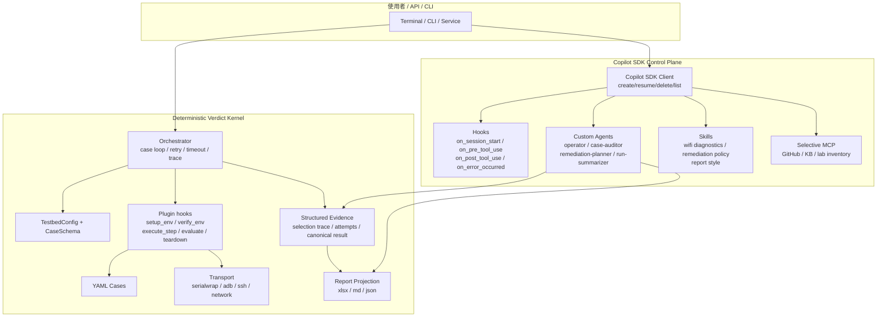
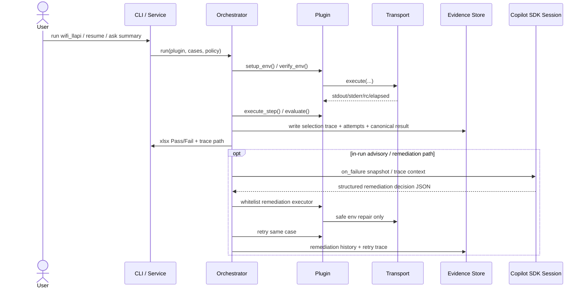

# TestPilot 系統規格書

> 版本：v0.1.0-draft（第三次重構規劃基線）
> 更新日期：2026-03-31
> 深度參考已收斂回本文件；詳細研究筆記改為 local-only，不再納入 repo。

---

## 1. 系統概述

TestPilot 是一套 plugin-based 嵌入式裝置測試自動化框架，面向 prplOS / OpenWrt 裝置。第三次重構後的系統設計以兩個平面為核心：

1. **Deterministic verdict kernel**：負責正式測試執行、證據蒐集、pass/fail 判定與報表投影。
2. **Copilot SDK control plane**：負責 session、resume、hooks、custom agents、skills、selective MCP，以及操作員導向的自然語言 UX。

`wifi_llapi` 仍是目前最完整的落地路徑；第三次重構的重點不是把 YAML 變成 prompt，也不是把最終 verdict 交給 agent，而是把既有 deterministic hot path 保留下來，再讓 Copilot SDK 吃掉 agent orchestration 的複雜度。自 2026-03-31 起，`wifi_llapi` 已接上 hook-governed live remediation loop，但範圍只限 safe environment repair，不允許 agent 改 testcase semantics、step 指令或 pass criteria。

### 核心設計原則

- **Kernel 與 Control Plane 分層**：Copilot SDK 處理 agent/control-plane；`plugin.evaluate()` 與正式 rerun 結果仍是最終 verdict 來源。
- **YAML 是 executable spec，不是主要 prompt**：formal case semantics 應由 schema、plugin hook、transport 決定。
- **Structured evidence 是唯一真相來源**：selection trace、attempt trace、commands、outputs、canonical result 需可追蹤。
- **報告投影分離**：`xlsx` 只保留對外交付的 `Pass/Fail`；`md/json` 承載 richer diagnostic statuses、root cause、suggestion、remediation history。
- **最小化 workaround**：不再以 Codex CLI 為相容目標，不為舊 runner policy 增加額外 workaround code。

---

## 2. 目標架構圖



### 平面職責表

| 平面 | 主要職責 | 不應承擔的責任 |
|---|---|---|
| **Copilot SDK control plane** | session/resume/persistence、tool policy hooks、custom agents、skills、operator UX、advisory audit、remediation planning、run summary | 正式 transport 執行、YAML semantics、最終 pass/fail 判定 |
| **Deterministic verdict kernel** | case discovery/filtering、retry-aware timeout、plugin hook execution、structured evidence、report projection、final verdict | 自由對話式判讀、agent prompt orchestration |

---

## 3. 執行生命週期



### Deterministic hot path

正式 verdict hot path 仍固定為：

1. `setup_env()`
2. `verify_env()`
3. `execute_step()`
4. `evaluate()`
5. `teardown()`
6. canonical result + report projection

補充：

- remediation 只允許發生在 **attempt 與 attempt 之間** 的 `on_retry` 期間。
- whitelist executor 只允許 safe environment actions；若 agent unavailable / invalid / out-of-policy，必須 fallback 到 deterministic builtin classifier，或直接不套 remediation。

### Timeout / Retry 原則

- 排程粒度：`per_case`
- 預設排程：`sequential`
- 失敗策略：`retry_then_fail_and_continue`
- Timeout：`min(max_seconds, (base_seconds + steps * per_step_seconds) * retry_multiplier^(attempt-1))`
- 每次 retry 都必須保留 attempt trace，而不是只保留最後結果。

---

## 4. Copilot SDK Control Plane 規格

### 4.1 模型與 runner policy（第三次重構目標）

`wifi_llapi` 的目標 policy：

1. Priority 1: `copilot + gpt-5.4 + high`
2. Priority 2: `copilot + sonnet-4.6 + high`
3. Priority 3: `copilot + gpt-5-mini + high`

補充規則：

- 不再以 `codex CLI` 為相容目標。
- 第一優先不可用時可自動降級，但必須保留 `selection trace`。
- agent 政策與 runtime config 的對齊屬於第三次重構實作項目，不應以 workaround 方式維持舊 policy。

### 4.2 Session 策略

- session ID 應顯式命名，例如：
  - `run-{run_id}`
  - `run-{run_id}-case-{case_id}`
  - `run-{run_id}-case-{case_id}-remediate-{attempt}`
- `disconnect()` 用於釋放 active session，但保留 resume 能力。
- `deleteSession()` 僅在 run / summary 完成且 artifacts 已落地後使用。
- session state 儲存 conversational context；canonical result 仍由 kernel artifacts 承擔。

### 4.3 Hook 邊界

| Hook | 目的 | 限制 |
|---|---|---|
| `on_session_start` | 注入 run/case/testbed/context metadata | 不改 formal case semantics |
| `on_pre_tool_use` | allow/deny/modify tool args、限制高風險工具 | 不直接代替 transport 執行正式測試 |
| `on_post_tool_use` | redact/truncate/annotate tool results | 不覆寫 canonical evidence |
| `on_user_prompt_submitted` | normalize operator intents | 不把 YAML 改寫為自由 prompt |
| `on_error_occurred` | advisory session retry/skip/abort | 不改正式 pass/fail 結果 |

### 4.4 Custom agents

建議角色：

- `operator`：操作員對話與 run/case 狀態說明
- `case-auditor`：讀 trace / evidence，輸出 root cause 與 suggestion
- `remediation-planner`：只輸出 structured remediation plan JSON
- `remediation-planner` / builtin fallback：只輸出 safe environment remediation decision，不直接執行任意 shell
- `run-summarizer`：彙整 run 級 md/json summary

### 4.5 Skills

建議 skill 套件：

- `wifi-llapi-diagnostics`
- `env-remediation-policy`
- `report-style`

### 4.6 MCP

MCP 只作為 **selective extension**，優先順序低於 in-process custom tools。

適合的 MCP：

- GitHub
- 知識庫 / FAQ
- lab inventory / reservation

不應成為 hot path 的：

- generic shell-on-DUT
- prompt-driven primary execution plane

---

## 5. Deterministic Kernel 規格

### 5.1 Kernel 仍保留的責任

- case discovery / case filtering
- source.row / object / api alignment gate
- retry-aware timeout 與 fail-and-continue
- plugin hook execution
- transport binding
- canonical result 寫入
- xlsx / md/json report projection

### 5.2 Canonical result

建議以 single canonical result 作為所有報表投影來源：

```json
{
  "run_id": "20260311T000000",
  "case_id": "D271",
  "final_verdict": "Pass",
  "diagnostic_status": "PassAfterRemediation",
  "root_cause": "STA config missing before retry",
  "suggestions": ["preflight check STA profile before case start"],
  "selection_trace": {},
  "attempts": [],
  "failure_snapshot": {},
  "remediation_history": [],
  "evidence_refs": []
}
```

### 5.3 Report projection

| 輸出 | 內容 |
|---|---|
| `xlsx` | `Pass` / `Fail` only |
| `md/json` | `Pass` / `PassAfterRemediation` / `FailEnv` / `FailConfig` / `FailTest` / `Inconclusive` + root cause + suggestion + remediation history |

### 5.4 不可退讓的 kernel 邊界

下列責任不得交給 conversational agent 決定：

- YAML case semantics
- environment gate semantics
- transport command execution
- pass criteria comparison
- xlsx final verdict projection
- 非 whitelist 的修復動作（例如修改 YAML、skip case、改 pass criteria）

---

## 6. 主要資料與 artifacts

| Artifact | 目的 | 備註 |
|---|---|---|
| `agent-config.yaml` | runner/model order 與 execution policy | 第三次重構需與新 policy 對齊 |
| selection trace | 記錄模型選擇與 fallback | 必須持久化 |
| attempt trace | 記錄 timeout / commands / outputs / comments | 每次 retry 都保留 |
| canonical result | 報表投影與 agent summary 的共同來源 | 不可被 agent 任意覆寫 |
| xlsx report | 對外交付 | Pass/Fail only |
| md/json report | 內部診斷 / remediation / summary | richer statuses |

---

## 7. 文件與目錄對照

```text
testpilot/
├── README.md
├── AGENTS.md
├── docs/
│   ├── plan.md
│   ├── spec.md
│   ├── todos.md
│   └── （local-only research notes; not versioned）
├── src/testpilot/
│   ├── core/
│   ├── reporting/
│   ├── schema/
│   ├── transport/
│   └── env/
├── plugins/
│   └── wifi_llapi/
│       ├── plugin.py
│       ├── agent-config.yaml
│       ├── cases/
│       └── reports/
└── tests/
```

---

## 8. 第三次重構範圍

第三次重構分為兩條主線：

### 8.1 R4：Copilot SDK 控制平面

- session foundation
- hooks policy layer
- custom agents
- skills
- advisory audit / summary
- remediation planning
- selective MCP
- runtime policy alignment

### 8.2 R5：Deterministic kernel 補強

- plugin fallback heuristic 收斂
- session/device binding 更嚴格
- canonical result / report projector 完整化
- control-plane / verdict-plane 邊界測試
- orchestrator / plugin 結構瘦身與解耦

---

## 9. 已知風險與非目標

### 9.1 已知風險

- `Orchestrator` 仍是責任過重的中心點
- `wifi_llapi/plugin.py` 仍含 wording-sensitive fallback path
- `plugins/wifi_llapi/agent-config.yaml` 尚待與新 policy 對齊
- Copilot SDK 仍屬 technical preview，導入時需分階段落地

### 9.2 非目標

- 不把 YAML 當作主要 execution prompt
- 不讓 agent 直接決定最終 pass/fail
- 不用 generic MCP shell 取代正式 transport
- 不為舊 `codex CLI` policy 新增 workaround code

---

## 10. 參考文件

1. `docs/plan.md`：主計畫與 phase 邊界
2. `docs/todos.md`：唯一待辦看板
3. 本文件與 `docs/plan.md`：第三次重構的 repo 內收斂基線
4. `README.md`：對外說明與當前/目標方向摘要
5. `AGENTS.md`：專案級 agent/model/policy 規則
