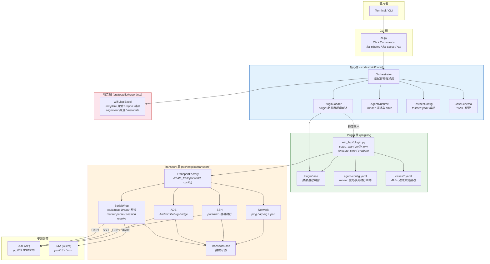
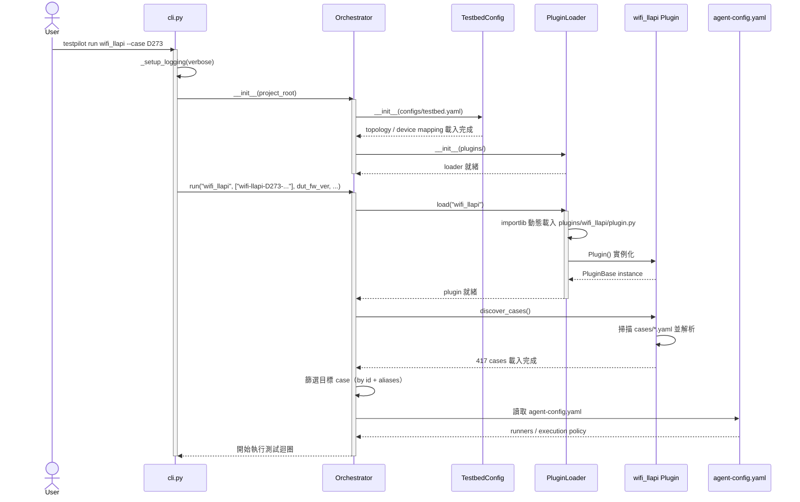
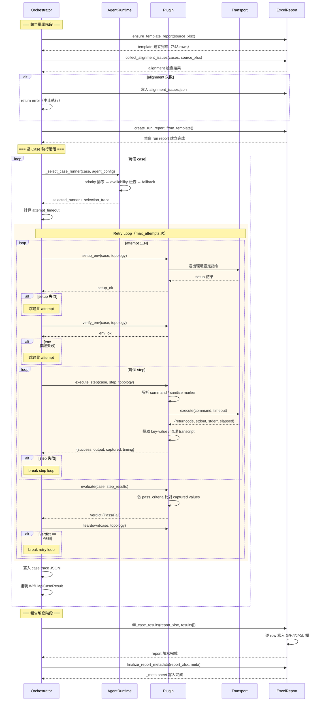
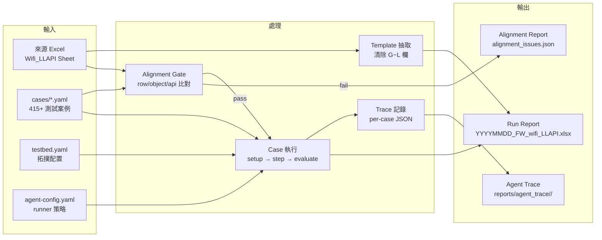

# TestPilot 系統規格書

> 版本：v0.1.0-draft（對應重構規劃）  
> 基線：v0.0.3-draft

---

## 1. 系統概述

TestPilot 是一套 plugin-based 嵌入式裝置測試自動化框架，針對 prplOS / OpenWrt 裝置，以 YAML 驅動測試流程，透過多種 Transport（Serial/ADB/SSH/Network）與受測裝置通訊，並產出 Excel 格式的測試報告。

### 核心設計原則

- **Plugin 可擴展**：每種測試類型（wifi_llapi、qos_llapi、sigma_qt …）為獨立 plugin。
- **YAML 驅動**：測試案例以宣告式 YAML 描述，而非 hard-code。
- **Transport 抽象**：裝置通訊透過統一介面，支援 serialwrap / adb / ssh / network。
- **報告雙軌**：對外交付用 Excel；agent 分析用 Markdown/JSON（規劃中）。

---

## 2. 系統架構圖



### 模組職責表

| 模組 | 檔案 | 行數 | 職責 |
|------|------|------|------|
| CLI | `cli.py` | 183 | Click 命令定義、參數解析 |
| Orchestrator | `orchestrator.py` | 893 | 測試編排、case 篩選、retry/timeout、report 協調 |
| PluginBase | `plugin_base.py` | 75 | Plugin 抽象介面（7 abstract methods） |
| PluginLoader | `plugin_loader.py` | 87 | Plugin 動態發現與載入 |
| AgentRuntime | `agent_runtime.py` | ~300 | Runner 選擇、fallback、timeout 計算 |
| TestbedConfig | `testbed_config.py` | ~60 | testbed.yaml 解析與拓撲資訊 |
| wifi_llapi Plugin | `plugin.py` | 1202 | 環境設定、指令執行、結果評估 |
| SerialWrap | `serialwrap.py` | 577 | serialwrap broker 整合、marker 解析 |
| WifiLlapiExcel | `wifi_llapi_excel.py` | 461 | Excel template/report 生成與回填 |

---

## 3. 啟動時序圖



---

## 4. 測試執行流程圖



---

## 5. 資料流概覽



---

## 6. 目錄結構

```text
testpilot/
├── src/testpilot/
│   ├── __init__.py
│   ├── cli.py                          # CLI 入口（Click）
│   ├── core/
│   │   ├── agent_runtime.py            # runner 選擇 / timeout 計算
│   │   ├── orchestrator.py             # 主編排器
│   │   ├── plugin_base.py              # PluginBase 抽象類別
│   │   ├── plugin_loader.py            # Plugin 動態載入
│   │   └── testbed_config.py           # testbed.yaml 解析
│   ├── reporting/
│   │   └── wifi_llapi_excel.py         # Excel report 生成/回填
│   ├── schema/
│   │   └── case_schema.py              # YAML case schema 驗證
│   ├── transport/
│   │   ├── base.py                     # TransportBase + StubTransport
│   │   ├── factory.py                  # create_transport()
│   │   ├── serialwrap.py               # serialwrap broker 整合
│   │   ├── adb.py                      # ADB transport
│   │   ├── ssh.py                      # SSH transport
│   │   └── network.py                  # ping/arping/iperf
│   └── env/
│       └── __init__.py                 # (roadmap)
├── plugins/
│   └── wifi_llapi/
│       ├── plugin.py                   # Plugin 實作（1202L）
│       ├── agent-config.yaml           # runner 優先序 + 執行策略
│       ├── cases/                      # 417 YAML test cases
│       │   ├── _template.yaml
│       │   ├── D019_downlinkmcs.yaml
│       │   └── ...
│       └── reports/
│           ├── templates/              # Excel template
│           └── agent_trace/            # per-run trace 目錄
├── configs/
│   └── testbed.yaml.example
├── scripts/
│   ├── gen_cases.py                    # YAML case 產生器
│   └── wifi_llapi_build_template_report.py
├── tests/                              # 38 tests
├── docs/
│   ├── plan.md                         # Master Plan
│   ├── spec.md                         # 本檔
│   └── todos.md                        # 唯一待辦看板
├── AGENTS.md                           # 開發規範
├── README.md                           # 使用說明
└── pyproject.toml                      # 建置配置
```

---

## 7. YAML Case Schema

```yaml
# 官方 case ID 格式：wifi-llapi-D{row:03d}-{slug}
id: wifi-llapi-D019-downlinkmcs
aliases:                                # 向後相容的舊 ID
  - wifi-llapi-r014-downlinkmcs
name: "DownlinkMCS readback"
version: "1.0"

source:                                 # 對應來源 Excel
  report: "0302-AT&T_LLAPI_Test_Report.xlsx"
  sheet: "Wifi_LLAPI"
  row: 19                              # Excel row number
  object: "WiFi.AccessPoint.{i}.AssociatedDevice.{i}."
  api: "DownlinkMCS"

bands: ["5g", "6g", "2.4g"]            # 適用頻段

sta_env_setup:                          # STA 環境設定步驟
  - target: STA
    steps:
      - description: "5G connect"
        commands: ["iw dev wl0 connect ..."]
      - description: "6G connect"
        commands: ["wpa_cli terminate", "sleep 1", ...]

steps:                                  # 測試步驟
  - id: read_downlinkmcs
    target: DUT
    command: "ubus-cli WiFi.AccessPoint.1.AssociatedDevice.1.DownlinkMCS?"
    expected_field: "DownlinkMCS"

pass_criteria:                          # 通過條件
  - field: DownlinkMCS
    operator: not_equals
    value: "0"
  - field: DownlinkMCS
    operator: regex
    value: "^\\d+$"
```

---

## 8. Transport 介面規格

```python
class TransportBase(ABC):
    @property
    def transport_type(self) -> str: ...     # "serial", "adb", "ssh", ...
    def connect(self, **kwargs) -> None: ... # 建立連線
    def disconnect(self) -> None: ...        # 關閉連線
    def execute(self, command: str, timeout: float = 30.0) -> dict: ...
        # Returns: {returncode: int, stdout: str, stderr: str, elapsed: float}
    @property
    def is_connected(self) -> bool: ...      # 連線狀態
```

### SerialWrap 特殊行為

- 透過 serialwrap broker 存取 UART（非直接 open TTY）
- 注入 marker：`__TP_BEGIN_{id}__` / `__TP_END_{id}__` / `__TP_RC_{id}={rc}`
- `_extract_marker_output()` 負責從 transcript 中擷取 marker 之間的輸出
- Session 解析支援：selector / alias / session_id / serial_port / device_by_id / COM port

---

## 9. Report 欄位映射（Wifi_LLAPI）

| Excel 欄 | 內容 | 來源 |
|-----------|------|------|
| A | Object（WiFi.Radio.{i}.） | 來源 Excel |
| B | Parameter | 來源 Excel |
| C | HLAPI Command | 來源 Excel |
| D | LLAPI Support | 來源 Excel |
| E | Implemented By | 來源 Excel |
| F | Test Procedure | 來源 Excel |
| **G** | **Test Steps（執行指令）** | `case_result.executed_test_command` |
| **H** | **Command Output（指令輸出）** | `case_result.command_output` |
| **I** | **Result — WiFi 5G** | Pass / Fail / N/A |
| **J** | **Result — WiFi 6G** | Pass / Fail / N/A |
| **K** | **Result — WiFi 2.4G** | Pass / Fail / N/A |
| **L** | **Tester** | 固定 `testpilot` |

---

## 10. Agent 執行策略

```yaml
# plugins/wifi_llapi/agent-config.yaml
execution:
  scope: per_case              # 每個 case 獨立執行
  mode: sequential             # 序列執行（max_concurrency=1）
  failure_policy: retry_then_fail_and_continue

  retry:
    max_attempts: 2
    backoff_seconds: 5

  timeout:
    base_seconds: 120
    per_step_seconds: 45
    retry_multiplier: 1.25     # 每次 retry timeout × 1.25
    max_seconds: 900

runners:
  - priority: 1                # 第一優先
    cli_agent: codex
    model: gpt-5.3-codex
    effort: high
  - priority: 2                # 降級備選
    cli_agent: copilot
    model: sonnet-4.6
    effort: high
```

**Timeout 公式**：
```
attempt_timeout = min(max_seconds, (base + steps × per_step) × multiplier^(attempt-1))
```

---

## 11. 已知隱患與重構方向

詳見 `docs/plan.md` 第二章「重構方案」。

主要架構問題：
- Orchestrator God Class（893L，混合 9 種職責）
- Plugin 硬編碼於 Orchestrator（違反 OCP）
- Report 覆蓋無防呆
- Serialwrap marker 洩漏到 report
- PluginBase 介面過胖（7 abstract methods）

重構路線：R1（Report 清理）→ R2（Orchestrator 解耦）→ R3（Plugin Template）→ R4（Copilot SDK）
